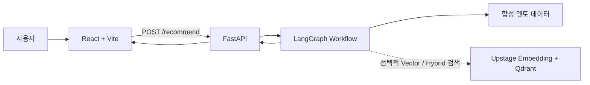
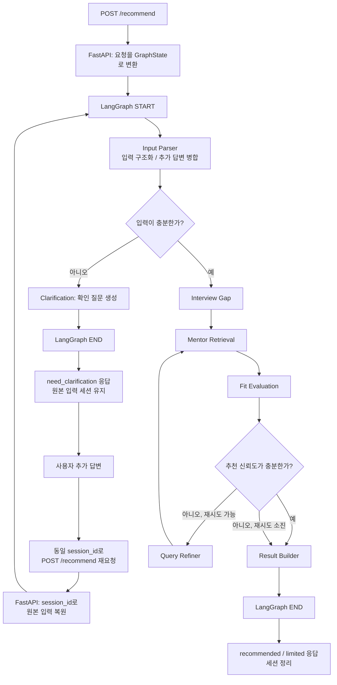

# SWM 멘토 매칭 에이전트

프로젝트 설명, 기술 스택, 진행 단계와 고민을 분석해 현재 부족한 역량을 도출하고, 그 약점을 보완할 수 있는 멘토를 근거와 함께 추천하는 LangGraph 기반 Agentic RAG 서비스입니다.

단순히 유사한 분야의 멘토를 찾는 대신 프로젝트의 빈틈을 분석하고, 해당 영역에 도움을 줄 수 있는 멘토 후보 2~3명을 추천합니다. 입력이 부족하면 확인 질문을 제시하며, 추천 신뢰도가 낮으면 검색 질의를 보정해 한 번 더 검색합니다.

## 주요 기능

- 자유 텍스트에서 기술 스택, 진행 단계, 고민과 목표 구조화
- 입력 충분성 판단 및 확인 질문 1개 생성
- 프로젝트의 핵심 약점과 필요한 멘토 전문성 분석
- BM25 규칙 검색을 기본으로 한 멘토 후보 검색
- 선택적 Vector 및 Hybrid 검색 지원
- 후보별 적합도, 추천 이유와 도움 가능 영역 생성
- 저신뢰 추천에 대한 질의 보정 및 최대 1회 재검색
- 추천 근거가 제한적인 경우 `limited` 결과 제공
- 확인 질문 왕복을 위한 인메모리 세션

## 아키텍처



| 영역 | 역할 | 기술 |
|---|---|---|
| Frontend | 입력, 확인 질문, 추천 결과 카드 및 상세 화면 | React 19, TypeScript, Vite |
| API | 요청 검증, 세션 관리, 워크플로우 실행 | FastAPI, Pydantic |
| Agent Workflow | 상태 관리, 조건 분기, 재검색 제어 | LangGraph |
| Retrieval | 멘토 후보 검색 | BM25 규칙 검색, 선택적 Upstage/Qdrant |
| Data | 합성 멘토 프로필 | JSON |

기본 검색 모드는 `bm25`이며 외부 API 키 없이 동작합니다. `vector` 또는 `hybrid` 모드는 Upstage API와 Qdrant 설정이 있을 때 사용할 수 있고, 벡터 검색 실패 시 BM25로 폴백합니다.

## 에이전트 플로우



| 단계 | 처리 내용 |
|---|---|
| FastAPI Request Handling | 요청을 GraphState로 변환합니다. 확인 질문 후속 요청이면 `session_id`로 보관한 원본 입력을 복원합니다. |
| Input Parser | 원본 입력과 `clarify_answer`를 병합하고, 입력을 구조화해 추천에 필요한 정보가 충분한지 판단합니다. |
| Clarification | 입력이 부족하면 확인 질문 1개를 생성하고 현재 LangGraph 실행을 종료합니다. |
| Interview Gap | 프로젝트 상황에서 부족한 역량, 우선순위와 검색 힌트를 도출합니다. |
| Mentor Retrieval | 약점 기반 검색 질의를 구성해 멘토 후보를 검색합니다. |
| Fit Evaluation | 검색 점수와 규칙 일치도를 결합해 적합도와 추천 이유를 생성합니다. |
| Query Refiner | 추천 근거가 약하면 검색 질의를 보정하고 최대 1회 재검색합니다. |
| Result Builder | 상위 3명의 멘토를 프론트엔드 응답 계약에 맞춰 반환합니다. |

확인 질문 응답은 하나의 LangGraph 실행 안에서 반복되지 않습니다. `need_clarification` 응답 후 프론트엔드가 동일한 `session_id`로 새 요청을 보내면, FastAPI가 저장된 원본 입력을 복원하고 Input Parser가 `clarify_answer`를 병합해 처리를 이어갑니다.

추천 이유는 멘토 프로필과 약점 분석에 존재하는 정보만 조합해 생성하며, 프로필에 없는 경력이나 전문성을 임의로 추가하지 않습니다.

## 전체 워크플로우

1. 사용자가 프로젝트 설명, 기술 스택과 진행 단계를 입력합니다.
2. 프론트엔드는 단일 엔드포인트 `POST /recommend`로 요청을 전송합니다.
3. 입력이 부족하면 `need_clarification` 응답을 반환하고 원본 입력을 세션에 보관합니다.
4. 사용자의 추가 답변을 원본 입력과 병합해 워크플로우를 다시 실행합니다.
5. 입력이 충분하면 프로젝트 약점을 분석하고 멘토 후보를 검색·평가합니다.
6. 추천 신뢰도가 낮으면 질의를 보정해 최대 1회 재검색합니다.
7. 최종 응답은 `recommended` 또는 `limited` 상태와 추천 멘토 카드로 반환됩니다.
8. 추천 또는 제한적 추천이 완료되면 해당 인메모리 세션을 정리합니다.

### API 응답 상태

| 상태 | 의미 |
|---|---|
| `need_clarification` | 추천에 필요한 입력이 부족해 확인 질문이 필요합니다. |
| `recommended` | 충분한 근거를 가진 추천 결과입니다. |
| `limited` | 재검색 후에도 근거가 제한적인 추천 결과입니다. |

## 프로젝트 구조

```text
.
├── backend/
│   └── app/
│       ├── graph/       # LangGraph 상태와 워크플로우
│       ├── nodes/       # 입력 파싱, 약점 분석, 검색, 평가, 결과 생성
│       ├── rag/         # BM25, Upstage Embedding, Qdrant 연동
│       ├── schemas/     # API 요청·응답 및 약점 분석 스키마
│       └── main.py      # FastAPI 앱과 인메모리 세션
├── frontend/
│   └── src/
│       ├── components/  # 공통, 입력, 결과 UI
│       ├── hooks/       # /recommend 통신
│       ├── mocks/       # 프론트 단독 실행용 목 응답
│       ├── screens/     # 입력, 로딩, 확인 질문, 결과 화면
│       └── types/       # 프론트 API 계약
├── data/
│   └── mentors.json     # 합성 멘토 프로필
├── scripts/
│   └── index_mentors.py # Vector 검색용 멘토 인덱싱
├── tests/               # 노드, 검색, 워크플로우, API 테스트
└── docs/reports/        # 통합 단계 보고서와 데모 가이드
```

## 실행 및 테스트

풀스택 실행 절차와 검증 시나리오는 [통합 데모 테스트 가이드](docs/reports/demo-integration-guide.md)를 따릅니다.

백엔드 테스트:

```bash
pytest
```

프론트엔드 검증:

```bash
cd frontend
npm run build
npm run lint
```

## 구현 범위

현재 구현은 로컬에서 실행 가능한 Agentic Workflow 데모를 목표로 합니다.

- 멘토 데이터는 10명의 합성 프로필을 사용합니다.
- 기본 경로는 LLM을 호출하지 않는 규칙 기반 분석과 BM25 검색입니다.
- 세션은 확인 질문 왕복을 위한 인메모리 저장소이며 서버 재시작 시 사라집니다.
- 실제 멘토 데이터 연동, 사용자 인증, 장기 메모리, 멘토 연락과 매칭 확정은 포함하지 않습니다.

## 관련 문서

| 문서 | 내용 |
|---|---|
| [통합 데모 테스트 가이드](docs/reports/demo-integration-guide.md) | 풀스택 실행 방법과 데모 시나리오 |
| [LangGraph 워크플로우 조립 보고서](docs/reports/phase2-step1-graph.md) | 그래프 노드, 분기 및 재검색 흐름 |
| [FastAPI 서버 보고서](docs/reports/phase2-step2-api.md) | `/recommend`, 응답 계약과 세션 |
| [프론트엔드 실서버 연동 보고서](docs/reports/phase2-step3-frontend.md) | 프론트엔드와 백엔드 E2E 연동 |
| [프론트엔드 README](frontend/README.md) | 프론트엔드 실행과 화면 구조 |
| [프론트엔드 설계 원칙](frontend/AGENT.md) | UI 및 API 계약 규칙 |
| [프론트엔드 디자인 명세](frontend/Design.md) | 화면과 디자인 시스템 |
