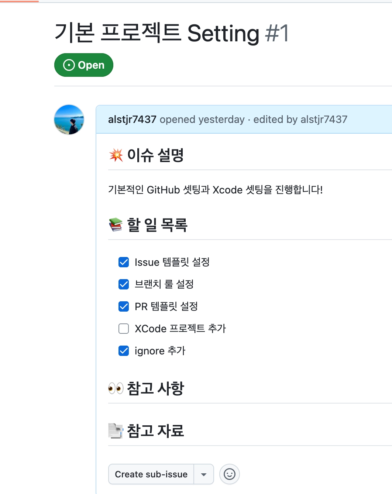
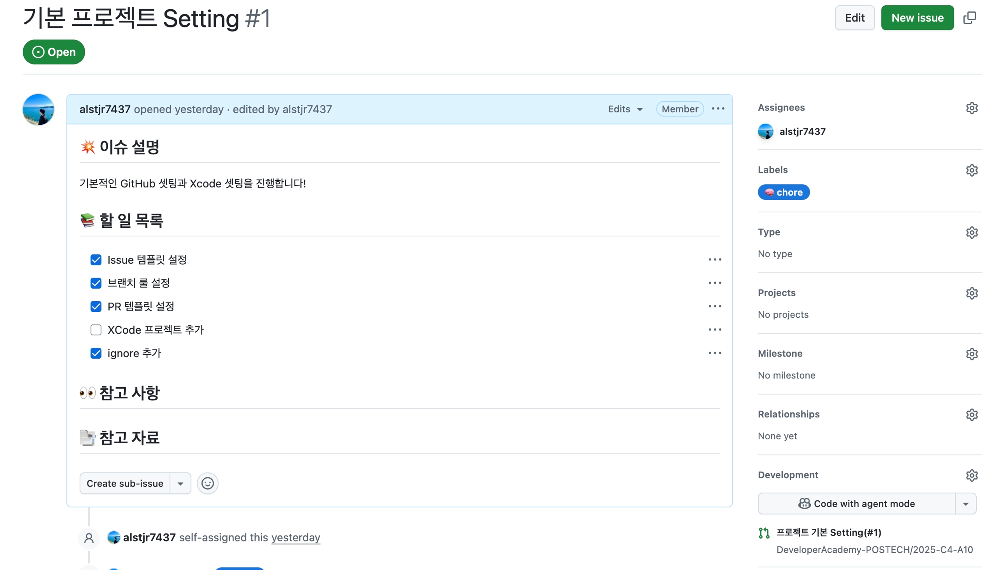
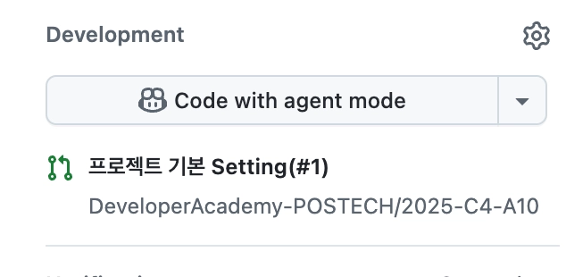
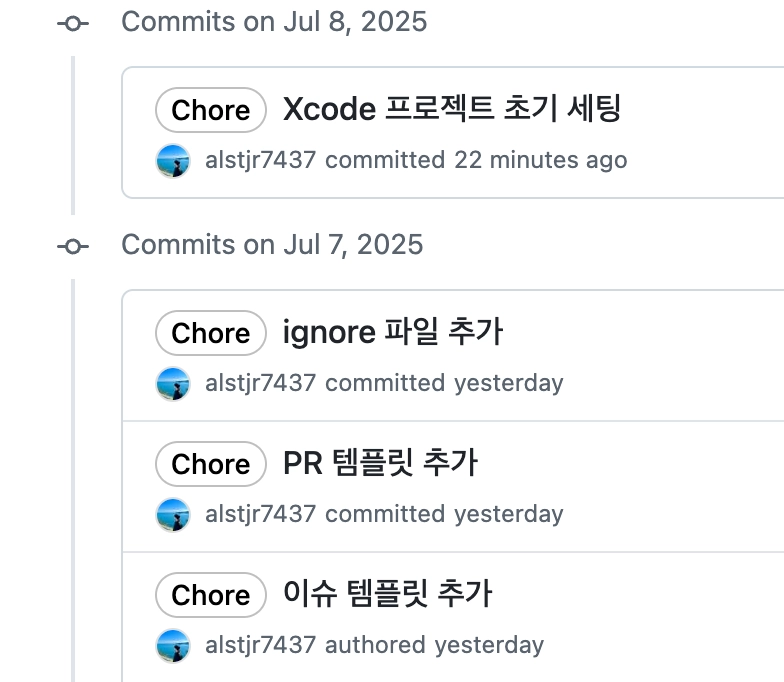
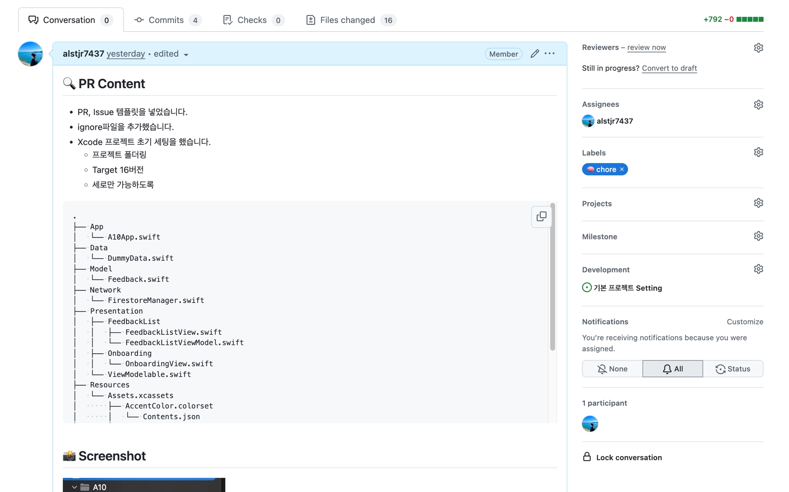

# 🤝 협업 컨벤션

> 우리 팀의 GitHub 기반 협업 규칙입니다.
> 작업 흐름(Feature Flow)과 Issue / Branch / Commit / PR 컨벤션을 정리했습니다.

---

## 📌 전체 Feature Flow

### 0. 할 일 정하기
GitHub **Issues / Projects 보드**를 보고 이번에 맡을 작업을 정합니다.

> 예) "오! 나는 이번에 프로젝트 세팅을 해야겠다"

### 1. Issue 생성
맡은 작업을 **작업 내용을 제목으로** Issue를 생성합니다.

> 예) `기본 프로젝트 Setting`

- Issue 템플릿(`.github/ISSUE_TEMPLATE`)에 맞춰 내용을 작성합니다.
- 가능하면 Label, Assignee, Projects를 함께 지정합니다.





### 2. Branch 생성
1번에서 만들어진 **Issue 번호**를 가져와 브랜치를 만듭니다.

```
<기능 컨벤션>/#<이슈번호>
```

> 예) `chore/#1`, `feat/#12`

- Issue 우측의 **Development** 영역에서 바로 연결된 브랜치를 만들 수 있습니다.



### 3. 커밋 컨벤션에 맞춰 작업하기
여러 작업을 커밋 컨벤션에 맞춰 진행합니다.
**각 작업을 잘 쪼개서 커밋합니다!**

> 예)
> - `chore: 이슈 템플릿 추가`
> - `chore: PR 템플릿 추가`
> - `chore: ignore 파일 추가`
> - `chore: Xcode 프로젝트 초기 세팅`



### 4. 모든 작업을 마치고 PR 작성
PR 내용, 구현 스크린샷, 논의할 부분을 작성해 PR을 생성합니다.
PR 제목은 **작업한 내용(#이슈번호)** 형식으로 작성합니다.

> 예) `기본 프로젝트 Setting(#1)`

- PR 템플릿(`.github/pull_request_template.md`)에 맞춰 작성합니다.
- PR 본문에 `Closes #<이슈번호>`를 적으면 Merge 시 Issue가 자동으로 닫힙니다.



### 5. Squash Merge 하기
**Squash and merge**를 이용해 Merge합니다.

### 6. 다음 Feature 가져가기
다음 작업을 시작합니다 ~ 🚀

---

## 🌿 Branch Convention

```
<type>/#<이슈번호>
```

| Type | 설명 |
| --- | --- |
| `feat` | 새로운 기능 추가 |
| `fix` | 버그 수정 |
| `chore` | 빌드/설정/패키지 등 기타 작업 |
| `style` | 코드 포맷, 세미콜론 등 (로직 변경 없음) |
| `refactor` | 코드 리팩토링 |
| `docs` | 문서 작업 |
| `test` | 테스트 코드 추가/수정 |

> 예) `feat/#12`, `fix/#7`, `chore/#1`

---

## 📝 Commit Convention

```
<type>: <subject>
```

| Type | 설명 |
| --- | --- |
| `feat` | 새로운 기능 추가 |
| `fix` | 버그 수정 |
| `chore` | 빌드/설정/패키지 등 기타 작업 |
| `style` | 코드 포맷, 세미콜론 등 (로직 변경 없음) |
| `refactor` | 코드 리팩토링 |
| `docs` | 문서 작업 |
| `test` | 테스트 코드 추가/수정 |
| `comment` | 주석 추가/변경 |
| `rename` | 파일/폴더명 변경 |
| `remove` | 파일 삭제 |

### 작성 규칙
- 제목은 **한 줄(50자 이내)**, 명확하고 간결하게 작성합니다.
- 작업을 **의미 단위로 잘게 쪼개서** 커밋합니다.
- 한 커밋에는 하나의 목적만 담습니다.

> 예)
> - `feat: 카카오톡 로그인 API 구현`
> - `fix: 로그인 토큰 만료 처리 오류 수정`
> - `chore: 프로젝트 세팅`

---

## 🔍 Pull Request Convention

### 제목
```
작업한 내용(#이슈번호)
```
> 예) `프로젝트 기본 Setting(#1)`

### 본문
PR 템플릿에 따라 아래 항목을 작성합니다.
- **🔍 PR Content** — 작업 내용 설명
- **📸 Screenshot** — 작업 화면 스크린샷
- **📍 PR Point** — 질문하거나 공유하고 싶은 내용

### Merge 규칙
- **Squash and merge** 사용

---

## 🗂 Issue Convention

- 제목은 **작업 내용**으로 작성합니다. (예: `프로젝트 세팅`)
- Issue 템플릿에 맞춰 이슈 설명 / 할 일 목록 / 참고 사항을 작성합니다.
- 생성된 **Issue 번호**를 브랜치와 PR에 연결합니다.
