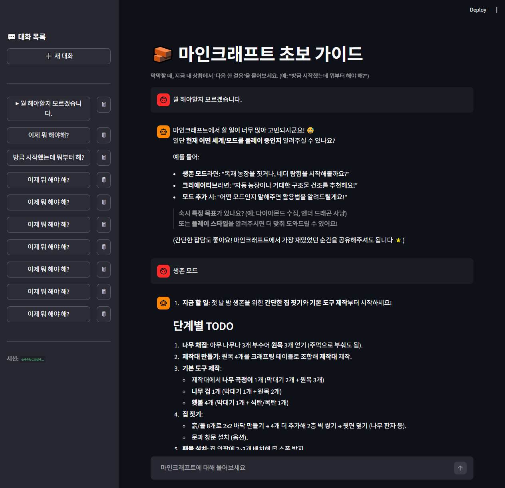
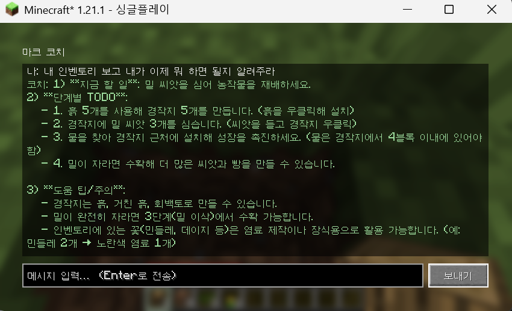
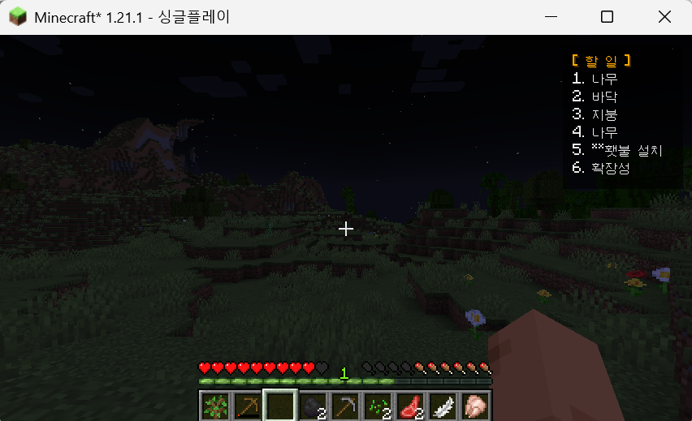
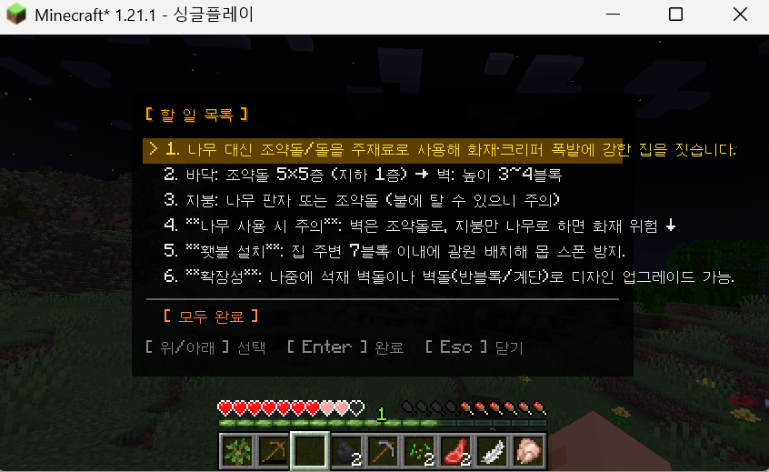
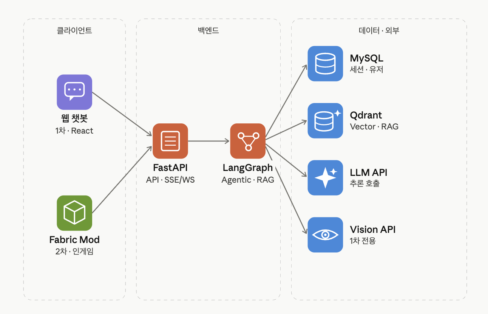
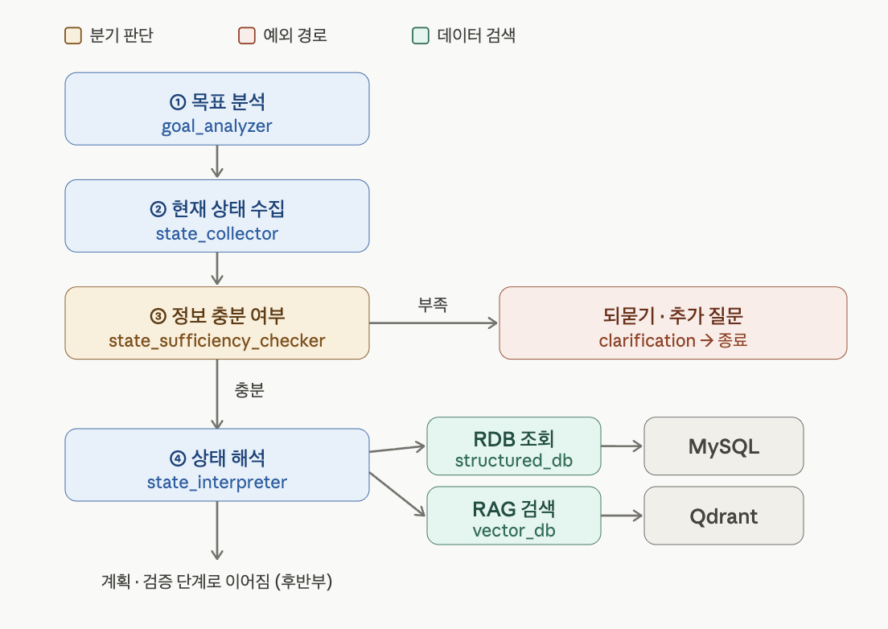
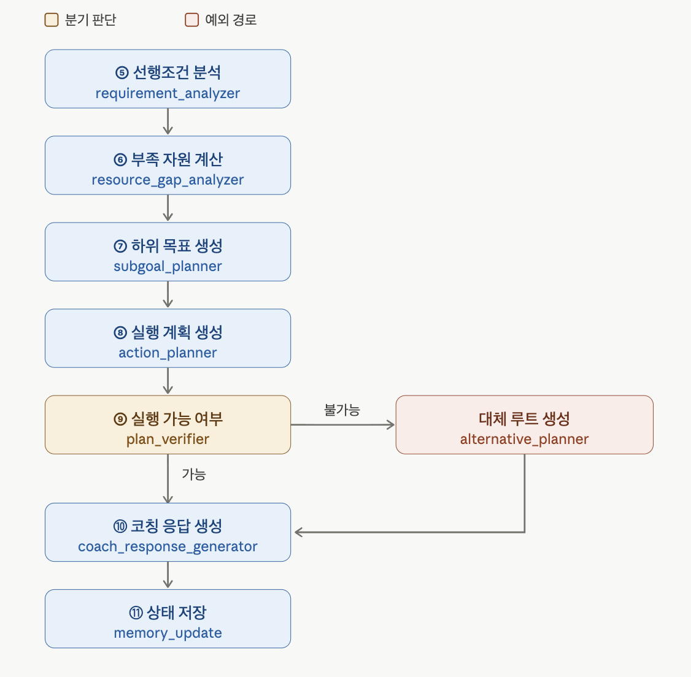

# 마인크래프트 초보 가이드 챗봇 (엔더드래곤)

마인크래프트를 처음 켜면 뭐부터 해야 할지 막막하죠. 이 프로젝트는 초보자의 지금 상황(가진 자원, 진행도)을 보고 "그래서 다음엔 뭘 하면 되는지"를 하나씩 짚어주는 챗봇입니다.

브라우저로도 쓸 수 있고, 마인크래프트 안에서 바로 물어볼 수도 있어요. 둘 다 같은 백엔드를 씁니다.

**사용 기술**: FastAPI, LangGraph, MySQL, Qdrant(Cloud), Upstage Solar, Fabric 모드, Streamlit(검증용)

---

## 🖥️ [서버 띄우기](docs/백엔드_사용법.md)

먼저 백엔드부터 켜야 합니다. 웹뷰든 게임 모드든 결국 이 서버를 호출하거든요.

```bash
cd project_code
cp .env.example .env          # UPSTAGE_API_KEY, 공유 QDRANT_URL/API_KEY 입력
docker compose up -d mysql    # 로컬 MySQL (Qdrant는 공유 클라우드 사용)
uv sync && uv run alembic upgrade head
bash start.sh                 # 백엔드 :8001, 웹뷰 :8002
```

위키 데이터(벡터 5,923개)는 공유 Qdrant Cloud에 이미 올려둬서, 따로 적재할 필요 없이 접속 정보만 받으면 바로 돌아갑니다. 설치하다 막히면 [백엔드 사용법](docs/백엔드_사용법.md)을 보세요.

## 🌐 [웹으로 써보기](docs/웹뷰_사용법.md)

브라우저에서 `http://localhost:8002`에 접속해서 질문을 입력하면 됩니다. 답변은 진행 상황이 단계별로 보이면서 실시간으로 흘러나오고, 사이드바에서 예전 대화를 다시 보거나 지울 수 있어요.

<p align="center">
  
</p>

## 🎮 [게임 안에서 써보기](docs/인게임_사용법.md)

마인크래프트 안에서 바로 코치를 부르는 Fabric 모드입니다.

```bash
cd minecraft-mod && ./gradlew runClient
```

월드에 들어간 뒤 채팅에 `/coach <질문>`을 치거나, **K**로 코치 창, **J**로 할 일 목록을 열 수 있습니다. 물어볼 때 지금 인벤토리를 같이 보내서, 가진 아이템에 맞춰 답해줍니다.

<p align="center">
  <br>
  <sub>채팅으로 코치에게 물어보기 (<code>/coach</code>)</sub>
</p>

코치가 알려준 할 일은 화면 우측 상단 HUD에 뜨고, **J**로 전체 목록을 펼쳐볼 수 있어요.

<div align="center">
  <table>
    <tr>
      <td align="center"><br><sub>우측 상단 할 일 HUD</sub></td>
      <td align="center"><br><sub>할 일 목록 전체 (J)</sub></td>
    </tr>
  </table>
</div>

---

## 🛠️ [어떻게 만들었나](docs/기술_문서.md)

- **에이전트 흐름** — 사용자 질문은 LangGraph를 따라 `분석 → 되묻기 → 검색 → 답변` 순으로 흐릅니다(현재 5노드).
- **검색(RAG)** — 답변 근거는 마인크래프트 위키에서 검색해 가져옵니다(Qdrant + Upstage 임베딩).
- **환각 방지** — 채굴 티어나 레시피처럼 틀리면 안 되는 건 "확정 사실"로 박아놔서 LLM이 지어내지 못하게 막았어요. 실제로 #7에서 겪었던 문제라 이렇게 풀었습니다.
- **저장** — 대화 기록은 MySQL에 저장하고, 스키마는 Alembic으로 관리합니다.
- **게임 연동** — 게임 모드는 인벤토리를 읽어 같이 넘기고, 받은 답변을 할 일 목록 HUD로 보여줍니다.

더 자세한 내용(아키텍처, API, 이슈별 작업 내역)은 [기술 문서](docs/기술_문서.md)에 정리해뒀습니다.

## 🧭 아키텍처랑 에이전트 흐름

웹뷰와 Fabric 모드가 FastAPI를 거쳐 LangGraph로 들어가고, 그 뒤에 MySQL(세션), Qdrant(RAG), LLM/Vision API가 붙습니다.

<p align="center">
  
</p>

에이전트는 목표를 분석하고 현재 상태를 모은 다음, 정보가 충분한지 따져보고 상태를 해석합니다.

<p align="center">
  
</p>

그다음 선행조건과 부족한 자원을 계산해서 하위 목표와 실행 계획을 세우고, 실행이 가능한지 확인한 뒤 코칭 답변을 내고 상태를 저장합니다.

<p align="center">
  
</p>

참고로 위 11노드는 처음에 잡았던 최종 목표고, 지금 실제로 돌아가는 건 5노드(`analyze → clarify →(ask) → retrieve → respond`)입니다. 차이는 [기술 문서](docs/기술_문서.md)에 적어뒀어요.

---

## 📚 문서

| 문서 | 내용 |
| --- | --- |
| [백엔드 사용법](docs/백엔드_사용법.md) | 백엔드(FastAPI) 클론부터 로컬 실행까지 (팀원 온보딩) |
| [웹뷰 사용법](docs/웹뷰_사용법.md) | Streamlit 검증용 웹뷰 쓰는 법 |
| [인게임 사용법](docs/인게임_사용법.md) | Fabric 모드 인게임에서 쓰는 법 |
| [기술 문서](docs/기술_문서.md) | 사용 기술과 적용 방법 (아키텍처, 워크플로우, RAG, DB, 이슈 매핑) |
| [스펙 문서](docs/스펙문서.md) | 제품 설계, 범위, 협업 모델 |
| [구현 계획](docs/구현계획/) | 이슈별 구현 절차와 커밋 분해 (#5, #7) |
| [알려진 이슈](docs/알려진_이슈.md) | 응답 품질 이슈 로그와 해결 기록 |
| [project_code/README](project_code/README.md) | 백엔드·웹뷰 내부 구조와 코드 |
| [minecraft-mod/README](minecraft-mod/README.md) | 인게임 Fabric 모드 빌드와 구조 |

## 📂 폴더 구조

```
asm-team20-ai-study/
├── docs/                 설계·실행 문서 + 아키텍처 다이어그램
│
├── project_code/         백엔드(FastAPI·LangGraph) + 검증용 웹뷰
│   ├── app/
│   │   ├── agents/         LangGraph 노드 (분석·되묻기·검색·답변)
│   │   ├── knowledge/      환각 방지용 확정 사실 (채굴 티어·레시피)
│   │   ├── core/           설정·DB·임베딩·LLM 연결
│   │   └── ...             graph·api·models·repositories 등
│   ├── frontend/          Streamlit 웹뷰
│   ├── scripts/           위키 → Qdrant 적재
│   └── alembic/ · tests/  마이그레이션 · 테스트
│
└── minecraft-mod/        인게임 Fabric 모드 (실제 메인 클라이언트)
    └── src/.../coach/
        ├── api/             백엔드 호출 · 인벤토리 캡처
        ├── gui/             코치 창 · 할 일 목록 · HUD
        └── config/          백엔드 주소·세션
```

웹뷰와 Fabric 모드는 같은 FastAPI API를 호출합니다. 그래서 백엔드는 어느 쪽 클라이언트에도 묶여 있지 않아요.
