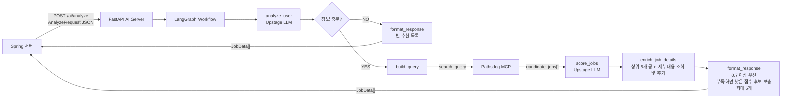
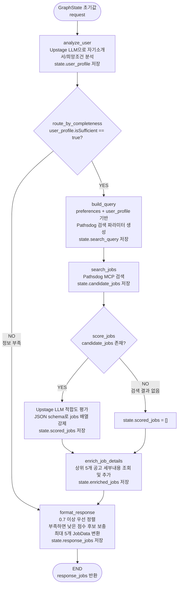

# AI Server

FastAPI와 LangGraph 기반 채용공고 추천 AI 서버입니다. Spring 서버가 자기소개서와 희망 조건을 `POST /ai/analyze`로 전달하면, AI 서버는 Upstage LLM으로 사용자 정보를 분석하고 Pathsdog MCP에서 채용공고를 검색한 뒤 적합도 점수를 매겨 추천 공고 목록을 반환합니다.

## 프로젝트 구조

```text
ai_server/
├── main.py                         # FastAPI 앱 진입점, /health 등록
├── requirements.txt                # Python 의존성
├── .env.example                    # 환경변수 예시 파일
├── app/
│   ├── api/
│   │   ├── routes.py               # /ai/analyze API 라우트
│   │   └── schemas.py              # 요청/응답 Pydantic 모델
│   ├── core/
│   │   ├── config.py               # .env 설정 로딩
│   │   └── llm.py                  # Upstage LLM 클라이언트
│   ├── graph/
│   │   ├── state.py                # LangGraph 상태 타입
│   │   ├── workflow.py             # LangGraph 노드 연결
│   │   └── nodes/
│   │       ├── analyze_user.py     # 자기소개서 기반 사용자 분석
│   │       ├── check_completeness.py
│   │       ├── build_query.py      # Pathsdog 검색 파라미터 생성
│   │       ├── search_jobs.py      # 채용공고 검색
│   │       ├── score_jobs.py       # 공고 적합도 평가
│   │       ├── enrich_job_details.py # 공고 상세 본문 보강
│   │       └── format_response.py  # 최종 응답 포맷팅
│   ├── integrations/
│   │   └── pathsdog_mcp.py         # Pathsdog MCP 연동
│   └── prompts/
│       ├── user_analysis.md        # 사용자 분석 프롬프트
│       └── suitability_scoring.md  # 적합도 평가 프롬프트
└── tests/                          # FastAPI, LangGraph, 연동 로직 테스트
```

## 전체 흐름



`score_jobs` 단계는 Upstage Chat Completions의 `response_format.type=json_schema` structured output을 사용해 LLM 응답을 `{"jobs": [...]}` 객체로 강제합니다. 서버는 그래도 방어적으로 응답을 한 번 더 검증하며, `jobs`가 아닌 흔한 목록 key나 비객체 항목이 섞이는 경우를 보정하거나 거부합니다.

## LangGraph 내부 흐름

`run_workflow`는 `{"request": AnalyzeRequest}`를 초기 `GraphState`로 넣고 `workflow.ainvoke`를 실행합니다. 각 노드는 필요한 값만 state에 추가로 반환하며, LangGraph가 이를 누적해 다음 노드로 넘깁니다.



여기서 `enrich_job_details`는 점수가 매겨진 전체 공고를 다시 조회하지 않습니다. `format_response`가 최종 반환할 때와 같은 기준으로 최대 5개 공고를 먼저 고른 뒤, 각 공고의 `jobId`로 Pathsdog MCP `get_job_detail(include_full_description=true)`를 호출합니다. 호출 결과의 `[상세 내용]` 또는 `[요약]` 본문을 `jobIntroduction`에 추가해서 `state.enriched_jobs`에 저장합니다.

`GraphState`에 누적되는 주요 키는 아래 순서로 채워집니다.

```text
request
  -> user_profile
  -> search_query
  -> candidate_jobs
  -> scored_jobs
  -> enriched_jobs
  -> response_jobs
```

## 요청 형식

Endpoint:

```http
POST /ai/analyze
Content-Type: application/json
```

Body:

```json
{
  "coverLetter": "자기소개서 전체 내용",
  "preferences": {
    "jobRole": "백엔드 개발자",
    "experienceLevel": "신입",
    "techStack": ["Java", "Spring Boot", "JPA", "MySQL", "Redis", "Docker", "AWS"],
    "region": "서울, 경기",
    "onlyWithReward": false,
    "isUrgent": false
  }
}
```

## 응답 형식

성공 시 `JobData[]`를 반환합니다.

```json
[
  {
    "jobId": "639",
    "companyName": "김캐디",
    "jobTitle": "백엔드 개발자 포지션 (신입~3년차, 병특)",
    "suitabilityScore": 0.92,
    "compensation": "원문 확인 필요",
    "deadline": "상시채용",
    "originalLink": "https://kimcaddie.career.greetinghr.com/ko/o/206177",
    "jobIntroduction": "회사 소개 및 포지션 상세",
    "analysis": {
      "matchReason": "Java, Spring Boot, JPA, MySQL, Redis, Docker, AWS 등 핵심 기술 스택이 공고와 잘 맞습니다.",
      "missingPoints": "실제 운영 환경에서의 장애 대응 경험과 구체적인 성능 개선 수치는 추가 확인이 필요합니다.",
      "checkpointGuide": "프로젝트 규모, 성능 개선 수치, 배포 경험을 지원서에서 구체적으로 강조하세요."
    }
  }
]
```

정보가 부족하거나 추천 가능한 공고가 없으면 빈 배열을 반환합니다.

```json
[]
```

워크플로우 실행 중 오류가 발생하면 현재 API는 `502`를 반환합니다.

```json
{
  "detail": "AI workflow failed"
}
```

## 동작 예시

아래 예시는 흔한 신입 백엔드 엔지니어 자기소개서와 선호 조건을 넣었을 때의 호출 예시입니다. 실제 추천 공고와 점수는 Pathsdog MCP의 현재 채용공고 데이터와 Upstage LLM 응답에 따라 달라질 수 있습니다.

Request:

```bash
curl -X POST http://127.0.0.1:8000/ai/analyze \
  -H "Content-Type: application/json" \
  -d '{
    "coverLetter": "저는 Java와 Spring Boot를 중심으로 웹 서비스 백엔드 개발을 학습하고 프로젝트를 진행해 온 신입 백엔드 개발자입니다. 팀 프로젝트에서 REST API 설계, JWT 인증, 일정 CRUD, 댓글, 알림 API를 담당했습니다. JPA로 엔티티 관계를 설계했고 MySQL 인덱스를 적용해 목록 조회 API의 응답 속도를 개선했습니다. Redis를 활용해 조회수 중복 집계와 캐시를 적용했고 Docker Compose로 Spring Boot, MySQL, Redis 로컬 개발 환경을 구성했습니다. AWS EC2에 애플리케이션을 배포하고 Nginx를 리버스 프록시로 설정했습니다. GitHub Pull Request 기반 코드 리뷰와 이슈 관리로 협업했으며, Service 단위 테스트와 Controller MockMvc 테스트를 작성했습니다.",
    "preferences": {
      "jobRole": "백엔드 개발자",
      "experienceLevel": "신입",
      "techStack": ["Java", "Spring", "Spring Boot", "JPA", "MySQL", "SQL", "Redis", "Docker", "AWS", "Nginx", "REST API", "JWT", "GitHub"],
      "region": "서울, 경기, 판교",
      "onlyWithReward": false,
      "isUrgent": false
    }
  }'
```

Response:

```json
[
  {
    "jobId": "529",
    "companyName": "토스",
    "jobTitle": "Server Developer [병역특례] (Product)",
    "suitabilityScore": 0.98,
    "compensation": "원문 확인 필요",
    "deadline": "상시채용",
    "originalLink": "https://toss.im/career/job-detail?job_id=4773428003",
    "jobIntroduction": "토스 제품 조직의 서버 개발자는 사용자 경험을 안정적으로 뒷받침하는 제품 서버를 설계하고 운영합니다. 제품 요구사항을 기술적 해법으로 전환하고, 결제·금융 도메인의 안정성, 확장성, 개발 생산성을 함께 개선합니다.",
    "analysis": {
      "matchReason": "Java, Spring Boot, Backend, JWT, GitHub, CI/CD, 테스트 자동화 등 핵심 기술 스택과 역할이 거의 일치하며, 병역특례 가능",
      "missingPoints": "프로젝트 규모, 팀 인원, 프로젝트 기간, 성능 개선 수치, 테스트 커버리지, 포트폴리오 링크 등은 추가 확인이 필요합니다.",
      "checkpointGuide": "GitHub 포트폴리오와 프로젝트 상세 내용을 정리하고, Spring Boot, JWT, Redis, AWS, CI/CD, 테스트 자동화 관련 심화 질문을 준비하세요."
    }
  },
  {
    "jobId": "530",
    "companyName": "토스",
    "jobTitle": "Server Developer (Product)",
    "suitabilityScore": 0.97,
    "compensation": "원문 확인 필요",
    "deadline": "상시채용",
    "originalLink": "https://toss.im/career/job-detail?job_id=4071141003&sub_position_id=4071141003&company=%ED%86%A0%EC%8A%A4",
    "jobIntroduction": "토스의 Product Server Developer는 제품 문제를 빠르게 발견하고 서버 시스템으로 해결합니다. 서비스 성장에 필요한 API, 데이터 흐름, 운영 자동화를 설계하며 여러 직군과 협업해 제품 품질을 높입니다.",
    "analysis": {
      "matchReason": "Java, Spring Boot, Backend, JWT, GitHub, CI/CD, 테스트 자동화 등 핵심 기술 스택과 역할이 일치합니다.",
      "missingPoints": "프로젝트 규모, 팀 인원, 프로젝트 기간, 성능 개선 수치, 테스트 커버리지, 포트폴리오 링크 등은 추가 확인이 필요합니다.",
      "checkpointGuide": "GitHub 포트폴리오와 프로젝트 상세 내용을 정리하고, 토스 기술 스택 및 개발 프로세스를 추가 학습하세요."
    }
  },
  {
    "jobId": "531",
    "companyName": "토스인컴",
    "jobTitle": "Server Developer (Product)",
    "suitabilityScore": 0.96,
    "compensation": "원문 확인 필요",
    "deadline": "상시채용",
    "originalLink": "https://toss.im/career/job-detail?job_id=4071141003&sub_position_id=6027071003&company=%ED%86%A0%EC%8A%A4%EC%9D%B8%EC%BB%B4",
    "jobIntroduction": "토스인컴 서버 개발자는 보험과 금융 사용자 경험을 위한 백엔드 시스템을 만듭니다. 제품 요구사항을 안정적인 서버 구조로 구현하고, 운영 환경에서 발생하는 문제를 데이터와 모니터링을 바탕으로 개선합니다.",
    "analysis": {
      "matchReason": "Java, Spring Boot, Backend, JWT, GitHub, CI/CD, 테스트 자동화 등 핵심 기술 스택과 역할이 일치합니다.",
      "missingPoints": "프로젝트 규모, 팀 인원, 프로젝트 기간, 성능 개선 수치, 테스트 커버리지, 포트폴리오 링크 등은 추가 확인이 필요합니다.",
      "checkpointGuide": "GitHub 포트폴리오와 프로젝트 상세 내용을 정리하고, 토스인컴 기술 스택 및 개발 프로세스를 추가 학습하세요."
    }
  },
  {
    "jobId": "639",
    "companyName": "김캐디",
    "jobTitle": "백엔드 개발자 포지션 (신입~3년차, 병특)",
    "suitabilityScore": 0.94,
    "compensation": "원문 확인 필요",
    "deadline": "상시채용",
    "originalLink": "https://kimcaddie.career.greetinghr.com/ko/o/206177",
    "jobIntroduction": "회사 소개 및 포지션 상세\n\n- 김캐디는 골프를 더 쉽고 편리하게 즐길 수 있도록 돕는 골프 플랫폼입니다.\n- 김캐디 팀은 골퍼와 매장을 운영하는 사장님들이 겪는 문제를 기술로 해결합니다.\n\n주요업무\n\n김캐디 팀이 다루는 서비스 전 분야의 백엔드 시스템을 설계하고 개발합니다. 도메인의 경계 없이 전체 비즈니스 로직을 깊이 있게 이해하고 개선해 나갑니다.",
    "analysis": {
      "matchReason": "Java, Spring Boot, Spring, JPA, MySQL, Redis, Docker, AWS, Nginx, GitHub 등 핵심 기술 스택과 역할이 일치하며, 병역특례 가능",
      "missingPoints": "프로젝트 규모, 팀 인원, 프로젝트 기간, 성능 개선 수치, 테스트 커버리지, 포트폴리오 링크 등은 추가 확인이 필요합니다.",
      "checkpointGuide": "GitHub 포트폴리오와 프로젝트 상세 내용을 정리하고, Spring Boot, JWT, Redis, AWS, CI/CD, 테스트 자동화 관련 심화 질문을 준비하세요."
    }
  },
  {
    "jobId": "1606",
    "companyName": "HYBE",
    "jobTitle": "[Weverse Company] Back-end (경력 무관)",
    "suitabilityScore": 0.92,
    "compensation": "원문 확인 필요",
    "deadline": "상시채용",
    "originalLink": "https://careers.hybecorp.com/ko/o/210534",
    "jobIntroduction": "Weverse Company의 Back-end 포지션은 글로벌 팬덤 플랫폼의 대규모 트래픽과 다양한 서비스 요구사항을 안정적으로 처리하는 서버 시스템을 개발합니다. 제품 조직과 협업해 사용자 경험을 개선하고, 운영 안정성과 확장성을 높이는 업무를 수행합니다.",
    "analysis": {
      "matchReason": "Java, Spring, Backend, Redis, Kafka 등 핵심 기술 스택과 역할이 일치하며, 판교 근무 가능",
      "missingPoints": "프로젝트 규모, 팀 인원, 프로젝트 기간, 성능 개선 수치, 테스트 커버리지, 포트폴리오 링크 등은 추가 확인이 필요합니다.",
      "checkpointGuide": "GitHub 포트폴리오와 프로젝트 상세 내용을 정리하고, Spring Boot, JWT, Redis, Kafka, AWS, CI/CD, 테스트 자동화 관련 심화 질문을 준비하세요."
    }
  }
]
```

이 예시 요청에서 `build_query`가 Pathsdog MCP에 전달하는 검색 파라미터는 아래처럼 축소됩니다. Spring DTO의 `techStack`은 상세 적합도 분석에는 계속 사용하지만, MCP 검색에서는 너무 많은 기술을 모두 필터로 걸면 후보가 0건으로 좁아질 수 있으므로 핵심 기술 2개와 역할 토큰을 사용합니다.

```json
{
  "skills": ["Java", "Spring Boot", "Backend"],
  "experience_filter": "신입",
  "has_compensation": false,
  "urgency": "all",
  "status": "active",
  "limit": 20
}
```

### Pathsdog MCP 응답 형식 확인

위 예시 검색 파라미터로 `search_jobs`를 호출하면 MCP 응답은 `structuredContent`가 아니라 `content[0].text`에 raw text로 들어옵니다. 2026-06-06 확인 기준 응답 형태는 아래와 같습니다.

```text
이번 페이지 8개 채용공고:

[ID:639] 김캐디 - 백엔드 개발자 포지션 (신입~3년차, 병특)
  기술: Java, Kotlin, Spring Boot, Spring, JPA, Hibernate, QueryDSL, Django, FastAPI, Docker, AWS, GCP, MySQL, DynamoDB, Amazon Redshift, Redis, Kafka, OpenSearch, Datadog, WebSocket, GitHub Actions, Jenkins, Claude Code, Cursor, Backend
  경력: 신입~3년차 | 근무지: 김캐디 본사 | 정규직
  상시채용 | 근무형태: 하이브리드
  링크: https://kimcaddie.career.greetinghr.com/ko/o/206177

[ID:1548] 두잇 - [전문연구요원] Software Engineer(신규, 전직)
  기술: Backend, Frontend, Java, Spring, Kotlin, React
  경력: 경력 무관 | 근무지: 두잇 | 정규직
  상시채용 | 근무형태: 오피스
  링크: https://teamdoeat.career.greetinghr.com/ko/o/127704
```

현재 `PathsdogMCPClient`는 이 raw text를 LLM 없이 정규식으로 파싱해서 `candidate_jobs`에 저장합니다. 파싱 후 형식은 아래와 같습니다.

```json
[
  {
    "jobId": "639",
    "companyName": "김캐디",
    "jobTitle": "백엔드 개발자 포지션 (신입~3년차, 병특)",
    "sourceSnapshot": "[ID:639] 김캐디 - 백엔드 개발자 포지션 (신입~3년차, 병특)\n  기술: Java, Kotlin, Spring Boot...",
    "skills": ["Java", "Kotlin", "Spring Boot", "Spring", "JPA", "Hibernate", "QueryDSL", "Django", "FastAPI", "Docker", "AWS", "GCP", "MySQL", "DynamoDB", "Amazon Redshift", "Redis", "Kafka", "OpenSearch", "Datadog", "WebSocket", "GitHub Actions", "Jenkins", "Claude Code", "Cursor", "Backend"],
    "experience": "신입~3년차",
    "location": "김캐디 본사",
    "deadline": "상시채용",
    "originalLink": "https://kimcaddie.career.greetinghr.com/ko/o/206177"
  }
]
```

`search_jobs` raw text에는 `jobIntroduction`에 바로 넣을 만한 긴 공고 소개나 본문 필드는 없습니다. 검색 응답에서 쓸 수 있는 후보는 `sourceSnapshot`뿐인데, 이 값은 검색 결과 한 블록을 보존한 짧은 스냅샷이라 공고 소개문으로 쓰기에는 부족합니다.

현재 구현된 보강 흐름은 `score_jobs -> enrich_job_details -> format_response`입니다. `enrich_job_details`는 `score_jobs` 결과에서 최종 응답 후보 최대 5개를 먼저 선택한 뒤, 이 상위 5개 공고에 대해서만 `get_job_detail(include_full_description=true)`로 공고 세부내용을 조회하고 `jobIntroduction` 필드에 추가합니다. `jobIntroduction`은 `[상세 내용]` 본문이 있으면 그 본문을, 없으면 `[요약]` 본문을, 그것도 없으면 `sourceSnapshot`을, 마지막으로 `원문 확인 필요`를 사용합니다. MCP 도구 스키마는 아래와 같습니다.

```json
{
  "job_id": 639,
  "include_full_description": true
}
```

`include_full_description=false` 또는 생략 시에도 `[요약]` 섹션은 내려오지만, 원문 전체 내용은 제외됩니다. `include_full_description=true`로 호출하면 raw text에 `[상세 내용]` 섹션이 추가되고, `jobIntroduction`은 이 섹션의 본문을 우선 사용합니다.

예시:

```text
[요약]
현재 누적 다운로드 200만 건, 앱스토어 평점 4.9를 유지하고 있으며 누적 투자 100억원을 기록했습니다. / 김캐디 팀이 다루는 서비스 전 분야의 백엔드 시스템을 설계하고 개발합니다. / 도메인의 경계 없이 전체 비즈니스 로직을 깊이 있게 이해하고 개선해 나갑니다.

[상세 내용]
회사 소개 및 포지션 상세

- 김캐디는 골프를 더 쉽고 편리하게 즐길 수 있도록 돕는 골프 플랫폼입니다.
- 김캐디 팀은 골퍼들부터 매장을 운영하는 사장님들까지 골프와 연결된 다양한 분야에서 문제를 해결하고 있어요.

For Golfers: 골퍼들이 겪는 예약의 번거로움과 실력 향상의 막막함을 기술로 해결합니다.
예약 시스템 : 스크린골프, 연습장, 레슨 예약 시스템 구축.
AI 기반 분석 : AI 스윙 분석과 정교한 스코어 데이터를 통해 실력 향상의 즐거움을 제공합니다.
```

#### README 예시 공고 상세 본문 실제 확인

2026-06-06에 README 예시 데이터의 추천 공고 5개에 대해 `get_job_detail(include_full_description=true)`를 직접 호출했고, 현재 `extract_job_introduction` 파서로 `jobIntroduction`에 들어갈 본문을 추출했습니다. Pathsdog MCP의 원본 데이터가 바뀌면 아래 raw text 길이와 본문 내용도 달라질 수 있습니다.

- `529` 토스 - Server Developer [병역특례] (Product)
  - MCP raw text 길이: `2012`, 추출된 `jobIntroduction` 길이: `1378`
  - 추출 기준: `[상세 내용]` 섹션
  - 실제 본문 발췌:

    ```text
    토스 서버의 조직 구조를 알려드려요

    토스의 Server Developer는 Product, Platform, Productivity 세 개의 Chapter로 나뉘어 일합니다. 직무명은 모두 같지만, 각 Chapter마다 집중하는 업무 영역에 차이가 있어요.
    Product Chapter는 유저가 직접 사용하는 토스의 서비스를 개발해요. 단순한 기능 구현을 넘어, 기술을 통해 비즈니스의 빠른 성장을 이끄는 역할을 합니다.

    합류하면 함께할 업무예요

    토스의 유저가 매일 사용하는 서비스의 서버를 설계하고 개발해요.
    ```

- `530` 토스 - Server Developer (Product)
  - MCP raw text 길이: `3301`, 추출된 `jobIntroduction` 길이: `2620`
  - 추출 기준: `[상세 내용]` 섹션
  - 실제 본문 발췌:

    ```text
    # 토스 서버의 조직 구조를 알려드려요
    - 토스의 Server Developer는 Product, Platform, Productivity 세 개의 Chapter로 나뉘어 일합니다.
    - Product Chapter는 유저가 직접 사용하는 토스의 서비스를 개발해요. 단순한 기능 구현을 넘어, 기술을 통해 비즈니스의 빠른 성장을 이끄는 역할을 합니다.

    # 합류하면 함께할 업무예요
    - 토스의 유저가 매일 사용하는 서비스의 서버를 설계하고 개발해요.
    ```

- `531` 토스인컴 - Server Developer
  - MCP raw text 길이: `2774`, 추출된 `jobIntroduction` 길이: `2073`
  - 추출 기준: `[상세 내용]` 섹션
  - 실제 본문 발췌:

    ```text
    토스인컴을 소개해 드려요

    토스인컴은 금융이 시작되는 시점인 ‘소득’과 관련된 서비스를 제공하기 위해 토스커뮤니티의 새로운 계열사로 가장 최근에 출범했어요.
    토스인컴은 특히 세무 영역에 집중하고 있어요.

    합류하면 함께할 업무예요

    토스인컴의 제품을 빠르게 실험하고 안정적으로 제공하기 위한 서버 시스템을 개발해요.
    ```

- `639` 김캐디 - 백엔드 개발자 포지션 (신입~3년차, 병특)
  - MCP raw text 길이: `5352`, 추출된 `jobIntroduction` 길이: `2775`
  - 추출 기준: `[상세 내용]` 섹션
  - 실제 본문 발췌:

    ```text
    회사 소개 및 포지션 상세

    - 김캐디는 골프를 더 쉽고 편리하게 즐길 수 있도록 돕는 골프 플랫폼입니다.
    - 김캐디 팀은 골퍼들부터 매장을 운영하는 사장님들까지 골프와 연결된 다양한 분야에서 문제를 해결하고 있어요.

    For Golfers: 골퍼들이 겪는 예약의 번거로움과 실력 향상의 막막함을 기술로 해결합니다.
    예약 시스템 : 스크린골프, 연습장, 레슨 예약 시스템 구축.
    ```

- `1606` Weverse Company - Back-end Engineer
  - MCP raw text 길이: `2631`, 추출된 `jobIntroduction` 길이: `189`
  - 추출 기준: `[상세 내용]` 섹션
  - 실제 본문:

    ```text
    직무 Summary
    글로벌 팬덤 플랫폼(Weverse)의 커뮤니티·멤버십·커머스 기능을 안정적으로 지원하는 백엔드 시스템을 개발합니다.
    전 세계 245개국, 6,400만 사용자 대상의 대용량 트래픽 및 데이터 처리 기술을 설계·고도화합니다.
    글로벌 서비스 환경에서 확장성과 안정성을 갖춘 플랫폼을 구축하며 혁신적인 팬 경험을 만들어갑니다.
    ```

비용과 응답 시간을 줄이기 위해 `search_jobs`로 후보를 넓게 가져온 뒤, 최종 응답에 들어갈 상위 5개 공고에 대해서만 세부내용을 조회하고 `jobIntroduction`에 추가합니다.

최종 응답은 `suitabilityScore >= 0.7`인 공고를 우선하고 점수 기준 내림차순으로 정렬합니다. 5개 미만이면 `0 < suitabilityScore < 0.7` 후보를 점수순으로 보충해 최대 5개까지 반환합니다. `0점` 또는 점수 파싱이 불가능한 공고는 보충하지 않습니다.

## 환경변수 설정

`.env.example`을 복사해서 `ai_server/.env`를 만듭니다.

```bash
cd /Users/kanghyoseung/Documents/aisw_maestro_05/ai_server
cp .env.example .env
```

`ai_server/.env`에 실제 값을 입력합니다.

```env
UPSTAGE_API_KEY=your-upstage-api-key
UPSTAGE_BASE_URL=https://api.upstage.ai/v1
UPSTAGE_MODEL=solar-pro3
PATHSDOG_MCP_URL=https://jobs.pathsdog.com/mcp
AI_SERVER_HOST=0.0.0.0
AI_SERVER_PORT=8000
```

`ai_server/.env`는 Git에 커밋하면 안 됩니다. 루트 `.gitignore`에 `**/.env`가 추가되어 있습니다.

## 실행 방법

처음 실행할 때:

```bash
cd /Users/kanghyoseung/Documents/aisw_maestro_05/ai_server
python3 -m venv .venv
source .venv/bin/activate
pip install -r requirements.txt
uvicorn main:app --host 127.0.0.1 --port 8000
```

이미 가상환경을 만들어둔 경우:

```bash
cd /Users/kanghyoseung/Documents/aisw_maestro_05/ai_server
source .venv/bin/activate
uvicorn main:app --host 127.0.0.1 --port 8000
```

서버 상태 확인:

```bash
curl http://127.0.0.1:8000/health
```

정상 응답:

```json
{
  "status": "ok"
}
```

## 테스트 방법

```bash
cd /Users/kanghyoseung/Documents/aisw_maestro_05/ai_server
source .venv/bin/activate
UPSTAGE_API_KEY=test-key pytest -q
```

테스트에서는 실제 Upstage API 호출 대신 가짜 LLM이나 라우트 테스트용 의존성을 사용합니다.

## 자주 나는 실행 오류

루트 디렉터리에서 아래처럼 실행하면 `main.py`를 찾지 못할 수 있습니다.

```bash
.venv/bin/uvicorn main:app --host 127.0.0.1 --port 8000
```

이 서버의 `main.py`는 `ai_server/main.py`에 있으므로 `ai_server` 디렉터리로 이동한 뒤 실행해야 합니다.

```bash
cd /Users/kanghyoseung/Documents/aisw_maestro_05/ai_server
source .venv/bin/activate
uvicorn main:app --host 127.0.0.1 --port 8000
```
