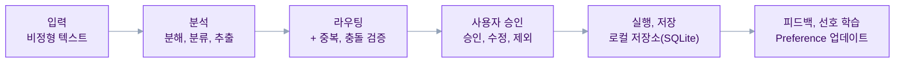
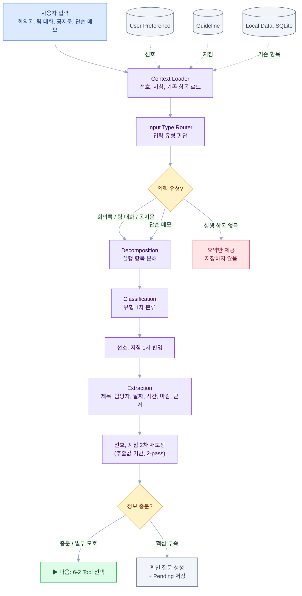
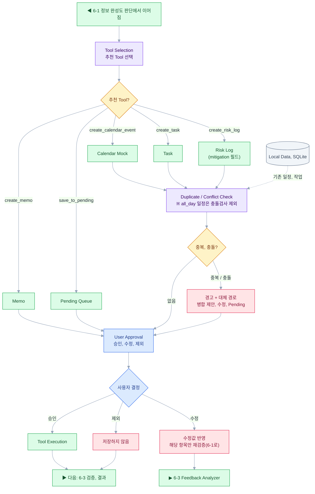
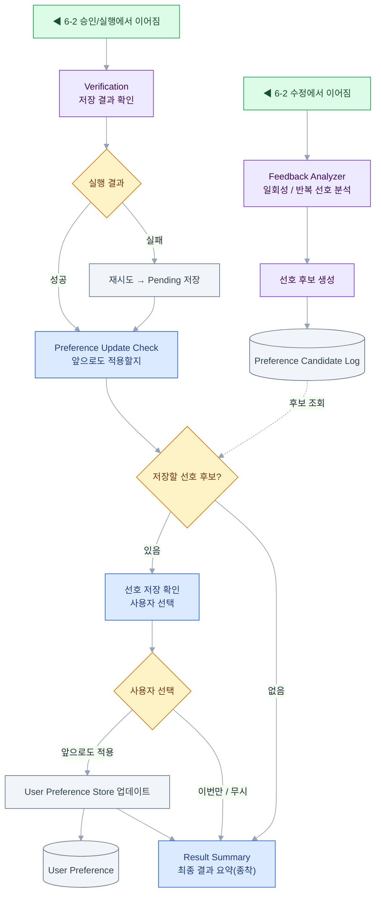
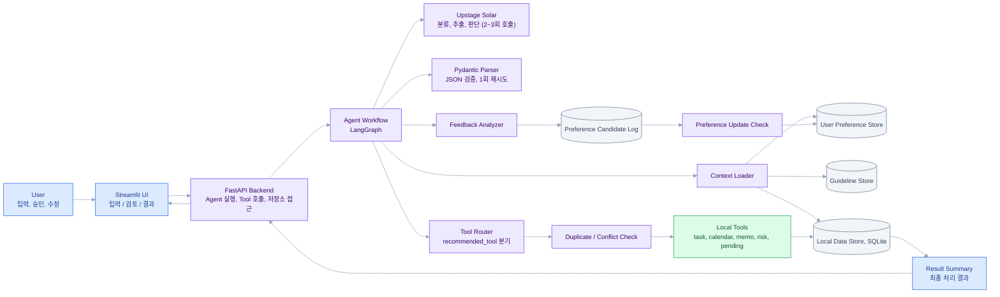

# [6조] Action Router Agent 프로젝트 기획서

*비정형 텍스트 기반 실행 항목 라우팅 Agentic Workflow*

| 항목 | 내용 |
| --- | --- |
| 주제 | Action Router Agent: 비정형 텍스트 기반 실행 항목 라우팅 Agentic Workflow |
| 참여자 | 박성종, 이동근, 이우태, 임재현, 장현 |
| 문서 구분 | 완성용 (통합1) |
| 작성 기준 | Q&A 통합 검토 + 결정사항_Claude.md 반영 |

> **프로젝트 성격**  본 프로젝트는 장기 서비스 출시가 아니라 3주 AI 기술교육 과제에 맞춘 '로컬 실행 가능한 Agentic Workflow 데모'이다. 다만 사용자에게 제공되는 경험은 서비스 형태로 설명한다(데모, 서비스 병행).


## 1. 문제 정의 및 프로젝트 개요


### 프로젝트 한 줄 정의 [필수]

회의록, 메신저 대화, 공지문, 단순 메모처럼 비정형으로 작성된 텍스트에서 실행 항목을 추출하고, Agent가 항목 유형과 처리 경로를 스스로 판단하여 적절한 Tool로 라우팅하는 'Action Router Agent' 서비스. (이번 단계에서는 로컬에서 실행 가능한 Agentic Workflow 데모로 구현한다.)


### 서비스 한 줄 정의 [필수]

사용자가 텍스트를 붙여넣으면 Agent가 일정, 할 일, 메모, 리스크, 보류 항목으로 자동 분류하고, 사용자 승인을 거쳐 실행 가능한 작업 목록으로 정리해 주는 AI 실행 항목 정리 서비스.


### 서비스 선정 배경 [권장]

팀 프로젝트와 교육 과정에서는 회의록, 팀 대화, 공지문, 과제 안내, 개인 메모 등 다양한 텍스트에 일정, 할 일, 담당자, 마감일, 리스크가 섞여 등장한다. 사용자는 이를 직접 읽고 옮겨야 하며 그 과정에서 누락, 모호가 잦다. 본 프로젝트는 3주 안에 로컬에서 동작하는 Agentic Workflow 구현이 목표이므로, 외부 플랫폼 연동보다 Agent가 스스로 판단, 분기하며 Tool을 선택하는 흐름에 집중한다.


### 해결하려는 문제 [필수]

- 텍스트 안의 실행 항목 누락
- 한 문장에 여러 작업, 일정, 리스크, 참고 메모가 섞여 있는 문제
- 담당자, 마감일, 날짜, 시간 등 핵심 정보 누락, 모호
- 일정, 할 일, 메모, 리스크, 보류를 사람이 매번 직접 구분해야 하는 문제
- 사용자가 Agent 판단을 수정해도 그 선호가 다음 판단에 반영되지 않는 문제

### 대상 사용자 [필수]

회의록, 메신저 대화, 공지문, 단순 메모를 바탕으로 팀 작업을 정리해야 하는 프로젝트 팀원, 팀장, 교육 과정 참여자, 소규모 협업팀.


### 핵심 가치 [필수]

단순 요약이 아니라 비정형 텍스트를 실행 가능한 항목으로 전환하고, Agent가 각 항목의 유형과 처리 경로를 판단해 적절한 Tool로 라우팅한다. 또한 사용자 수정사항을 Preference Candidate로 분석하고 사용자가 승인한 선호만 장기 저장하여 이후 판단에 반영한다.


## 2. 사용자 및 Agent 설계


### 타깃 사용자 페르소나 [권장]

20대 초중반의 개발 프로젝트 팀원 또는 팀장. Notion, Google Docs, Discord, Slack, 카카오톡 등 여러 채널에서 회의 내용과 작업 요청을 확인한다. 짧은 기간에 데모, 문서, 발표자료를 동시에 준비해야 하므로 작업 누락과 마감 관리에 민감하다.


### Agent의 역할 [필수]

1. Context Loader: User Preference Store, Guideline Store, Local Data Store(SQLite)를 조회한다.
2. Input Type Router: 입력 유형을 회의록, 팀 대화, 공지문, 단순 메모, 실행 항목 없음으로 판단한다.
3. Decomposition: 한 입력에 섞인 여러 실행 항목을 독립 항목으로 분해한다(단순 메모도 실행 항목 검사).
4. Classification: 각 항목을 일정, 할 일, 메모, 리스크, 보류, 무시로 분류한다.
5. 선호, 지침 반영: 1차는 프롬프트 컨텍스트로 반영하고, 2차는 추출 결과를 기준으로 코드 후처리(재보정)한다.
6. Extraction: 제목, 담당자, 날짜, 시간, 마감일, 우선순위, 근거 문장을 추출한다.
7. Completeness Check: 필수 필드가 없거나 confidence가 MVP 초기 기준값(0.7) 미만이면 확인 필요/Pending으로 보낸다(임계값은 팀 검토로 조정).
8. Tool Routing: 항목 유형과 정보 완성도에 따라 Local Tool을 선택한다.
9. Duplicate / Conflict Check: 기존 저장소와 비교해 중복, 일정 충돌을 검증한다.
10. User Approval: 승인, 수정, 제외된 항목만 저장 대상으로 확정한다.
11. Feedback Analyzer: 사용자 수정사항을 분석해 Preference Candidate를 생성한다.
12. Preference Update Check: 작업 종료 시 선호 저장 여부를 확인한다.

### Agent의 성격 및 톤앤매너 [권장]

전문적이고 간결한 업무 보조 Agent. 모호한 정보는 임의로 확정하지 않고 추론값, 확인 필요, 보류 상태로 구분해 보여주며, 판단 결과, 추천 Tool, 판단 근거, 중복/충돌 여부를 명확히 제시한다.


### Agent의 자율성 범위 [필수]

- 입력 유형 판단, 항목 분해, 분류, 정보 추출, Tool 선택, 중복/충돌 검증, 피드백 분석을 자율 수행한다.
- 실제 저장은 사용자 승인 이후에만 수행한다.
- 사용자 수정사항은 즉시 장기 선호로 저장하지 않고 Preference Candidate로 임시 기록한다.
- 사용자가 '앞으로도 적용'을 선택한 선호만 User Preference Store에 저장한다.

## 3. 핵심 기능 및 사용자 흐름


### 주요 사용자 시나리오 [필수]

데모 안정성을 위해 공식 데모 3개(필수)를 고정하고, 선호 학습 2개는 확장으로 둔다.

| 구분 | 입력 예문 / 상황 | 검증 포인트 | Tier |
| --- | --- | --- | --- |
| 필수 | '내일까지 성종은 발표자료, 동근은 API 테스트 정리, 우태는 데모 영상 준비. 금요일 오전 10시 최종 리허설하자.' | 다항목 분해, 분류, Tool Routing, 저장 | Tier 1 |
| 필수 | '다음 주쯤 멘토님께 보여드리고, 안 되면 캘린더 연동은 Mock으로 대체하자.' | 모호 일정→확인 질문/Pending, 리스크 분리(mitigation) | Tier 1 |
| 필수 | '다음 주 화요일 오전 10시에 팀 회의 잡자.' (같은 시간 기존 일정 존재) | 일정 충돌 감지, 대체 경로 제안 | Tier 2 |
| 확장 | '다음 주쯤 멘토님께 보여드리자.' (모호 날짜→Pending 선호가 저장된 상태) | 저장된 선호 반영 | Tier 2 |
| 확장 | Agent가 '기획서 다시 보기'를 메모로 분류 → 사용자가 할 일로 수정 | Feedback Analyzer, Preference Candidate 생성 | Tier 3 |


### 핵심 기능 정의 [필수]

- 텍스트 입력 UI(붙여넣기)
- Context Loader: 선호, 지침, 기존 항목 요약 조회
- 입력 유형 판단(meeting_note / chat / notice / memo / none)
- 실행 항목 분해
- 항목 분류 및 정보 추출(task / calendar / memo / risk / pending / ignore)
- 선호, 지침 반영(추출 전/후 2-pass)
- 정보 완성도 판단(필수 필드, confidence)
- Tool Routing(recommended_tool 기준 Local Tool 호출)
- 중복, 충돌 검증(SQLite 저장소 대조)
- 사용자 승인 UI(승인/수정/제외)
- Feedback Analyzer 기반 선호 후보 생성 및 선호 저장 확인
- 결과 요약 및 저장소 탭 보기

### 사용자 관점 워크플로우 [필수]

1. 사용자가 비정형 텍스트를 입력한다.
2. Agent가 선호, 팀 지침, 로컬 저장소 요약을 불러온다.
3. Agent가 입력 유형을 판단하고 실행 항목을 분해한다.
4. 각 항목을 분류하고 필요한 정보를 추출한다.
5. Tool Routing, 중복/충돌 검증, 확인 필요 여부를 판단한다.
6. 사용자가 항목별 판단 근거를 확인하고 승인/수정/제외한다(다항목은 표로 일괄 표시).
7. 승인된 항목만 Local Tool을 통해 저장된다.
8. 수정사항 중 반복 가능한 항목은 Preference Candidate로 기록된다.
9. 작업 종료 시 사용자가 앞으로 적용할 선호를 선택한다.
10. 최종 저장 결과와 실패/보류 항목을 확인한다.

### 시스템 관점 워크플로우 [권장]

Input → Context Loader → Input Type Router → Decomposition → Classification → 선호, 지침 1차 → Extraction → 선호, 지침 2차 재보정 → Completeness Check → Tool Selection → Duplicate/Conflict Check → User Approval → Tool Execution → Verification → Feedback Analyzer → Preference Candidate → Preference Update Check → Result Summary. (상세 도식은 6장 참조. 사용자 승인 결과는 UI가 아니라 Workflow/FastAPI가 Tool을 실행한다.)


## 4. 기술 구현 설계


### 기술 스택 [필수]

| 영역 | 채택안 | 비고 |
| --- | --- | --- |
| Language | Python | Streamlit/FastAPI 생태계 |
| UI | Streamlit | 입력, 승인/수정, 결과 확인 |
| Backend | FastAPI | Agent 실행, Tool 호출, 저장소 접근 API |
| Agent Workflow | LangGraph | 노드, 분기, 루프 구현 |
| LLM | Upstage Solar | 교육 크레딧 사용 가능 모델 |
| Structured Output | Pydantic | JSON 출력 검증, 재시도 |
| Storage | SQLite | 조회, 중복검사 / 난이도 시 JSON 대체 가능 |
| Tools | Python 함수 기반 Local Tools | create_task, create_calendar_event 등 |
| Memory | Preference / Guideline / Candidate Store | 선호, 지침, 선호 후보 기록 |


### 시스템 아키텍처 [권장]

Streamlit은 입력, 승인, 수정, 결과 확인을 담당한다. FastAPI는 Agent Workflow 실행, Tool 호출, 저장소 접근, Preference 업데이트를 담당한다. LangGraph가 판단 노드와 분기 흐름을 구성하고, Tool은 외부 서비스가 아닌 로컬 저장 함수로 구현한다. Tool Routing은 네이티브 function-calling이 아니라 Solar의 JSON 출력을 코드가 해석해 분기하는 방식이므로 JSON 출력 안정성 확보가 핵심이다. (상세 구성도는 7장 참조.)


### 프롬프트 및 Structured Output 전략 [권장]

- Solar에 입력 텍스트, 기준 날짜(KST), User Preference, Guideline, 기존 저장소 요약을 함께 제공한다.
- 출력은 정해진 JSON Schema를 따르게 하고 Pydantic으로 검증한다.
- 검증 실패 시 1회 재시도하고, 그래도 실패하면 분석 실패 표시 + 원문을 Pending에 저장한다.
- LLM 호출은 노드마다 매번 하지 않고 2~3회로 분할한다(분류, 추출 / 완성도+Tool선택 / Feedback분석).
- recommended_tool 필드를 기준으로 코드가 Local Tool 함수를 호출한다.
```json
{
  "input_type": "meeting_note",
  "items": [
    {
      "type": "task",
      "title": "발표자료 만들기",
      "assignee": "박성종",
      "due_date": "2026-06-06",
      "priority": "high",
      "confidence": 0.91,
      "needs_confirmation": false,
      "recommended_tool": "create_task",
      "source_sentence": "내일까지 성종은 발표자료 만들고"
    }
  ]
}
```


### 데이터 활용 및 기억 관리 [권장]

MVP에서는 Vector DB 기반 RAG를 사용하지 않고, 필요한 선호, 지침을 SQLite에서 직접 조회해 프롬프트와 후처리 로직에 반영한다. 저장소 구성은 다음과 같다.

| 저장소 | 역할 |
| --- | --- |
| Task Store | 승인된 할 일 항목 저장 |
| Calendar Mock Store | 승인된 일정, 충돌 검증용 일정 저장 |
| Memo Store | 참고 가치가 있는 메모 저장 |
| Risk Log Store | 리스크와 대응 방안(mitigation) 저장 |
| Pending Queue | 정보가 부족한 항목, 확인 질문 저장 |
| User Preference Store | 사용자가 승인한 장기 선호 규칙 저장 |
| Guideline Store | 팀, 서비스 차원의 판단 지침 저장 |
| Preference Candidate Log | 사용자 수정 기반 선호 후보 임시 기록 |


### 주요 판단 규칙 [필수]

- 코드 enum은 영문 snake_case로 쓰고 화면에는 한글 라벨로 매핑한다.
- 특정 시각/시간대가 있으면 calendar, 산출물과 마감일이 있으면 task로 분류한다.
- 날짜만 있는 일정은 all_day=true로 저장하고, 일반 시간대 충돌 검사에서는 제외한다.
- 시작 시간이 있는 일정은 기본 길이를 1시간으로 두고 '추정: 1시간'으로 표시한다.
- 일정 충돌은 시작, 종료 시간 범위 겹침으로 판정한다.
- 리스크 대응 방안은 별도 task로 자동 생성하지 않고 Risk Log의 mitigation 필드에 기록한다.
- 필수 필드(title, type) 누락 또는 confidence가 MVP 초기 기준값(0.7) 미만이면 확인 필요/Pending으로 분기한다(임계값은 팀 검토로 조정).
- priority 예시 기준: 마감 24시간 이내 또는 '급하게/중요' 표현이면 high, 기본값 medium(규칙은 팀 검토로 확정).
- 단순 메모도 실행 항목 존재 여부를 검사해 있으면 분해하고, 없으면 Memo로 저장한다.
- 선호, 지침은 1차는 프롬프트 컨텍스트로 반영하고, 2차는 추출 결과 기준 코드 후처리(재보정)로 적용한다(2-pass).
- Guideline Store가 User Preference Store보다 우선한다(그다음 LLM 기본 판단).
- Task 중복은 제목 유사 + 담당자 동일 + 마감일 동일/근접으로 보고, 병합은 제안만 한다.
- 유사도 판정은 규칙 기반을 우선하고 애매한 경우만 LLM을 보조로 쓴다.
- 사용자 수정 후에는 수정된 항목만 정보 완성도, Tool Routing, 중복/충돌 검증을 다시 수행한다.

### confidence 산정 및 확인 필요 분기 [필수]

confidence는 분류가 맞을 확률이 아니라 '이대로 바로 등록하거나 실행해도 되는 확신도'다. 의미 판단은 LLM이, 점수 계산과 임계값 분기는 코드가 맡는 하이브리드로 산정한다.

LLM은 점수를 직접 매기지 않고, 판단에 필요한 플래그를 항목별로 출력한다.

- type, type_certainty (분류 확신도)
- date_status: concrete / vague / missing
- assignee_present: true / false
- time_present: true / false
- needs_base_event: true / false ('회의 전까지'처럼 기준 이벤트가 필요한 표현)
- required_ok: true / false (해당 유형의 필수 필드 충족 여부)
불확실성은 두 가지이고 순서가 있다. (1) 분류 확신도: 이 유형이 맞는가(LLM). (2) 완성도: 그 유형 기준으로 정보가 충분한가(코드, 유형별 필수 필드). 완성도는 유형이 정해져야 의미가 있으므로 분류가 먼저다.

분기 순서: 분류 확신도가 낮으면 그 자체로 확인 필요로 보낸다(사유: 분류 애매). 이때 완성도는 top-1 유형을 가정한 조건부 값이라 결정에 쓰지 않는다. 분류가 충분히 확실할 때만 완성도를 따져 부족하면 확인 필요로 보낸다(사유: 정보 부족).

| 유형 | 필수(없으면 확인 필요) | 감점/평가 대상 | 비고 |
| --- | --- | --- | --- |
| 할 일(task) | title | 담당자 없음, 마감 없음/모호 | 둘 다 없으면 크게 감점 |
| 일정(calendar) | title, 날짜 | 날짜 모호 | 시간 없음은 감점 아님, all_day 처리 |
| 메모(memo) | title/내용 | 거의 없음 | 완성도는 늘 높음, 불확실성은 분류 쪽 |
| 리스크(risk) | 설명 | 거의 없음 | mitigation은 선택 |
| 보류(pending) | - | - | 정의상 정보 부족, 이미 낮음 |
| 무시(ignore) | - | - | 점수 의미 없음 |

규칙 기반 점수 예시(코드): 기본 1.0에서 시작해 다음을 감점한다.

- 날짜 vague: -0.3, (해당 유형에서 필수인데) missing: -0.2
- 할 일인데 assignee 없음: -0.2
- 일정인데 time 없음: 감점 아님, all_day로 처리
- needs_base_event(기준 이벤트 필요): -0.3
- 0에서 1 사이로 clamp
결합과 표시: 표시용 confidence는 min(완성도, 분류 확신도)으로 둬서 약한 고리를 그대로 드러낸다. 실제 분기 needs_confirmation은 단순 평균이나 합이 아니라 OR 게이트로 한다. 즉 분류 확신도가 낮거나, 분류는 통과했지만 완성도가 낮으면 둘 중 하나만 걸려도 확인 필요로 보낸다.

모호와 누락: 필수 필드가 모호하거나 누락이면 점수와 무관하게 무조건 확인 필요로 보낸다. 모호한 표현은 틀린 값을 자신 있게 추론할 위험(false precision)이 있어 누락과 같거나 약간 더 경계한다. 경계 판단은 점수 숫자가 아니라 플래그로 한다.

화면 표시: 숫자는 한 개(min 값)만 보여주고, 확인 필요 배지와 사유 한 줄(분류 애매 또는 정보 부족)로 어느 축에서 막혔는지 알린다. 두 점수를 따로 노출하지 않는다.

임계값: confidence 0.7은 데이터로 계산하는 값이 아니라 MVP 초기 컷오프다. 데모 시나리오를 돌려보며 팀이 손으로 조정한다(팀 검토 항목).


### 제약사항 및 예외 처리 [필수]

- Slack, Notion, 이메일, 실제 Google Calendar API 연동은 MVP에서 제외(Google Calendar는 후속 확장).
- 외부 서비스 배포, 복잡한 사용자 계정 관리 제외.
- Vector DB 기반 RAG, 대규모 장기 메모리 검색 제외.
- 복잡한 멀티 에이전트 구조 제외.
- 정보 부족 항목은 Pending Queue에 저장하고 확인 질문을 함께 표시한다(실시간 채팅 왕복은 미구현).
- 확인 질문 경로(clarification)는 별도 저장 Tool이 아니라 '질문 생성 + Pending 저장' 경로다.
- Tool 실행 실패 시 원문, 실패 사유를 Pending Queue에 임시 저장한다.
- 대표 시나리오 외 입력은 best-effort로 처리한다.
- 병합 기능은 제안만 표시하고 실제 동작은 새로 생성/제외/Pending으로 제한한다.

## 5. 성과 평가 및 실행 계획


### 성공 지표 [권장]

- 필수 시나리오 3개에서 입력부터 저장 결과 확인까지 End-to-End로 실행된다.
- 하나의 입력에서 여러 실행 항목을 분해할 수 있다.
- 일정, 할 일, 메모, 리스크, 보류, 무시를 구분하고 recommended_tool을 자동 선택한다.
- 각 항목별 recommended_tool과 routing_reason(근거)을 화면에 표시한다.
- 기존 저장소와 비교해 일정 충돌, Task 중복 후보를 표시한다.
- 사용자 승인 항목만 로컬 저장소에 저장한다.
- Workflow 로그로 Agent가 탄 분기를 확인할 수 있다.
- (확장) 사용자 수정 → Preference Candidate 생성과 선호 저장 전/후 차이를 보여준다.

### MVP 범위 [필수]

| Tier | 범위 | 항목 |
| --- | --- | --- |
| Tier 1 | 필수(1차 데모) | 텍스트 입력, 항목 분해, 분류, 정보 추출, Tool Routing, 사용자 승인, 로컬 저장, 결과 요약 |
| Tier 2 | 차순위 | Context Loader, 선호/지침 반영, 중복/충돌 검증, Workflow 로그 표시 |
| Tier 3 | 여유 시 | Feedback Analyzer, Preference Candidate, 선호 저장 확인, Clarification 폼 보완, Tool 실패 시연 |

[MVP 제외] 외부 서비스 실시간 연동, 서비스 배포, 복잡한 계정 관리, Vector DB RAG, 대규모 장기 메모리 검색, 멀티 에이전트, 완성형 캘린더/PM 서비스, 병합 기능(제안만), Google Calendar API(후속 확장).


### 단계별 개발 로드맵 [필수]

| 기간 | 목표 | 주요 작업 |
| --- | --- | --- |
| 5/31 | 기획서 제출 | 기획서 정리, 시나리오 확정, 기술 스택 확정 |
| 6/1~6/2 | 스키마/저장소/Tool 설계 | Pydantic 모델, SQLite 스키마, Local Tool 함수 정의 |
| 6/3~6/4 | Agent Core 구현 | LangGraph 노드, Solar JSON 출력, Context Loader, Tool Routing |
| 6/5~6/6 | UI 및 통합 | Streamlit 화면, FastAPI 연결, 승인/수정 흐름, 저장소 탭 |
| 6/7 | 1차 데모 제출 | 필수 시나리오 테스트, 오류 케이스 정리, 결과 요약 |
| 6/8~6/10 | 개선 및 발표 준비 | 확장 시나리오, Preference 흐름 보강, 발표 자료 |
| 6/11(목) 14:00~16:00 | 데모 발표 | 데모 시연, 결과 발표 |

※ 6/8~6/10은 데모 발표 준비 기간이다(발표: 6/11(목) 14:00~16:00). 기획서 자체는 발표하지 않고 제출만 하며, 팀 내부 작업 참고용으로 최대한 자세히 작성한다.


### 역할 분담안 [필수]

| 역할 | 주요 책임 | 담당자 |
| --- | --- | --- |
| Streamlit UI | 입력, 분석 결과, 승인/수정, 저장소 탭 |  |
| FastAPI Backend | API 엔드포인트, Agent 실행, 상태 흐름 |  |
| Agent Workflow / LangGraph | 노드 구성, 분기, Tool Routing | 공동 가능 |
| Local Tools / Storage | SQLite 스키마, 저장 함수, 중복/충돌 검증 |  |
| Preference / Feedback | Preference Candidate, 선호 저장 확인 |  |
| Demo / Docs | 시나리오 테스트, 발표자료, 문서 정리 |  |

※ 담당자는 팀 협의로 배정. Agent Workflow/LangGraph는 공동 또는 복수 인원 배정 가능.


### 기대 효과 [권장]

단순 요약형 챗봇이 아니라 입력을 해석하고 실행 항목을 분해하며 항목별 처리 경로와 Tool을 선택하는 Agentic Workflow를 구현한다. 특히 '정보가 부족하면 등록 대신 Pending/질문으로 스스로 경로를 바꾸는 점'과 '사용자 수정을 반복 선호로 학습하는 점'이 단순 분류기와의 핵심 차이다.


## 6. Agentic Workflow 흐름도

전체 흐름은 아래 요약(미니맵)으로 한눈에 보고, 세부 판단, 분기는 단계별 상세(6-1~6-3)에서 확인한다. 토막 사이의 '◀ / ▶' 표시는 앞뒤 단계 연결을 뜻한다.


*그림 1. 전체 흐름 요약(미니맵)*


### 6-1. 분석 단계 (입력 → 정보 완성도 판단)


*그림 1-1. 입력, Context Loader, 분해, 분류, 추출, 선호 2-pass, 완성도*


### 6-2. 라우팅, 검증, 승인 (Tool 선택 → 실행)


*그림 1-2. Tool 선택, 중복/충돌 검증, 사용자 승인, 실행*


### 6-3. 피드백, 선호, 결과 (검증 → 선호 저장)


*그림 1-3. 검증, 결과 요약, Feedback Analyzer, 선호 저장 확인*


## 7. 시스템 구성도


*그림 2. 시스템 구성 (Streamlit, FastAPI, LangGraph, Solar, SQLite)*


## 8. 확인 필요 사항

- Upstage Solar의 정확한 사용 가능 모델명, API 범위는 교육 운영 자료 또는 코치님 확인 후 확정한다.
- FastAPI, LangGraph는 현재 필수 기술로 가정해 작성했으며, 과정 요구사항 확인 후 필요 시 조정한다.
- SQLite 구현 난이도가 일정상 부담될 경우 JSON 파일 저장소로 대체할 수 있다.
