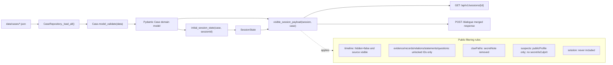
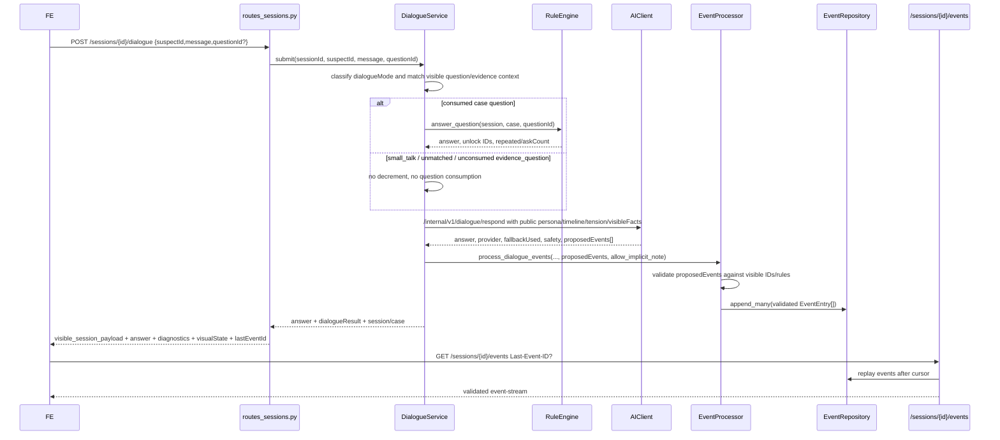
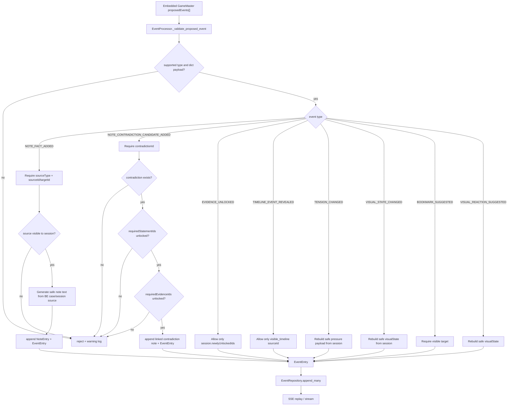
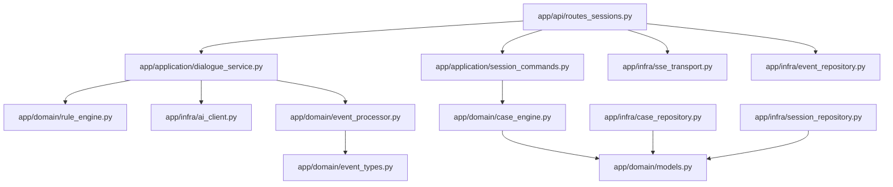

# Backend architecture and model map

This document is the BE-local map for future backend agents. It documents the current runtime shape, public/hidden boundaries, and migration gaps against the canonical DOCS story contracts. Canonical story architecture is owned by DOCS; this file references the canonical target docs rather than inventing story schema.

Canonical references:

- `../../Docs/story-architecture.md`
- `../../Docs/story-data-contract.md`
- `../../Docs/service-contract-dialogue-story.md`
- `../../Docs/story-validation-gates.md`
- `../../Docs/Senario/schema.md`

## Scope

Backend is the authoritative service for:

- case JSON loading and Pydantic validation
- session state and unlock persistence
- deterministic question, contradiction, and accusation verdicts
- free-text dialogue classification and AI request context assembly
- validating GameMaster `proposedEvents`
- publishing validated session updates through SSE
- building FE-safe public payloads

AI may draft dialogue and propose events, but BE validates and applies state changes.

## Case JSON to public session payload

Key code paths:

- `app/infra/case_repository.py`: loads JSON and validates `Case`.
- `app/domain/models.py`: Pydantic domain models for case and session state.
- `app/domain/case_engine.py`: initializes sessions, applies unlocks, builds public payloads.
- `app/api/routes_sessions.py`: merges `lastEventId` and `visualState` into session responses.

## Dialogue and event flow

Dialogue response diagnostic fields exposed to FE:

- `answer`
- `dialogueResult.messageId`
- `dialogueResult.suspectId`
- `dialogueResult.dialogueMode` / `dialogueResult.intent`
- `dialogueResult.matchedQuestionId` nullable for `small_talk`, `unmatched`, or unconsumed evidence context
- `dialogueResult.consumedQuestion`
- `dialogueResult.previousRemainingQuestions`
- `dialogueResult.remainingQuestions`
- `dialogueResult.remainingQuestionsDelta`
- `dialogueResult.repeated`, `askCount`, `unlockedIds`
- `dialogueResult.provider`, `fallbackUsed`, `safety`
- `dialogueResult.proposedEventsCount`, `appliedEventsCount`
- `dialogueResult.emotionalState`, `tensionLevel`
- top-level `provider`, `fallbackUsed`, `safety`, `proposedEventsCount`, `appliedEventsCount`
- `proposedEventsApplied` event IDs
- `visualState`
- merged session fields, including `lastEventId`

## Event validation flow

Important behavior:

- `small_talk` and `unmatched` call `process_dialogue_events(..., allow_implicit_note=False)` and do not create `NOTE_FACT_ADDED` unless a validated explicit proposed event supplies a visible source reference.
- For consumed case/evidence questions, BE may add an implicit fact note if no validated `NOTE_FACT_ADDED` was proposed.
- AI text is not trusted as authoritative note content for proposed fact notes. BE derives note text from visible source IDs.
- Contradiction candidate notes require a known `contradictionId` whose required statement/evidence IDs are currently visible/unlocked.

## Data model relationships

```mermaid
erDiagram
    Case ||--o| Opening : has
    Case ||--o| Storyline : has
    Storyline ||--o{ StoryAct : contains
    Storyline ||--o{ TimelineEvent : contains
    Storyline ||--o{ CluePath : contains
    CluePath ||--o{ CluePathStep : contains
    Storyline ||--o{ ObjectiveRule : contains

    Case ||--o{ Character : suspects
    Case ||--o{ CharacterTimeline : target_characterTimelines
    Case ||--o{ VisualProfile : target_visualProfiles
    Case ||--o{ Evidence : evidence
    Case ||--o{ Record : records
    Case ||--o{ Relationship : relations
    Case ||--o{ Statement : statements
    Case ||--o{ Question : questions
    Case ||--o{ Contradiction : contradictions
    Case ||--|| Solution : hidden_solution

    Character ||--o{ Statement : characterId
    Character ||--o{ Question : characterId
    Character ||--o{ Relationship : characterId
    Character ||--o{ Contradiction : relatedCharacterId
    Character ||--o{ CharacterTimeline : suspectId
    Character ||--o{ VisualProfile : suspectId
    Question ||--o{ Statement : unlocksStatementIds
    Question ||--o{ Evidence : unlocksEvidenceIds
    Question ||--o{ Record : unlocksRecordIds
    Question ||--o{ Relationship : unlocksRelationIds
    Contradiction ||--o{ Statement : requiredStatementIds
    Contradiction ||--o{ Evidence : requiredEvidenceIds

    Case ||--o{ SessionState : creates
    SessionState ||--o{ DialogueEntry : dialogueLog
    SessionState ||--o{ NoteEntry : notes
    SessionState ||--o{ BookmarkEntry : bookmarks
    SessionState ||--o{ EventEntry : event_stream
    SessionState }o--o{ Evidence : unlockedEvidenceIds
    SessionState }o--o{ Record : unlockedRecordIds
    SessionState }o--o{ Relationship : unlockedRelationIds
    SessionState }o--o{ Statement : unlockedStatementIds
    SessionState }o--o{ Question : unlockedQuestionIds
    SessionState }o--o{ Contradiction : discoveredContradictionIds
```

## Public vs hidden/private field boundary

### Hidden/private in case data or domain models

These fields must not appear in FE public payloads or AI public dialogue context unless a future DOCS-owned contract explicitly allows a reveal path:

- `Character.secret`
- `Character.isCulprit`
- `Case.solution`
- `Solution.culpritId`, `motive`, `method`, `required*`, `endings`
- `TimelineEvent.hidden`
- hidden global timeline entries before they become public by an explicit rule
- target `characterTimelines[].privateEvents`
- target private character timeline fields such as private `actualAction`/`actualLocation` truth
- target `persona.privateMotive`, `persona.secret`
- `CluePath.secretNote`
- any private character timeline/persona fields added later

### Exposed to FE via session payload

Current safe public fields include:

- session: `sessionId`, `caseId`, `phase`, `remainingQuestions`, `selectedSuspectId`, `lastEventId`, `visualState`
- story: `opening`, public `storyline.publicPremise`, acts, public clue paths without `secretNote`, `visibleTimeline`
- suspects: `characterId`, `name`, `role`, `publicProfile`, target `publicPersona`, `motiveCandidate`, `pressure`, `pressureState`, `tensionLevel`, target `tensionScore`, `emotionalState`, target `expression`, `speechStyle`, `publicTimeline`
- session content: `dialogueLog`, `notes`, `bookmarks`
- visible/unlocked collections: `evidence`, `records`, `relations`, `statements`, `questions`
- state IDs: `unlockedQuestionIds`, `askedQuestionCounts`, `newlyUnlockedIds`, `discoveredContradictionIds`, `pressureBySuspect`, `pressureStates`
- accusation summary after accusation: submitted motive/method may be preserved in public response; deterministic verdict remains based on IDs

### Exposed to AI dialogue endpoint

`DialogueService` sends only BE-curated context:

- `caseId`, `sessionId`, `currentActId`; target also includes `requestId` and `currentObjective`
- `dialogueMode` / `intent`
- `consumedQuestion`
- selected suspect public fields: `id`, `name`, `role`, `publicProfile`, target `publicPersona`, `speechStyle`, `publicTimeline`, `pressure`, `pressureState`, `tensionLevel` label, target `tensionScore`, `emotionalState`, target `expression`
- player `message`
- matched `question` if any
- `allowedStatement` for matched context or neutral fallback context; target shape includes `sourceRefs`
- `visibleFacts`: currently visible statement/evidence/record IDs, discovered contradiction IDs, current objective/act, visible timeline
- target `storyline`, `characterTimeline`, `visualState`, and `allowedEventPolicy`
- `dialogueHistorySummary`
- `style` hint and `revealAllowed=false`

AI must not receive `secret`, `isCulprit`, full `solution`, private timeline entries, or hidden timeline items.

## Canonical decisions and BE migration plan

DOCS accepted the canonical story/data/dialogue contract in `../../Docs/story-data-contract.md` and `../../Docs/service-contract-dialogue-story.md`. BE-local implementation status:

1. `suspect.tensionLevel` is canonically a label string: `low | medium | high | critical`.
   - Current BE already sends label strings to AI and FE.
   - Numeric intensity is `suspect.pressure`; target may also expose `suspect.tensionScore` as a numeric alias/normalized score.
2. `characterTimelines[]` is first-class target case data.
   - Current BE does not have `Case.characterTimelines` yet.
   - Current BE derives `suspects[].publicTimeline` from visible global `storyline.timeline` entries whose source IDs match the character's visible statements/questions. This is a temporary adapter, not the accepted target shape.
   - Migration: add Pydantic models for `CharacterTimeline` with public/private event split, migrate `case_001.json`, and build `suspects[].publicTimeline` from `characterTimelines[].publicEvents` filtered by stable visible IDs.
3. `speechStyle` and `tensionProfile` belong in BE case data after migration.
   - Current BE uses `public_speech_style(characterId)` hardcoded mapping as a temporary adapter.
   - Migration: add `Character.persona`, `Character.speechStyle`, and `Character.tensionProfile`; remove hardcoded speech adapter once case data is migrated.
4. `allowedStatement` remains the factual anchor.
   - `publicTimeline` and `visibleFacts` may shape tone/context.
   - They may ground factual dialogue text only when referenced by `allowedStatement.sourceRefs` or `allowedEventPolicy` stable IDs.
   - Migration: enrich `_allowed_statement_for_question`/evidence context with `sourceRefs`, and include an `allowedEventPolicy` in BE -> AI payload.
5. Target BE -> AI payload additions still needed.
   - Add `requestId`, `currentObjective`, `storyline`, `characterTimeline`, `visualState`, and `allowedEventPolicy`.
   - Keep `revealAllowed=false` for interrogation dialogue.
6. Target visual fields still needed.
   - Canonical expression enum: `neutral`, `wary`, `defensive`, `angry`, `anxious`, `shocked`, `breakdown`, `confident_lying`, `sad`, `focused`.
   - Current BE exposes `characterImageState`/`emotionalState` and `tensionLevel`, but not a separate `expression` everywhere.
   - Migration: add `expression` to `visualState`, suspects, and relevant SSE payloads; use `tensionProfile` thresholds after case data migration.
7. Canonical contradiction candidate proposed event shape is richer than current BE validation.
   - Target payload fields: `candidateId`, `contradictionId`, `suspectId`, `statementIds`, `evidenceIds`, `timelineIds`, `confidence`, `reasonCode`, `displayText`, `submitEligible`.
   - Current BE validates primarily by `contradictionId` plus unlocked required statement/evidence IDs and regenerates public note text.
   - Migration: accept the richer payload shape, validate all supplied stable IDs, continue regenerating public text, and include safe canonical fields in SSE payload.

## Current implementation deltas against canonical docs

The runtime supports FE/AI with safe public fields, but these gaps remain relative to DOCS canonical contracts:

1. `Case.characterTimelines` missing from Pydantic model and case JSON.
2. `Character.persona`, `Character.speechStyle`, and `Character.tensionProfile` missing from Pydantic model and case JSON.
3. `suspects[].publicTimeline` is derived from global timeline source matching instead of `characterTimelines[].publicEvents`.
4. `allowedStatement.sourceRefs` is not consistently populated.
5. BE -> AI payload does not yet include target `requestId`, `currentObjective`, `storyline`, `characterTimeline`, `visualState`, or `allowedEventPolicy`.
6. `visualState.expression`, `suspects[].expression`, and `suspects[].tensionScore` are target fields but not consistently exposed by current runtime.
7. `TENSION_CHANGED` SSE payload should include `tensionLevel` and optionally `tensionScore`; current payload includes `pressure` and `pressureState`.
8. `NOTE_CONTRADICTION_CANDIDATE_ADDED` validation should migrate to the canonical candidate payload while preserving BE-side sanitization/regeneration.

These are now accepted migration items rather than open story-contract questions. Future runtime work should implement them against the canonical DOCS files above.

## File map

## Maintenance rules

- Update this document when changing public session payload, dialogue response contract, event types, or domain models.
- If a change alters story schema or public/private reveal semantics, send `CROSS-FEEDBACK` to DOCS and copy `orchest:1.1` before assuming a target shape.
- Runtime changes require normal BE tests and Docker refresh. Docs-only changes do not require Docker refresh.
