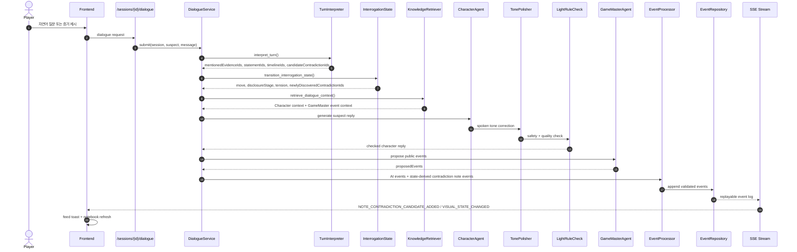
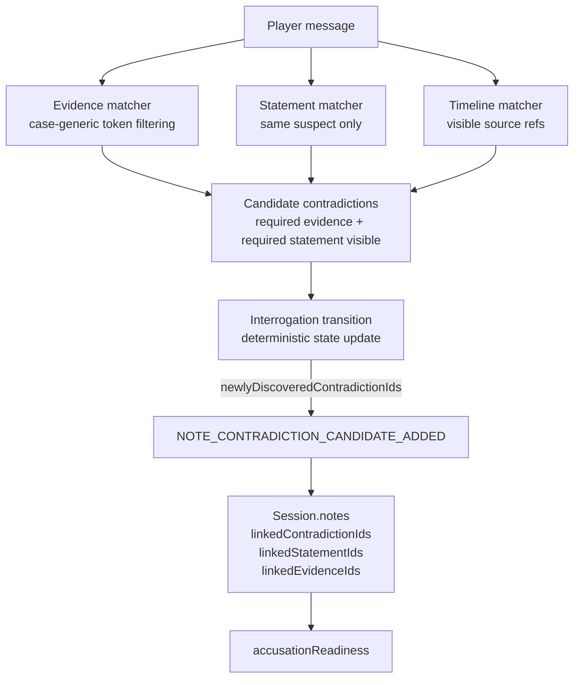
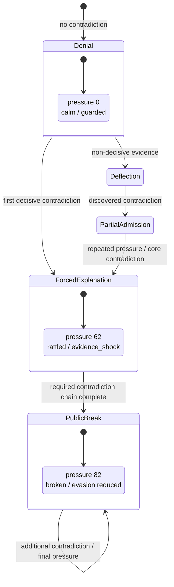
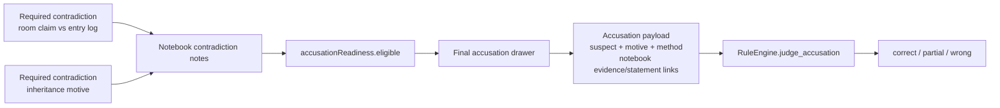

# Agentic Interrogation Flow

이 문서는 이번 PR에서 구현한 탐정 시뮬레이션 루프를 시각화한다. 핵심 목표는 용의자 대화 생성, 모순 인식, 사건 수첩 반영, 긴장 상태 전이, 최종 고발까지 한 번의 게임 플로우로 이어지게 만드는 것이다.

---

## 1. 전체 런타임 구조

```mermaid
flowchart LR
    Player["Player<br/>자연어 질문/증거 제시"]
    FE["Frontend<br/>InterrogationStage<br/>InvestigationDrawer"]
    API["FastAPI Session API"]
    DialogueService["DialogueService<br/>turn orchestration"]
    TurnInterpreter["TurnInterpreter<br/>intent/evidence/statement/timeline match"]
    StateEngine["InterrogationState<br/>deterministic transition"]
    Knowledge["KnowledgeRetriever<br/>Character / GameMaster context split"]
    Character["CharacterAgent<br/>suspect reply"]
    Tone["DialogueTonePolisher<br/>spoken Korean polish"]
    Guard["LightRuleCheck<br/>safety + quality regen"]
    GM["GameMasterAgent<br/>public event proposal"]
    Events["EventProcessor<br/>validated events + notes"]
    Store["Session/Event Store<br/>PostgreSQL + JSON fallback"]
    SSE["SSE Feed<br/>GM notification stream"]
    Notebook["Case Notebook<br/>notes + contradiction candidates"]
    Accuse["Accusation Endpoint<br/>final verdict"]

    Player --> FE --> API --> DialogueService
    DialogueService --> TurnInterpreter --> StateEngine
    DialogueService --> Knowledge
    Knowledge --> Character --> Tone --> Guard --> GM
    StateEngine --> DialogueService
    GM --> Events
    StateEngine -->|"newlyDiscoveredContradictionIds"| Events
    Events --> Store
    Events --> SSE --> FE
    Store --> Notebook --> FE
    FE -->|"notebook proof + selected proof"| Accuse
    Accuse --> Store

    classDef client fill:#172554,stroke:#60a5fa,color:#eff6ff;
    classDef be fill:#052e16,stroke:#34d399,color:#ecfdf5;
    classDef ai fill:#3b0764,stroke:#c084fc,color:#faf5ff;
    classDef state fill:#431407,stroke:#f59e0b,color:#fffbeb;
    classDef store fill:#1f2937,stroke:#94a3b8,color:#f8fafc;

    class Player,FE client;
    class API,DialogueService,TurnInterpreter,Events,Accuse be;
    class Knowledge,Character,Tone,Guard,GM ai;
    class StateEngine state;
    class Store,SSE,Notebook store;
```



설계 포인트:

- 생성은 LLM이 자율적으로 하되, 전이는 `InterrogationState`가 결정적으로 수행한다.
- `KnowledgeRetriever`는 캐릭터 응답 컨텍스트와 GameMaster 이벤트 컨텍스트를 분리한다.
- `EventProcessor`는 AI/BE 제안 이벤트를 세션 공개 정책에 맞춰 검증한 뒤에만 수첩과 SSE에 반영한다.
- 최종 고발은 사용자가 선택한 근거뿐 아니라 사건 수첩에 쌓인 모순 note 링크를 자동 포함한다.

---

## 2. 한 턴의 시퀀스



핵심 보장:

- 모순을 직접 언급한 턴은 `candidateContradictionIds`를 통해 `press_inconsistency`로 승격된다.
- 전이 엔진이 새 모순을 확정하면 GameMaster 이벤트 여부와 무관하게 수첩 후보 note가 만들어진다.
- SSE 피드는 같은 이벤트 로그를 읽기 때문에 새로고침/재접속에도 누락되지 않는다.

---

## 3. 모순 인식과 수첩 반영



오탐 방지:

- `서재`, `기록`, `증거`, `흔적`, 숫자형 시간 토큰처럼 케이스 전반에 흔한 단어는 증거 매칭에서 약화한다.
- 같은 턴에 언급되지 않은 증거가 `timeWindow`만으로 딸려 들어오지 않도록 했다.
- 같은 note는 이미 수첩에 있으면 중복 생성하지 않는다.

---

## 4. 긴장 상태와 발화 변화



데이터 소스:

- `BE/data/cases/case_001.json`의 `personaVariants`가 긴장도별 행동 양식을 가진다.
- `CharacterAgent`는 active overlay의 `tone`, `voice`, `styleDirectives`, `hesitation`, `evasiveness`를 프롬프트 컨텍스트에 넣는다.
- `DialogueTonePolisher`와 `LightRuleCheck`는 따옴표, 대본 지문, 자기 자신 제3자 호칭, 무협/사극 말투를 품질 실패로 다룬다.

---

## 5. 최종 고발 흐름



검증된 흐름:

1. 플레이어가 서재 출입 기록으로 방 알리바이를 압박한다.
2. `con_room_claim_vs_entry_log`가 수첩 note로 추가된다.
3. 플레이어가 찢어진 유언장으로 상속 갈등 부인을 압박한다.
4. `con_inheritance_motive`가 수첩 note로 추가된다.
5. `accusationReadiness.eligible=true`가 내려온다.
6. FE는 수첩 note의 `linkedEvidenceIds`, `linkedStatementIds`, `linkedContradictionIds`를 고발 payload에 자동 포함한다.
7. BE `RuleEngine`이 `correct / proofComplete=true`를 반환한다.

---

## 6. Runtime Verification Snapshot

마지막 Docker 검증에서 확인한 값:

```text
Backend health: 200
Frontend: 200
SSE event: NOTE_CONTRADICTION_CANDIDATE_ADDED / con_room_claim_vs_entry_log
accusationReadiness.eligible: true
accusation verdict: correct
proofComplete: true
FE build: success
BE tests: 2 passed
```

---

## 7. Review Checklist

- [x] 용의자 응답은 CharacterAgent + TonePolisher + LightRuleCheck 체인으로 자연어 발화 형태를 유지한다.
- [x] 전이는 점수 누적이 아니라 발견된 모순과 공개 근거에 의해 결정된다.
- [x] 모순 발견은 수첩 note와 SSE 피드로 연결된다.
- [x] 상태별 voice는 init data에서 읽고, 프롬프트 컨텍스트로 주입된다.
- [x] 최종 고발은 수첩 기반 proof를 자동 포함한다.
- [x] 공개 API/SSE에는 private solution refs가 직접 노출되지 않는다.
