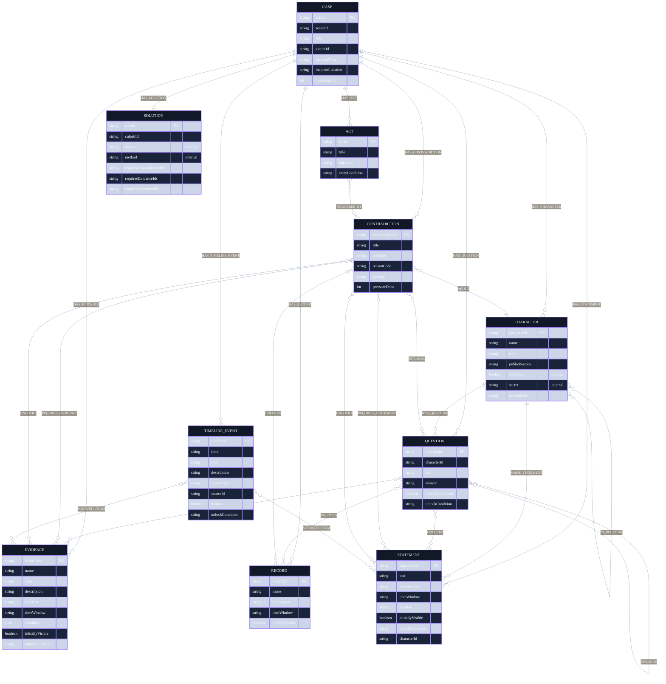
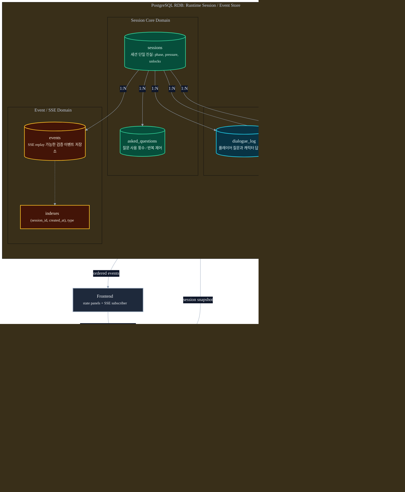
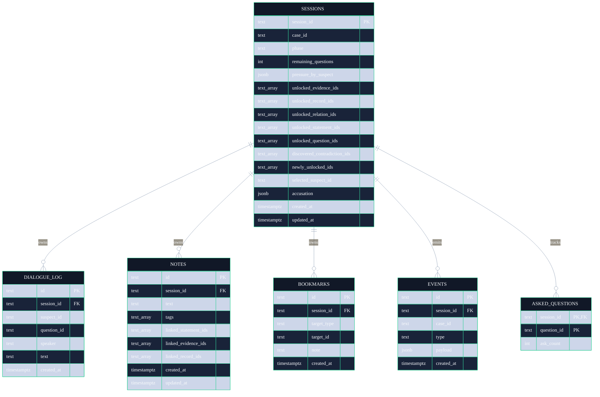
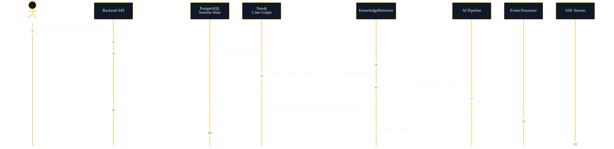

# Detective Agent DB 도메인 다이어그램

작성 목적: GraphDB(Neo4j)와 RDB(PostgreSQL)의 책임을 분리해서, 케이스 지식 그래프와 플레이 세션 상태가 섞이지 않도록 문서화한다.

근거 파일:
- GraphDB: `BE/scripts/init_neo4j.cypher`, `BE/scripts/migrate_case_to_neo4j.py`, `Docs/db-migration-plan.md`
- RDB: `BE/scripts/init_schema.sql`, `docker-compose.yml`

---

## 1. DB 책임 분리 요약

| 저장소 | 주 책임 | 저장 데이터 성격 | 쓰기 주체 | 읽기 주체 | 공개 경계 |
| --- | --- | --- | --- | --- | --- |
| Neo4j GraphDB | 케이스 지식, 추론 경로, 해금 체인 | 정적/준정적 Case Wiki | 케이스 마이그레이션/에디터 | KnowledgeRetriever, CaseRepository, RuleEngine | `secret`, `isCulprit`, `Solution`, hidden timeline은 공개 API로 직접 노출 금지 |
| PostgreSQL RDB | 세션 상태, 이벤트 로그, 플레이어 기록 | 세션별 동적 Runtime State | Backend Event Processor / SessionRepository | API, SSE replay, FE state builders | AI proposedEvents는 검증 후에만 반영 |

---

## 2. GraphDB / Neo4j 도메인 다이어그램

```mermaid
%%{init: {
  "theme": "base",
  "themeVariables": {
    "background": "#020617",
    "primaryColor": "#111827",
    "primaryTextColor": "#f8fafc",
    "primaryBorderColor": "#a78bfa",
    "lineColor": "#94a3b8",
    "secondaryColor": "#0f172a",
    "tertiaryColor": "#1e293b",
    "fontFamily": "JetBrains Mono, Pretendard, sans-serif"
  },
  "flowchart": {
    "curve": "basis",
    "nodeSpacing": 58,
    "rankSpacing": 82,
    "padding": 18,
    "htmlLabels": true
  }
}}%%
flowchart LR
    %% Layout rule:
    %% Case is the hub. Static case dimensions fan out horizontally.
    %% Unlock / evidence / contradiction loops are drawn inside the Puzzle lane to reduce edge crossing.

    subgraph GDB["Neo4j GraphDB: Case Knowledge / Truth Graph"]
        direction LR

        CaseHub(("Case<br/>case_001"))

        subgraph ActorLane["Actor Domain"]
            direction TB
            Character["Character<br/><small>용의자/피해자 공개 프로필 + 내부 비밀</small>"]
            Relation["IN_RELATION<br/><small>인물 관계·갈등·공개 여부</small>"]
            Question["Question<br/><small>캐릭터별 질문 후보 + 해금 조건</small>"]
            Statement["Statement<br/><small>진술·시간·장소·공개 여부</small>"]
            Character -->|HAS_QUESTION| Question
            Character -->|MADE_STATEMENT| Statement
            Character -.->|IN_RELATION| Relation
        end

        subgraph FactLane["Fact / Evidence Domain"]
            direction TB
            Evidence["Evidence<br/><small>물증·디지털·기록성 증거</small>"]
            Record["Record<br/><small>보고서·예약 기록·수첩 기록</small>"]
            Timeline["TimelineEvent<br/><small>공개/비공개 사건 시간축</small>"]
            Timeline -->|SOURCED_FROM| Evidence
            Timeline -.->|SOURCED_FROM| Statement
        end

        subgraph PuzzleLane["Puzzle / Unlock Domain"]
            direction TB
            Contradiction{{"Contradiction<br/><small>진술과 증거의 충돌 판정 단위</small>"}}
            UnlockChain["UNLOCKS<br/><small>질문·진술·증거·기록 해금 체인</small>"]
            Act["Act<br/><small>스토리 막 / 진입 조건</small>"]
            Contradiction -->|UNLOCKS| UnlockChain
            Act -->|TRIGGERED_BY| Contradiction
        end

        subgraph PrivateLane["Private Solution Domain"]
            direction TB
            Solution[["Solution<br/><small>범인·동기·수법·필수 단서</small>"]]
            Boundary["Public API Boundary<br/><small>secret/isCulprit/Solution 직접 노출 금지</small>"]
            Solution -. internal only .-> Boundary
        end

        CaseHub -->|HAS_CHARACTER| Character
        CaseHub -->|HAS_EVIDENCE| Evidence
        CaseHub -->|HAS_RECORD| Record
        CaseHub -->|HAS_TIMELINE_EVENT| Timeline
        CaseHub -->|HAS_CONTRADICTION| Contradiction
        CaseHub -->|HAS_ACT| Act
        CaseHub -->|HAS_SOLUTION| Solution

        Contradiction -->|ABOUT| Character
        Contradiction -->|REQUIRES_STATEMENT| Statement
        Contradiction -->|REQUIRES_EVIDENCE| Evidence
        Question -->|UNLOCKS| Statement
        Question -->|UNLOCKS| Evidence
        Question -->|UNLOCKS| Record
        Question -->|UNLOCKS| Question
    end

    Retriever["KnowledgeRetriever<br/><small>Cypher query + public visibility filter</small>"]
    AgentPipe["AI Dialogue Pipeline<br/><small>CharacterAgent → LightRuleCheck → GameMasterAgent</small>"]
    RuleEngine["Deterministic RuleEngine<br/><small>contradiction / accusation verdict</small>"]

    Retriever -->|matched context| AgentPipe
    Retriever -->|public facts only| RuleEngine
    GDB -->|read model| Retriever

    classDef case fill:#312e81,stroke:#c4b5fd,color:#f8fafc,stroke-width:3px;
    classDef actor fill:#083344,stroke:#22d3ee,color:#ecfeff,stroke-width:2px;
    classDef fact fill:#064e3b,stroke:#34d399,color:#ecfdf5,stroke-width:2px;
    classDef puzzle fill:#431407,stroke:#fbbf24,color:#fffbeb,stroke-width:2px;
    classDef private fill:#881337,stroke:#fb7185,color:#fff1f2,stroke-width:2px,stroke-dasharray:6 4;
    classDef external fill:#1e293b,stroke:#94a3b8,color:#f8fafc,stroke-width:2px;

    class CaseHub case;
    class Character,Relation,Question,Statement actor;
    class Evidence,Record,Timeline fact;
    class Contradiction,UnlockChain,Act puzzle;
    class Solution,Boundary private;
    class Retriever,AgentPipe,RuleEngine external;
```

### GraphDB 도메인 역할 정의

| 도메인 | 핵심 노드/관계 | 역할 | 설계 원칙 |
| --- | --- | --- | --- |
| Case Root | `Case`, `HAS_*` | 하나의 사건 지식 그래프 루트. 캐릭터, 증거, 진술, 모순, 해답을 묶는다. | 모든 케이스 노드는 `caseId`로 스코프를 고정한다. |
| Actor Domain | `Character`, `Question`, `Statement`, `IN_RELATION`, `MADE_STATEMENT`, `HAS_QUESTION` | 용의자별 말투/역할/질문/진술/관계를 저장한다. | `secret`, `isCulprit`는 내부 전용. FE payload 빌더에서 제거해야 한다. |
| Fact / Evidence Domain | `Evidence`, `Record`, `TimelineEvent`, `SOURCED_FROM` | 물증, 문서, 공개/비공개 시간축을 관리한다. | 증거 신뢰도와 공개 여부를 기준으로 탐정에게 보여줄 지식을 제한한다. |
| Puzzle / Unlock Domain | `Contradiction`, `REQUIRES_*`, `UNLOCKS`, `Act`, `TRIGGERED_BY` | 추리 게임의 핵심 경로. 어떤 진술과 증거가 모순을 만들고, 무엇을 해금하는지 표현한다. | LLM이 직접 unlock을 확정하지 않는다. BE가 검증한 모순만 해금 체인을 실행한다. |
| Private Solution Domain | `Solution` | 최종 범인, 동기, 수법, 필수 증거/진술/모순 조건을 저장한다. | 최종 판정용 내부 기준이며 공개 API/AI 프롬프트로 직접 유출하지 않는다. |
| Retrieval Domain | `KnowledgeRetriever`가 수행하는 Cypher read model | 질문의 시간/장소/증거/인물 엔티티로 관련 진술·증거·모순·타임라인만 검색한다. | CharacterAgent에는 공개 가능 컨텍스트만 전달한다. |

---

## 3. GraphDB 세부 ER 스타일 다이어그램

---

## 4. RDB / PostgreSQL 도메인 다이어그램

### RDB 도메인 역할 정의

| 도메인 | 핵심 테이블 | 역할 | 설계 원칙 |
| --- | --- | --- | --- |
| Session Core Domain | `sessions`, `asked_questions` | 현재 세션의 phase, 남은 질문 수, 압박도, 해금 ID, 발견 모순, 선택 용의자, 최종 고발 상태를 보관한다. | BE가 세션 상태의 단일 권위자다. AI 제안은 검증 전까지 상태가 아니다. |
| Interaction Log Domain | `dialogue_log` | 플레이어 질문과 캐릭터 응답을 시간순으로 저장한다. | 이후 회상, 로그 표시, 디버깅에 필요한 원장을 보존한다. |
| Notebook Domain | `notes`, `bookmarks` | 플레이어가 남긴 수첩 메모와 특정 단서/대화/기록 핀을 저장한다. | GraphDB의 지식 ID를 참조하되 FK로 강결합하지 않고, 세션별 사용자 기록으로 관리한다. |
| Event / SSE Domain | `events` | 검증된 세션 변화 이벤트를 append-only 형태로 저장하고 SSE 재연결/리플레이에 사용한다. | `events(session_id, created_at)` 인덱스로 세션별 순서 복구를 보장한다. |
| Repository Domain | `SessionRepository`, `EventRepository` | SQL 쓰기/읽기를 캡슐화해서 API와 도메인 로직이 SQL 세부사항에 의존하지 않게 한다. | 라우터에 SQL/상태 mutation 로직을 넣지 않는다. |

---

## 5. RDB 세부 ER 다이어그램

---

## 6. 두 DB가 만나는 런타임 흐름

---

## 7. 구현 체크리스트

- Neo4j는 “사건의 진실과 단서 연결”을 저장한다.
- PostgreSQL은 “플레이어가 지금 어디까지 봤고 무엇을 했는가”를 저장한다.
- GraphDB의 `secret`, `isCulprit`, `Solution`, hidden timeline은 공개 API에 직접 노출하지 않는다.
- AI는 GraphDB/RDB에 직접 쓰지 않는다. `proposedEvents`만 반환하고, BE Event Processor가 검증/반영한다.
- FE는 RDB 세션 snapshot과 SSE event stream을 통해 화면을 갱신한다.
- Mermaid 렌더링 안정성을 위해 큰 그래프는 overview flowchart와 ER diagram으로 나누어 관리한다.
