# Story Agent Contract

Owner: DOCS
Scope: canonical 3-Agent model, typed payload contract, CharacterKnowledgePack flow, tension-level persona injection, and CaseWiki/Obsidian authoring shape.

This document is the implementation target for AI and the integration contract for BE. It is not a prompt sketch. BE, AI, and FE must treat these boundaries as product invariants.

## 1. Canonical 3-Agent Pipeline

```mermaid
flowchart LR
    BE[BE public DialogueRequest] --> CKP[CharacterKnowledgePack]
    CKP --> CAI[CharacterAgentInput]
    CAI --> CA[CharacterAgent]
    CA --> DCR[DraftCharacterReply]
    DCR --> LRI[LightRuleCheckInput]
    LRI --> LRC[LightRuleCheck]
    LRC --> CCR[CheckedCharacterReply]
    CCR --> GMI[GameMasterAgentInput]
    GMI --> GM[GameMasterAgent]
    GM --> GMP[GameMasterProposal]
    GMP --> BEP[BE EventProcessor]
    BEP --> SSE[Validated SSE/session state]
```



Required execution order:
1. BE builds a public-only `CharacterKnowledgePack`.
2. BE/AI selects `activePersonaOverlay` from `personaVariants` using current tension and recent dialogue context.
3. `CharacterAgent` produces `DraftCharacterReply`.
4. `LightRuleCheck` validates, repairs, or blocks final text.
5. `GameMasterAgent` proposes public candidate/unlock events only.
6. BE `EventProcessor` validates/dedupes/persists/applies events and BE `TensionPolicy`.

## 2. Responsibility Boundaries

`CharacterAgent`:
- uses only BE-visible `CharacterKnowledgePack`, `activePersonaOverlay`, `allowedStatement`, `allowedEventPolicy`, and recent dialogue
- produces draft character text, source refs, voice metadata, and provider/fallback metadata
- must not propose events
- must not mutate session state
- must not decide visibility, unlocks, contradictions, tension, final verdicts, or notes persistence

`LightRuleCheck`:
- validates draft/final text against public facts, allowed refs, private-leak rules, and style constraints
- may repair text or block it with explicit `blockedReason`
- is a lightweight anomaly/leakage/invariant checker, not a scripted dialogue rule engine
- should not block normal creative phrasing, emotional texture, or non-authoritative connective tissue when it does not violate hard invariants
- must not propose events
- must not mutate state
- must not approve hidden/private truth exposure

`GameMasterAgent`:
- consumes checked public text plus policy/refs
- proposes `proposedEvents[]` only
- is intentionally LLM-based to interpret surfaced dialogue into candidate notes, clues, relationship shifts, rumors, observations, and interpretations
- is not merely a deterministic map executor
- may propose public relationship/evidence/evidence-detail/timeline/notebook/bookmark unlock candidates and contradiction candidates with stable IDs
- must not emit `TENSION_CHANGED`
- must not emit final contradiction discovery/verdict
- must not reveal private truth
- must not mutate BE/session/FE state

BE authority:
- BE owns public/private filtering, visibility gates, unlocks, EventProcessor validation, dedupe, persistence, final contradiction discovery, final verdicts, `TensionPolicy`, SSE, and session state.
- BE may reject, rewrite, or ignore any AI proposed event.

## 3. CharacterKnowledgePack

`CharacterKnowledgePack` is the public-only knowledge bundle BE sends to AI for one selected suspect and one dialogue turn. It can be compiled from case JSON, CaseWiki/Obsidian pages, LLMWiki exports, and session state, but BE must filter it before AI sees it.

For the richer CaseWiki/Obsidian authoring model behind this pack, see `Docs/story-knowledge-wiki-contract.md`. This agent contract defines the runtime pack shape; the knowledge-wiki contract defines how facts, evidence, relationship edges, timeline layers, rumors, and case detail chains are authored and linted.

Canonical forbidden private refs:
- `secret`
- `solution`
- `privateTimeline`
- `privateEvents`
- `privateMotive`
- `privateRefs`
- `culprit`
- `culpritId`
- `isCulprit`
- `finalDiscovery`
- `finalVerdict`
- `actualAction`
- `actualLocation`
- `secretNote`

These forbidden refs must not appear in `CharacterKnowledgePack`, agent logs, `CharacterAgent` output, `LightRuleCheck` output, `GameMasterProposal`, BE public payloads, SSE payloads, or FE diagnostics.

```json
{
  "packId": "ckp_case_001_char_hanseoyeon_sess_123_evt_000007",
  "caseId": "case_001",
  "sessionId": "sess_123",
  "suspectId": "char_hanseoyeon",
  "visibility": "public",
  "publicPersona": "차갑고 계산적이며 질문을 통제하려 한다.",
  "publicMask": "침착한 상속인",
  "speechStyle": {
    "register": "formal",
    "baseTone": "cold_defensive",
    "sentenceLength": "medium",
    "vocabulary": ["정확히", "오해", "불쾌하군요"],
    "avoid": ["정답 직접 암시", "과장된 감정 표현"]
  },
  "personaVariants": {
    "baseline": {
      "variantId": "pv_hanseoyeon_baseline",
      "tensionLevel": "low",
      "pressureState": "normal",
      "emotionalState": "neutral",
      "tone": "controlled",
      "evasiveness": 0.35,
      "hesitation": "low",
      "allowedTone": ["formal", "precise", "guarded"],
      "forbiddenTone": ["confessional", "panicked"],
      "sample": "그 시간엔 제 방에 있었습니다."
    },
    "pressed": {
      "variantId": "pv_hanseoyeon_pressed",
      "tensionLevel": "high",
      "pressureState": "pressed",
      "emotionalState": "shocked",
      "tone": "sharp_defensive",
      "evasiveness": 0.7,
      "hesitation": "high",
      "allowedTone": ["defensive", "curt", "controlled anger"],
      "forbiddenTone": ["full confession", "solution reveal"],
      "sample": "그 기록만으로 저를 몰아가실 생각인가요?"
    }
  },
  "activePersonaOverlay": {
    "variantId": "pv_hanseoyeon_pressed",
    "selectionReason": "tensionLevel=high pressureState=pressed emotionalState=shocked recentDialoguePressure=0.8",
    "tensionLevel": "high",
    "pressureState": "pressed",
    "emotionalState": "shocked",
    "tensionScore": 58,
    "contradictionPressure": {
      "contradictionIds": ["con_room_claim_vs_entry_log"],
      "newlyDiscovered": false,
      "alreadyDiscovered": true
    },
    "recentDialoguePressure": 0.8,
    "tone": "sharp_defensive",
    "evasiveness": 0.7,
    "hesitation": "high",
    "allowedTone": ["defensive", "curt", "controlled anger"],
    "forbiddenTone": ["full confession", "private motive reveal"]
  },
  "visibleTimeline": [
    {
      "timelineId": "ctl_hanseoyeon_2200_claim_room",
      "time": "22:00",
      "summary": "한서연은 22시 이후 계속 방에 있었다고 말한다.",
      "sourceRefs": ["st_hanseoyeon_room_2200"],
      "visibility": "public"
    }
  ],
  "alibiSnippets": [
    {
      "statementId": "st_hanseoyeon_room_2200",
      "text": "저는 22시 이후 계속 제 방에 있었습니다.",
      "sourceRefs": ["q_hanseoyeon_alibi"],
      "visibility": "public"
    }
  ],
  "evidenceSnippets": [
    {
      "evidenceId": "ev_study_entry_log",
      "name": "서재 출입 기록",
      "summary": "22:02에 서재 문이 열린 기록이 있다.",
      "sourceRefs": ["tl_global_2202_study_entry"],
      "visibility": "public"
    }
  ],
  "relationshipSnippets": [
    {
      "relationshipId": "rel_hanseoyeon_victim_inheritance",
      "summary": "상속 문제로 피해자와 갈등이 있었다.",
      "visibility": "public"
    }
  ],
  "recentDialogue": [
    {
      "speakerType": "player",
      "text": "서재 출입 기록과 당신 말이 충돌합니다.",
      "pressureHint": "contradiction_pressure",
      "sourceRefs": ["ev_study_entry_log", "st_hanseoyeon_room_2200"]
    }
  ],
  "forbiddenRefs": ["secret", "solution", "privateTimeline", "privateEvents", "privateMotive", "privateRefs", "culprit", "culpritId", "isCulprit", "finalDiscovery", "finalVerdict", "actualAction", "actualLocation", "secretNote"]
}
```

## 4. Persona Overlay Selection

`activePersonaOverlay` is selected before `CharacterAgent` drafts text. The selector may live in BE, AI, or a shared adapter during migration, but it must use only public/session-visible inputs.

Selection inputs:
- `tensionLevel`: `low|medium|high|critical`
- `pressureState`: `normal|pressed|broken`
- `emotionalState`: `neutral|wary|defensive|angry|anxious|shocked|breakdown|confident_lying`
- `tensionScore`: `0..100`
- `contradictionPressure`: discovered contradiction IDs and whether they are newly discovered or already known
- `recentDialogue`: recent player pressure, repeated questions, evidence mentions, contradiction challenge

Selection rules:
- `baseline` is the fallback for low/normal/neutral.
- `calm` is a low-pressure cooperative or controlled variant.
- `defensive` is selected for medium pressure or direct challenge without validated contradiction.
- `pressed` is selected after validated contradiction pressure or high tension.
- `nervous` is selected when evidence pressure is high but expression is anxious rather than angry.
- `broken` is selected for critical/breakdown state.
- `angry` is selected for high pressure with angry emotional state.
- The overlay changes voice, evasiveness, hesitation, sentence shape, and allowed/forbidden tone, but never changes facts or visibility.
- Overlay selection must not mutate BE pressure or emit `TENSION_CHANGED`.

## 5. Agent Schemas

The following Pydantic-style schemas define the canonical model. Field names may be adapted in code, but implementation must preserve meaning and boundaries.

```python
from typing import Literal, Optional
from pydantic import BaseModel, Field

TensionLevel = Literal["low", "medium", "high", "critical"]
PressureState = Literal["normal", "pressed", "broken"]
Visibility = Literal["public"]

class SourceRefs(BaseModel):
    statementIds: list[str] = []
    evidenceIds: list[str] = []
    timelineIds: list[str] = []
    relationshipIds: list[str] = []
    contradictionIds: list[str] = []

class PersonaVariant(BaseModel):
    variantId: str
    tensionLevel: TensionLevel
    pressureState: PressureState
    emotionalState: str
    tone: str
    evasiveness: float = Field(ge=0, le=1)
    hesitation: str
    allowedTone: list[str]
    forbiddenTone: list[str]
    sample: str
    visibility: Visibility = "public"

class ActivePersonaOverlay(PersonaVariant):
    selectionReason: str
    tensionScore: int = Field(ge=0, le=100)
    contradictionPressure: dict
    recentDialoguePressure: float = Field(ge=0, le=1)

class KnowledgeSnippet(BaseModel):
    id: str
    text: str
    sourceRefs: SourceRefs
    visibility: Visibility = "public"

class CharacterKnowledgePack(BaseModel):
    packId: str
    caseId: str
    sessionId: str
    suspectId: str
    visibility: Visibility = "public"
    publicPersona: str
    publicMask: Optional[str] = None
    speechStyle: dict
    personaVariants: dict[str, PersonaVariant]
    activePersonaOverlay: ActivePersonaOverlay
    visibleTimeline: list[dict]
    alibiSnippets: list[dict]
    evidenceSnippets: list[dict]
    relationshipSnippets: list[dict]
    recentDialogue: list[dict]
    forbiddenRefs: list[str]

class CharacterAgentInput(BaseModel):
    requestId: str
    correlationId: str
    message: str
    dialogueMode: str
    intent: Optional[str] = None
    allowedStatement: Optional[dict] = None
    allowedEventPolicy: dict
    characterKnowledgePack: CharacterKnowledgePack
    style: dict = {}
    revealAllowed: bool = False

class DraftCharacterReply(BaseModel):
    requestId: str
    correlationId: str
    suspectId: str
    draftText: str
    usedRefs: SourceRefs
    voiceMetadata: dict
    personaOverlayId: str
    provider: str
    model: Optional[str] = None
    fallbackUsed: bool = False
    degraded: bool = False
    blockedReason: Optional[str] = None

class LightRuleCheckInput(BaseModel):
    requestId: str
    correlationId: str
    draft: DraftCharacterReply
    characterKnowledgePack: CharacterKnowledgePack
    allowedStatement: Optional[dict] = None
    allowedEventPolicy: dict
    forbiddenRefs: list[str]
    revealAllowed: bool = False

class CheckedCharacterReply(BaseModel):
    requestId: str
    correlationId: str
    suspectId: str
    finalText: str
    repaired: bool = False
    blocked: bool = False
    blockedReason: Optional[str] = None
    safetyFindings: dict
    usedRefs: SourceRefs
    personaOverlayId: str
    provider: str
    model: Optional[str] = None
    fallbackUsed: bool = False
    degraded: bool = False

class GameMasterAgentInput(BaseModel):
    requestId: str
    correlationId: str
    checkedReply: CheckedCharacterReply
    characterKnowledgePack: CharacterKnowledgePack
    allowedEventPolicy: dict
    visibleRefs: SourceRefs

class ProposedEvent(BaseModel):
    type: str
    payload: dict
    sourceRefs: SourceRefs
    confidence: float = Field(ge=0, le=1)

class GameMasterProposal(BaseModel):
    requestId: str
    correlationId: str
    proposedEvents: list[ProposedEvent]
    rejectedByAgent: list[dict] = []
    invariants: dict
```

## 6. Agent Examples

### CharacterAgentInput -> DraftCharacterReply

Input excerpt:

```json
{
  "requestId": "req_001",
  "correlationId": "corr_001",
  "message": "서재 출입 기록과 당신 알리바이가 충돌합니다.",
  "dialogueMode": "evidence_question",
  "intent": "challenge_alibi",
  "allowedStatement": {
    "id": "st_hanseoyeon_room_2200",
    "text": "저는 22시 이후 계속 제 방에 있었습니다.",
    "sourceRefs": {
      "statementIds": ["st_hanseoyeon_room_2200"],
      "timelineIds": ["ctl_hanseoyeon_2200_claim_room"],
      "evidenceIds": []
    }
  },
  "characterKnowledgePack": {
    "packId": "ckp_case_001_char_hanseoyeon_sess_123_evt_000007",
    "suspectId": "char_hanseoyeon",
    "publicPersona": "차갑고 계산적이며 질문을 통제하려 한다.",
    "activePersonaOverlay": {
      "variantId": "pv_hanseoyeon_pressed",
      "tensionLevel": "high",
      "pressureState": "pressed",
      "emotionalState": "shocked",
      "tensionScore": 58,
      "tone": "sharp_defensive",
      "evasive": 0.7
    }
  },
  "revealAllowed": false
}
```

Output:

```json
{
  "requestId": "req_001",
  "correlationId": "corr_001",
  "suspectId": "char_hanseoyeon",
  "draftText": "그 기록 하나로 단정하지 마세요. 저는 22시 이후 제 방에 있었다고 말씀드렸습니다.",
  "usedRefs": {
    "statementIds": ["st_hanseoyeon_room_2200"],
    "evidenceIds": ["ev_study_entry_log"],
    "timelineIds": ["ctl_hanseoyeon_2200_claim_room"]
  },
  "voiceMetadata": {
    "tone": "sharp_defensive",
    "hesitation": "high",
    "evasive": 0.7,
    "tensionLevel": "high"
  },
  "personaOverlayId": "pv_hanseoyeon_pressed",
  "provider": "openai",
  "model": "gpt-...",
  "fallbackUsed": false,
  "degraded": false
}
```

### LightRuleCheckInput -> CheckedCharacterReply

```json
{
  "requestId": "req_001",
  "correlationId": "corr_001",
  "suspectId": "char_hanseoyeon",
  "finalText": "그 기록 하나로 단정하지 마세요. 저는 22시 이후 제 방에 있었다고 말씀드렸습니다.",
  "repaired": false,
  "blocked": false,
  "blockedReason": null,
  "safetyFindings": {
    "leaksSolution": false,
    "violatesCaseFacts": false,
    "usesPrivateRefs": false,
    "unsupportedNewFacts": false,
    "forbiddenRefsDetected": []
  },
  "usedRefs": {
    "statementIds": ["st_hanseoyeon_room_2200"],
    "evidenceIds": ["ev_study_entry_log"],
    "timelineIds": ["ctl_hanseoyeon_2200_claim_room"]
  },
  "personaOverlayId": "pv_hanseoyeon_pressed",
  "provider": "openai",
  "model": "gpt-...",
  "fallbackUsed": false,
  "degraded": false
}
```

### GameMasterAgentInput -> GameMasterProposal

```json
{
  "requestId": "req_001",
  "correlationId": "corr_001",
  "proposedEvents": [
    {
      "type": "NOTE_CONTRADICTION_CANDIDATE_ADDED",
      "payload": {
        "candidateId": "cand_con_room_claim_vs_entry_log",
        "contradictionId": "con_room_claim_vs_entry_log",
        "suspectId": "char_hanseoyeon",
        "statementIds": ["st_hanseoyeon_room_2200"],
        "evidenceIds": ["ev_study_entry_log"],
        "timelineIds": ["ctl_hanseoyeon_2200_claim_room", "tl_global_2202_study_entry"],
        "reasonCode": "same_time_location_conflict",
        "displayText": "방 알리바이와 서재 출입 기록이 충돌할 수 있습니다.",
        "submitEligible": true
      },
      "sourceRefs": {
        "statementIds": ["st_hanseoyeon_room_2200"],
        "evidenceIds": ["ev_study_entry_log"],
        "contradictionIds": ["con_room_claim_vs_entry_log"]
      },
      "confidence": 0.84
    }
  ],
  "rejectedByAgent": [],
  "invariants": {
    "noTensionChanged": true,
    "noFinalVerdict": true,
    "noPrivateReveal": true,
    "noStateMutation": true
  }
}
```

## 7. CaseWiki/Obsidian Frontmatter

Authoring pages may be maintained in Obsidian/CaseWiki, then compiled into BE case data and public projections. Private authoring fields must never enter public `CharacterKnowledgePack`.

### Character Persona Page

```yaml
---
id: char_hanseoyeon
type: character-persona
visibility: mixed
public_name: 한서연
role: 조카
publicPersona: 차갑고 계산적이며 질문을 통제하려 한다.
publicMask: 침착한 상속인
  privateMotive: HIDDEN_PRIVATE_DO_NOT_EXPORT
  secret: HIDDEN_PRIVATE_DO_NOT_EXPORT
  privateTimeline: HIDDEN_PRIVATE_DO_NOT_EXPORT
  culprit: HIDDEN_PRIVATE_DO_NOT_EXPORT
  finalDiscovery: HIDDEN_PRIVATE_DO_NOT_EXPORT
speechStyle:
  register: formal
  baseTone: cold_defensive
  sentenceLength: medium
  vocabulary: [정확히, 오해, 불쾌하군요]
  avoid: [정답 직접 암시, 과장된 감정 표현]
personaVariants:
  baseline:
    visibility: public
    tensionLevel: low
    pressureState: normal
    emotionalState: neutral
    tone: controlled
    evasiveness: 0.35
    hesitation: low
    allowedTone: [formal, precise, guarded]
    forbiddenTone: [confessional, panicked, solution-revealing]
    sourceRefs: [char_hanseoyeon]
  calm:
    visibility: public
    tensionLevel: low
    pressureState: normal
    emotionalState: confident_lying
    tone: coolly polite
    evasiveness: 0.45
    hesitation: low
  defensive:
    visibility: public
    tensionLevel: medium
    pressureState: pressed
    emotionalState: defensive
    tone: clipped defensive
    evasiveness: 0.6
    hesitation: medium
  pressed:
    visibility: public
    tensionLevel: high
    pressureState: pressed
    emotionalState: shocked
    tone: sharp defensive
    evasiveness: 0.7
    hesitation: high
  nervous:
    visibility: public
    tensionLevel: high
    pressureState: pressed
    emotionalState: anxious
    tone: strained evasive
    evasiveness: 0.75
    hesitation: high
  broken:
    visibility: public
    tensionLevel: critical
    pressureState: broken
    emotionalState: breakdown
    tone: fragmented
    evasiveness: 0.4
    hesitation: very_high
  angry:
    visibility: public
    tensionLevel: high
    pressureState: pressed
    emotionalState: angry
    tone: cold anger
    evasiveness: 0.65
    hesitation: medium
privateLeakChecks:
  forbiddenKeys: [secret, solution, privateTimeline, privateEvents, privateMotive, privateRefs, culprit, culpritId, isCulprit, finalDiscovery, finalVerdict, actualAction, actualLocation, secretNote]
  exportToCharacterKnowledgePack: public_only
---
```

### Public Timeline Page

```yaml
---
id: ctl_hanseoyeon_2200_claim_room
type: character-timeline-event
visibility: public
suspectId: char_hanseoyeon
time: "22:00"
summary: 한서연은 22시 이후 계속 방에 있었다고 말한다.
claimedLocation: 한서연의 방
claimedAction: 혼자 쉬고 있었다고 주장
sourceRefs:
  statementIds: [st_hanseoyeon_room_2200]
  questionIds: [q_hanseoyeon_alibi]
  evidenceIds: []
visibilityGate:
  revealWhen: statement_unlocked
forbiddenExportFields: [actualLocation, actualAction, privateNote, culpritInference]
---
```

### Evidence Page

```yaml
---
id: ev_study_entry_log
type: evidence
visibility: public
name: 서재 출입 기록
summary: 22:02에 서재 문이 열린 기록이 있다.
foundAt: 2층 서재 출입 시스템
timeWindow: "22:02"
reliability: 0.92
sourceRefs:
  timelineIds: [tl_global_2202_study_entry]
  contradictionIds: [con_room_claim_vs_entry_log]
visibilityGate:
  revealWhen: initially_visible
allowedUse:
  characterAgent: context_only_unless_allowedStatement_or_policy_refs
  gameMasterAgent: contradiction_candidate_ref
---
```

## 8. Validation Gates

Schema/docs gates:
- All JSON examples parse after removing comments.
- Pydantic-style schemas include all required agent input/output objects.
- Mermaid fences are balanced and start with valid diagram keywords.

Runtime gates:
- BE -> AI payload includes `characterKnowledgePack`, `personaVariants`, and `activePersonaOverlay`.
- Same suspect + same allowed statement produces visibly different wording under baseline/low vs high/critical overlay, without changing facts.
- `CharacterAgent` output has no `proposedEvents`.
- `LightRuleCheck` output has no `proposedEvents` and no state mutation fields.
- `GameMasterProposal` contains only `proposedEvents[]` and invariant flags.
- AI never emits `TENSION_CHANGED`, final verdict/discovery, private reveal, or direct mutation.
- BE remains authority for visibility, EventProcessor validation, TensionPolicy, final contradiction discovery, persistence, and SSE.
- Forbidden private refs fail leak scan if they appear in `CharacterKnowledgePack`, agent logs, agent outputs, BE public payload, SSE, or FE diagnostics.
