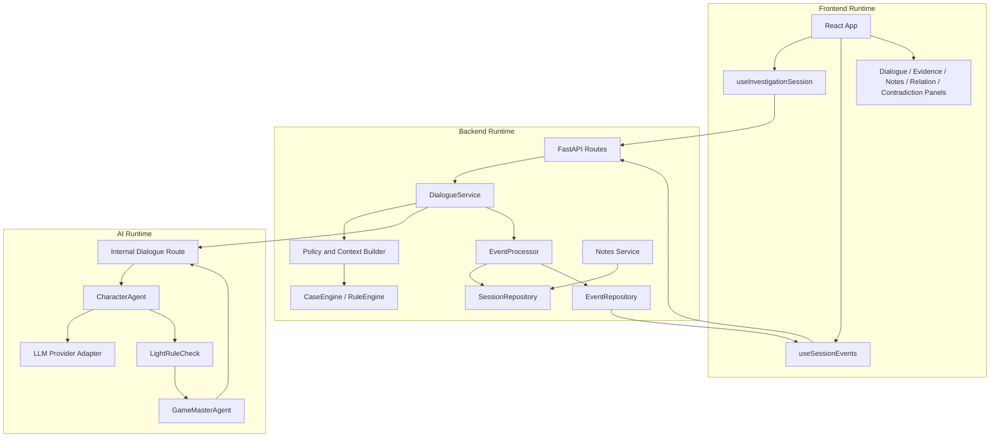
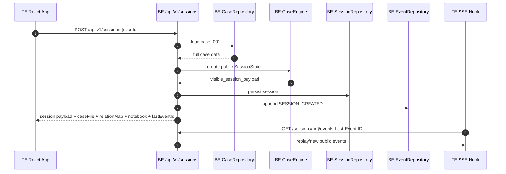
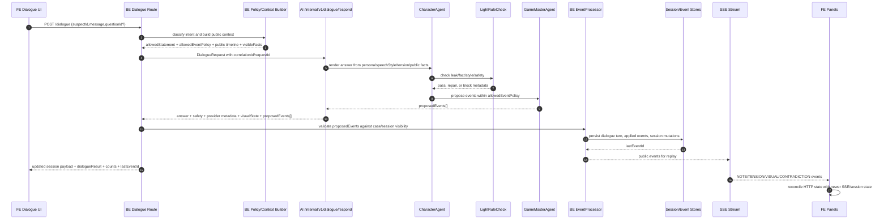
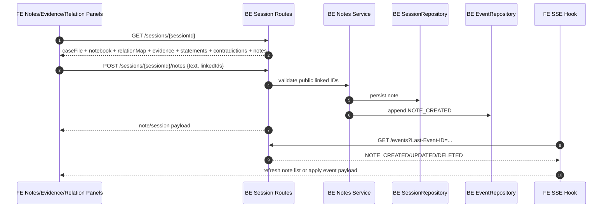
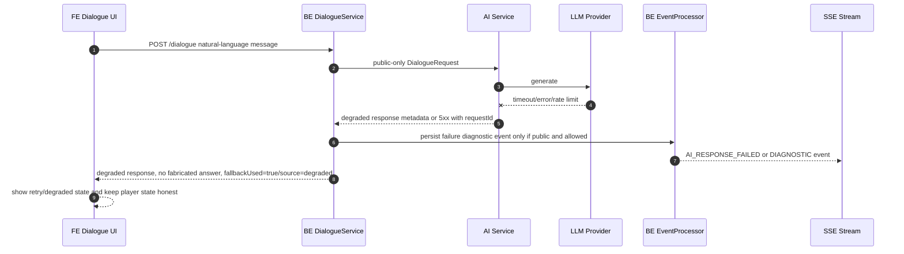
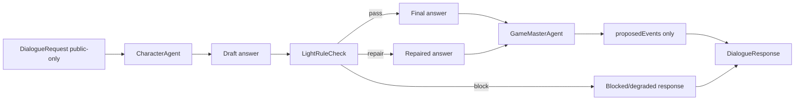

# Story Architecture

Owner: DOCS
Scope: canonical story architecture for BE, embedded AI engine, and FE.

This document defines how the main case story, per-character timelines, persona, speech style, tension, visible facts, investigation read models, embedded AI proposed events, BE validation, SSE, FE dialogue bubbles, and FE visual state fit together.

First-class 3-Agent model note: `Docs/story-agent-contract.md` is the canonical implementation contract for `CharacterAgentInput -> DraftCharacterReply`, `LightRuleCheckInput -> CheckedCharacterReply`, `GameMasterAgentInput -> GameMasterProposal`, `CharacterKnowledgePack`, and tension-level persona injection.

Bounded autonomy/content milestone note: `Docs/story-knowledge-wiki-contract.md` is the canonical CaseWiki/Obsidian knowledge graph authoring contract. It moves the next quality milestone away from ad-hoc rule patching and toward richer public projections for autonomous character dialogue.

## 1. Current implementation state verified

Verified files:
- `BE/data/cases/case_001.json`
- `BE/app/domain/models.py`
- `BE/app/domain/case_engine.py`
- `BE/app/application/dialogue_service.py`
- `BE/app/domain/event_processor.py`
- `BE/app/ai_engine/schemas/common.py`
- `BE/app/ai_engine/schemas/dialogue.py`
- `BE/app/ai_engine/application/character_agent.py`
- `BE/app/ai_engine/domain/proposed_events.py`
- `FE/src/types.ts`
- `FE/src/adapters/sessionAdapter.ts`
- `FE/src/hooks/useInvestigationSession.ts`
- `FE/src/hooks/useSessionEvents.ts`
- `FE/src/components/InterrogationStage.tsx`

Current BE case story source:
- `opening`: `hook`, `objective`, `rules`, `victoryCondition`
- `storyline.publicPremise`
- `storyline.acts[]`: `actId`, `title`, `objective`, `entryCondition`, `focusSuspectIds`, `recommendedQuestionIds`, `requiredClueIds`, `playerHint`, `completionCondition`
- `storyline.timeline[]`: global visible/hidden timeline entries with `time`, `title`, `description`, `sourceType`, `sourceId`, `unlockCondition`, `hidden`
- `storyline.cluePaths[]`: clue path steps to contradictions; `secretNote` exists and must never be public
- `storyline.currentObjectiveRules[]`: session-state rules for `currentObjective` and `currentActId`

Current BE public session exposure:
- `visible_session_payload()` exposes `opening`, public `storyline`, `visibleTimeline`, `currentObjective`, `currentActId`, suspects, dialogue log, notes, evidence, records, relations, statements, questions, pressure state, and unlock state.
- Latest BE smoke reported public `caseFile`, `relationMap`, and `notebook` read models plus notes CRUD/SSE. These are now part of the target FE consumption contract and must stay public-only.
- Hidden `TimelineEvent.hidden` is removed by `visible_timeline()`.
- `CluePath.secretNote` is removed by `_public_clue_path()`.
- `Character.secret`, `Character.isCulprit`, and `Case.solution` are not included in public session payload.

Current gaps:
- Character-specific timeline is not first-class in `Case`/case JSON. BE derives `suspects[].publicTimeline` from visible global timeline entries whose `sourceId` matches visible statement/question IDs. Because global timeline `sourceId` often points to evidence IDs, this can be weak or empty.
- Character persona/speech style/tension variants are partly hardcoded in `BE/app/domain/case_engine.py::public_speech_style()`. This is a temporary adapter and must migrate into scenario case data.
- BE sends `suspect.tensionLevel` as a label string (`low|medium|high|critical`) and `suspect.pressure` as numeric. AI schema currently typed `Suspect.tensionLevel` as `int | None`; canonical contract below resolves this by making `tensionLevel` a label and adding optional `tensionScore` for normalized numeric intensity.
- BE dialogue payload currently does not send full `storyline`, `characterTimeline`, `visualState`, or `allowedEventPolicy`, although AI schemas accept them. Target contract requires these fields.
- AI currently keeps generated factual content scoped to `allowedStatement`. Canonical rule: public timeline and visible facts may influence wording, hesitation, and context, but must not introduce new factual claims unless the fact is represented by `allowedStatement` or an allowed source referenced in `allowedEventPolicy`.
- FE displays runtime diagnostics and tension/expression metadata, but `useSessionEvents()` currently logs SSE readiness/skipped state and does not yet apply event-stream updates to UI state.
- FE must render the investigation loop from BE read models, not local-only controls: relationship map, notes, case file, evidence detail, statements/testimony, contradiction candidates, and discovered contradiction details.
- FE dialogue must be a per-turn conversation view. Each detective question and suspect answer is a separate turn bubble with speaker identity; answer-only panels or duplicated lower logs are not acceptable as the canonical UX.

## 2. Target architecture principles

1. Runtime RAG/vector DB is not required for the MVP. Use deterministic structured retrieval by stable IDs: `caseId`, `sessionId`, `suspectId`, `actId`, `evidenceId`, `statementId`, `questionId`, `timelineId`, `contradictionId`, `factId`, and `relationshipId`.
2. Main story, per-character timelines, fact pages, evidence pages, relationship graph, and character perceived knowledge are the source of truth for dialogue grounding.
3. AI does not own truth, unlock state, tension state, or session state. CharacterAgent generates within BE-provided public context. LightRuleCheck checks for leaks/inconsistency. GameMasterAgent proposes public unlock/candidate events only.
4. BE EventProcessor is the only authority that validates/applies proposed events, dedupes event effects, runs TensionPolicy, persists state, and emits public SSE.
5. `small_talk` and `unmatched` must not create `NOTE_FACT_ADDED` unless a BE-validated proposed event references stable visible IDs.
6. Character dialogue varies by selected character persona, public character timeline, visible facts, pressure/tension, and emotional state.
7. Tension/persona variants are core gameplay. `low|medium|high|critical` must affect wording, hesitation, expression, and FE visual state.
8. FE art direction is Ace-Attorney-like comic/noir. Character portrait/background variants are selected by `visualState`, `emotionalState`, `expression`, and `tensionLevel`.
9. FE investigation panels are BE-backed: case file, evidence detail, relationship map, notebook/notes, statements/testimony, and contradictions come from session payload/SSE/notes endpoints.
10. Public/private boundaries are non-negotiable: public payloads and log-visible diagnostics must not leak hidden truth.
11. Rules are guardrails, not the content engine. Character autonomy comes from richer bounded knowledge projection; BE/EventProcessor and LightRuleCheck guard visibility, leakage, and mutation.
12. Bounded generative autonomy is expected: local texture, social nuance, suspicion wording, emotional reaction, and plausible non-authoritative connective tissue should come from LLM agents when hard invariants remain intact.

## 3. Canonical flow

```mermaid
flowchart LR
    A[BE/data/cases/case_001.json] --> B[CaseRepository]
    B --> C[Pydantic Case / Storyline / CharacterTimeline models]
    C --> D[SessionState]
    C --> E[visible_session_payload]
    D --> E
    E --> F[FE session view: opening/storyline/visibleTimeline/suspects]

    F --> G[Player free-text dialogue]
    G --> H[POST /api/v1/sessions/{sessionId}/dialogue]
    H --> I[BE DialogueService]
    I --> J[Structured retrieval: suspect/act/evidence/statement/timeline/contradiction IDs]
    J --> K[BE -> AI DialogueRequest]
    K --> L[AI CharacterAgent]
    L --> M[AI LightRuleCheck]
    M --> N[AI GameMaster proposedEvents]
    N --> O[BE EventProcessor validates/applies]
    O --> P[EventRepository]
    P --> Q[SSE /sessions/{sessionId}/events]
    O --> R[HTTP dialogue response diagnostics]
    Q --> S[FE dialogue bubbles/diagnostics/notebook/evidence/timeline/relationMap/visuals]
    R --> S
```

Text flow:

`case JSON -> BE public session payload -> BE dialogue AI payload -> AI CharacterAgent/LightRuleCheck/GameMaster -> BE EventProcessor -> SSE -> FE diagnostics/visuals`

## 4. Production service boundary

Production runtime is service-backed. It must not silently replace BE, AI, or FE behavior with canned local answers.



Boundary rules:
- FE sends player actions and renders BE public state. FE does not fabricate canonical notes, contradictions, evidence unlocks, relationship updates, or AI answers.
- BE owns session state, public/private filtering, policy construction, EventProcessor validation, persistence, and SSE replay.
- AI owns natural language answer generation, safety checks, and proposed event creation only. AI does not persist session state and does not mark facts as applied.
- Provider adapters are replaceable, but production provider failures must surface as degraded responses and diagnostics, not canned successful detective dialogue.

## 5. Runtime sequence diagrams

### Session create



### Player free-text question



### Notes and investigation panels



### Production degraded AI response



## 6. Agent structure

AI agent pipeline:



Agent responsibilities:
- `CharacterAgent`: voice, persona, speech style, tension-aware wording, and natural-language phrasing. It may use only public context and allowed factual anchors.
- `LightRuleCheck`: final text and event safety. It checks private leakage, unsupported facts, policy violations, blocked terms, and contradiction with allowed visible facts.
- `GameMasterAgent`: proposes public unlock/candidate events within `allowedEventPolicy`, such as relationship/evidence/evidence-detail/timeline/notebook unlock candidates and contradiction candidates with stable IDs. It never mutates state and never emits final `TENSION_CHANGED`.
- Provider adapter: calls the configured model. Provider failure must be explicit in `provider`, `model`, `fallbackUsed`, `blockedReason`, and logs.

## 7. Production mock/fallback policy

Production policy:
- No silent canned dialogue in production. A successful production dialogue must come from BE policy/context plus AI CharacterAgent/provider path or an explicitly documented deterministic BE-owned non-AI mode.
- Local/mock fixtures are allowed only in tests, Storybook/dev preview, or intentionally configured offline development.
- FE `LOCAL/MOCK` state is debug-only and must be visibly marked. It cannot be used as commit-ready production evidence.
- BE compatibility adapters may preserve old endpoints temporarily, but they must still route to canonical validation and diagnostics.
- BE-owned degraded fallback is allowed only when it is generated from public case/session state, marked with `fallbackUsed=true`/`degraded=true`, logged as a warning, and sanitized for private refs. A matched player turn may consume the 12-turn budget, but fallback must not silently masquerade as normal provider output.
- AI fallback/repair paths must not mutate authoritative truth directly: no fabricated culprit/solution, no private refs, no unvalidated contradiction discovery, no evidence unlock, no note fact, and no tension/objective progress unless the BE rule engine independently validates the public turn.

Environment/config gates:
- Production-like Docker dogfood must set explicit service URLs for FE -> BE and BE -> AI.
- If AI provider credentials/config are missing, readiness should fail or dialogue should return degraded semantics with `fallbackUsed=true`/`degraded=true`; it must not pass as a normal provider answer.
- Tests may enable mock providers with a named env flag such as `AI_PROVIDER=mock` or equivalent. Completion reports must state when mock mode was used.
- Health/readiness endpoints must distinguish process-up from dependency-ready where possible.

## 8. Observability contract

Every cross-service operation should carry:
- `correlationId`: one end-to-end ID from FE/BE request through AI and SSE logs.
- `requestId`: per HTTP/AI call ID.
- `sessionId`, `caseId`, `suspectId`, `messageId`, and `lastEventId` when available.
- `provider`, `model`, `fallbackUsed`, `safety.leaksSolution`, `safety.violatesCaseFacts`, `safety.repaired`, `blockedReason`.
- `dialogueMode`, `intent`, `matchedQuestionId`, `allowedEventPolicy.allowedTypes`.
- `proposedEventsCount`, `appliedEventsCount`, rejected event count/reasons.
- SSE replay diagnostics: requested `Last-Event-ID`, first replayed ID, latest ID, dropped/unknown ID handling.

Structured log rule:
- Logs may include public stable IDs and public excerpts needed for debugging.
- Logs must not include `solution`, `secret`, private timeline events, API keys, raw provider secrets, or hidden prompt content.
- Completion reports must include the commands used to inspect health, logs, SSE replay, and fallback/provider metadata.

## 9. Public/private data boundary

Never expose these in public session, public dialogue response, FE diagnostics, SSE payloads, or AI prompts with `revealAllowed=false`:
- `Character.secret`
- `Character.isCulprit`
- `Case.solution`
- private character timeline / private refs: `privateTimeline`, `privateEvents`, `privateRefs`, `actualAction`, `actualLocation`, `privateMotive`, `privateNote`
- culprit/final state refs: `culprit`, `culpritId`, `finalDiscovery`, `finalVerdict`
- hidden global timeline entries (`hidden: true`)
- `CluePath.secretNote`
- private contradiction author notes or solution-only rationale

Allowed public data:
- `opening`
- `storyline.publicPremise`
- public `storyline.acts[]`
- visible global timeline entries with hidden fields removed
- public clue path prompts with `secretNote` removed
- public suspect profile/persona/speech style/tension label
- public character timeline events whose `visibility = public` and whose `unlockCondition` is satisfied
- visible evidence/records/relations/statements/questions
- validated events and sanitized payloads emitted by BE EventProcessor

## 10. Source-of-truth model

Target case data owns:
- main story: `opening`, `storyline`, `storyline.acts`, `storyline.timeline`, `storyline.cluePaths`, objective rules
- per-character story: `characterTimelines[]`
- persona and style: `suspects[].persona`, `suspects[].speechStyle`, `suspects[].tensionProfile`
- visual asset semantic selectors: `visualProfiles` or `visualAssets` mapping character/expression/tension/background IDs
- stable references linking all story objects
- public investigation read model sources: relations, evidence, records, statements, contradictions, and notebook seed data
- wiki/knowledge graph authoring sources after migration: facts, evidence pages, directed relationships, timeline layers, rumor/confidence/provenance, and case detail chains

BE owns:
- loading/validating target case JSON into domain models
- filtering public data by session unlock state
- current objective/current act calculation
- dialogue classification/matching
- AI payload construction with public-only context
- wiki compiler/retriever/projection into per-session/per-character `CharacterKnowledgePack`
- EventProcessor validation and session mutation
- SSE publication

AI owns:
- character voice rendering within public context
- leak/inconsistency checking
- public unlock/candidate event proposal creation using stable IDs only
- provider/fallback/safety metadata
- implementing the first-class agent schemas and invariants in `Docs/story-agent-contract.md`

FE owns:
- rendering public session state
- rendering every dialogue turn as a speaker bubble from `dialogueLog`/dialogue response data
- rendering BE-backed case file, evidence detail, relationship map, notes, statements/testimony, contradiction candidates, and discovered contradiction details
- displaying developer diagnostics in MVP debug surfaces
- applying BE HTTP response and SSE event updates
- selecting noir/comic assets from `visualState` metadata

## 11. Canonical tension model

Canonical fields:
- `pressure`: number, BE-owned raw pressure score, normally `0..100`.
- `pressureState`: BE-facing label: `normal|pressed|broken`.
- `tensionLevel`: public visual/dialogue label: `low|medium|high|critical`.
- `tensionScore`: optional normalized numeric intensity for AI: `0..100`. If absent, AI derives it from `pressure`.
- `emotionalState`: current emotion label such as `neutral|wary|defensive|angry|anxious|shocked|breakdown|confident_lying`.
- `expression`: FE portrait selector, same taxonomy as visual contract unless a case-specific override is documented.

Decision resolving BE / embedded AI engine mismatch:
- `suspect.tensionLevel` is a label string, not numeric.
- AI must not require numeric `tensionLevel`.
- BE should send `suspect.pressure` and may send `suspect.tensionScore` if normalized numeric intensity is useful.
- FE uses `visualState.tensionLevel` label and `visualState.expression` for display.

BE-owned TensionPolicy:
- Only BE/EventProcessor applies `TENSION_CHANGED`.
- Tension rises only when a new BE-validated evidence + testimony/alibi contradiction is discovered.
- Generic dialogue, small talk, unmatched dialogue, relationship unlocks, evidence unlocks, evidence-detail unlocks, timeline unlocks, notebook/bookmark updates, and contradiction candidate creation do not raise tension by themselves.
- Tension changes are monotonic for the relevant suspect within a session unless a future explicit recovery mechanic is documented.
- Tension changes are idempotent: replaying SSE, re-asking the same question, receiving duplicate proposed events, or re-submitting an already discovered contradiction must not increment pressure again.
- AI degraded/failure responses must not create tension progress, unlock progress, or contradiction discovery progress.
- `TensionPolicy` should key dedupe on stable IDs such as `sessionId`, `suspectId`, `contradictionId`, required `statementIds`, and required `evidenceIds`.

Tension persona injection:
- `CharacterKnowledgePack.personaVariants` and `activePersonaOverlay` are the canonical AI voice input.
- `activePersonaOverlay` is selected from public/session-visible `tensionLevel`, `pressureState`, `emotionalState`, `tensionScore`, contradiction pressure, and recent dialogue pressure.
- Overlay selection changes tone, evasiveness, hesitation, and sentence shape. It must not change factual content, visibility, unlock state, pressure, or tension.
- See `Docs/story-agent-contract.md` for required schemas and CaseWiki/Obsidian frontmatter.

## 12. Character timeline grounding rule

`characterTimelines[]` is canonical scenario source.

Derived public views:
- `suspects[].publicTimeline` in BE -> FE session payload is a filtered, public, per-suspect projection.
- BE -> AI may send both:
  - `suspect.publicTimeline`: compact selected suspect public events.
  - `characterTimeline`: structured context for selected suspect only.

AI grounding rule:
- `allowedStatement.text` remains the only source for new answer facts by default.
- `publicTimeline`, `visibleFacts`, and `storyline` may shape tone, references, uncertainty, and follow-up phrasing.
- AI may mention a public timeline fact as factual content only if it is also referenced by `allowedEventPolicy` or included in the selected `allowedStatement.sources`/`allowedSourceRefs` target contract.
- With `revealAllowed=false`, AI must ignore private timeline events, solution, culprit identity, `actualAction`, `privateMotive`, and `secretNote` even if accidentally present.

## 13. Event authority rule

GameMaster proposed events are proposals, not state mutation.

GameMaster may propose these public event categories only when allowed by `allowedEventPolicy`:
- relationship unlock/candidate events with stable `relationshipId`/`rel_` refs
- evidence unlock/candidate events with stable `evidenceId`/`ev_` refs
- evidence-detail unlock/candidate events with stable evidence/detail refs
- timeline/notebook/bookmark candidate events with stable timeline/statement/evidence refs
- contradiction candidate events with stable `contradictionId`, `statementIds`, `evidenceIds`, and optional `timelineIds`

GameMaster must not propose:
- `TENSION_CHANGED`
- final contradiction discovery/verdict events
- direct session mutation events
- private truth reveal events when `revealAllowed=false`

BE EventProcessor validates:
- event type is supported
- payload uses stable IDs
- referenced IDs exist in the current case
- referenced IDs are visible/unlocked or otherwise eligible
- event does not leak private truth
- event is allowed for current dialogue mode/policy
- duplicate proposed events are deduped by stable IDs before persistence
- final unlock/discovery/tension state is computed by BE policies, not trusted from AI

`small_talk` and `unmatched`:
- do not consume questions
- do not decrement remaining questions
- do not create implicit `NOTE_FACT_ADDED`
- must not create `TENSION_CHANGED`

## 14. FE visual update precedence

Canonical precedence when both HTTP dialogue response and SSE replay contain visual metadata:
1. BE session payload state after latest applied event is authoritative.
2. SSE events with a newer `eventId`/sequence than `lastEventId` update FE state.
3. HTTP `visualState` can be applied immediately for responsive UI, but must be reconciled by SSE/session state.
4. FE local fallback/mock state is debug-only and must be visually marked `LOCAL/MOCK`.

## 15. Investigation read model contract

The target player loop is not only dialogue. FE must be able to inspect, cross-reference, and mutate public investigation state through BE-owned models.

Required public read models in BE -> FE session payload:
- `caseFile`: opening hook, objective, rules, current act/objective, visible timeline, and public premise.
- `relationMap`: `{ centerCharacterId, nodes[], edges[] }` with stable character/relationship IDs, labels, descriptions, lock/visibility state, and evidence/statement refs when public.
- `notebook`: grouped public data for `caseFile`, `evidence`, `records`, `statements`, `statementsBySuspect`, `questionsBySuspect`, `relations`, `relationMap`, `contradictions`, `bookmarks`, and `notes`.
- `evidence`: public evidence list with enough detail for inspection: `description`, `foundAt`, `timeWindow`, `reliability`, `sourceRefs`, unlock state, and asset metadata when available.
- `statements`: public testimony/statement records with `statementId`, `suspectId`, text, source question, timeline refs, evidence refs, and contradiction refs.
- `contradictions`: public candidate/discovered contradiction detail, not only `discoveredContradictionIds`.
- `notes`: BE-persisted user/system notes with stable IDs and optional links to evidence, statements, records, contradictions, or suspects.

Mutation rules:
- User-created notes are BE-backed via notes endpoints and reflected in session payload/SSE.
- Contradiction submission requires an explicit player-selected statement/testimony plus evidence. A one-click canned contradiction is not canonical.
- Relationship map changes, note changes, contradiction candidates, contradiction discoveries, tension changes, and visual changes must be replayable through SSE or refreshable through `GET /sessions/{sessionId}`.

## 16. Dialogue UI contract

Canonical dialogue UX:
- each player message and suspect answer is a distinct turn in chronological order
- each turn has speaker type/name, suspect ID when applicable, text, timestamp/order, and optional metadata for diagnostics
- suspect turns may display current portrait/expression next to the bubble
- switching suspects filters or scopes the visible conversation clearly without losing chronological session history
- lower debug logs may exist in MVP, but must not duplicate the main conversation as the only reliable dialogue history

## 17. Visual asset contract

Canonical asset quality:
- suspect portraits must be coherent noir comic/cartoon assets, not placeholder SVG silhouettes or generic dashboard art
- every canonical expression has either a real asset path or an explicit neutral fallback: `neutral,wary,defensive,angry,anxious,shocked,breakdown,confident_lying,sad,focused`
- evidence assets should be recognizable object cards usable for cross-examination and detail inspection
- asset loading failures and LOCAL/MOCK art fallback are blockers for polished runtime validation

## 18. Known temporary adapters

These are allowed short-term but not target architecture:
- BE `public_speech_style(characterId)` hardcoded style map.
- BE-derived `publicTimeline` from global timeline source IDs.
- AI `Suspect.tensionLevel: int | None` schema typing.
- FE arbitrary expression strings and local fallback expression mapping.
- FE SSE hook that logs readiness but does not apply event updates.
- FE controls that open no BE-backed panel/drawer or mutate local-only investigation state.
- FE placeholder/low-quality character assets pending ImageGen-grade noir comic replacements.

All must be tracked as migration items in the service contracts and validation gates.
