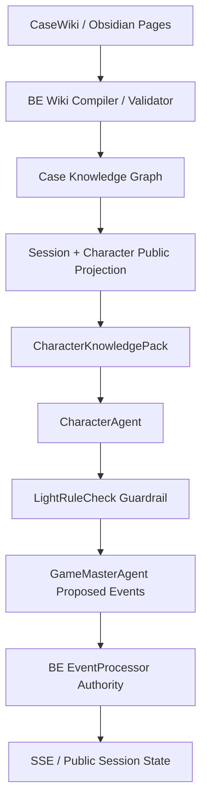

# Story Knowledge Wiki Contract

Owner: DOCS
Scope: high-priority next quality/content milestone for bounded character autonomy through richer CaseWiki/Obsidian/knowledge-graph authoring.

This contract does not replace the production no-mock/runtime gates or the 3-Agent boundary contract. It defines the next content architecture layer: characters feel autonomous because BE compiles a rich, public-only knowledge projection, while rules remain guardrails for leakage, visibility, event mutation, and final state.

## 1. Design Principle

Rules are guardrails, not the content engine.

Canonical shorthand: rules are guardrails; layered case knowledge is the content engine.

- CharacterAgent should answer from layered social, evidential, and perceived knowledge, not from canned scripts or endless ad-hoc rule patches.
- LightRuleCheck is a light verifier for impossible knowledge, private leakage, main-story invariant breaks, and severe contradiction. It must not grow into a dialogue script engine.
- GameMasterAgent is intentionally LLM-based: it interprets surfaced dialogue into candidate notes, observations, rumors, relationship shifts, and proposed events. It does not mutate authoritative state.
- BE/EventProcessor remains authority for visibility gates, final state, persistence, contradiction discovery, TensionPolicy, and SSE.
- Hidden truth, private timeline, culprit/final discovery, and solution-only authoring fields never enter AI prompts, public payloads, SSE, logs, or FE diagnostics.

### Bounded generative autonomy

The target experience is not a fully deterministic rule puzzle. AI should create local context and connective tissue as long as it does not damage the fixed main story.

| Category | Examples | Policy |
| --- | --- | --- |
| Hard Invariants | culprit, core method, core truth timeline, key evidence truth, ending criteria, final accusation criteria, private/public boundary, BE state authority | Validate strictly; block, repair, or reject violations. These are the only normal reasons to add hard validators. |
| Soft Constraints | persona tone, known/unknown facts, relationship stance, pressure/trust thresholds, evidence reactions, confidence/provenance, current objective | Guide generation; prefer better context/retrieval/persona data before adding validators. |
| Generative Freedom | dialogue phrasing, emotional texture, suspicion wording, small social inferences, scene flavor, relationship tension expression, memory paraphrase, plausible but non-authoritative connective tissue | Allow by default when non-contradictory; store only as `NOTE`, `OBSERVATION`, `RUMOR`, or `INTERPRETATION` with confidence/provenance if persisted. |

Guard accretion warning: when an AI turn is weak, shallow, or misses nuance, the first fix should be richer CaseWiki data, better projection, better retrieval, or clearer persona/context. Add or tighten hard validators only when the output violates main-story invariants, private visibility, state authority, or safety.

Future fix rubric:

| Observed Issue | Correct Response |
| --- | --- |
| AI breaks main truth, private boundary, or BE state authority | Add or adjust a projection filter, LightRuleCheck invariant check, BE validator, or EventProcessor rule. |
| AI sounds shallow, misses relationship nuance, or lacks local context | Enrich wiki pages, public projection, retriever ranking, persona overlays, recent dialogue, evidence reactions, or relationship stance. Do not add a hard guard first. |
| AI proposes interesting but non-authoritative context | Allow as `NOTE`, `OBSERVATION`, `RUMOR`, or `INTERPRETATION` with confidence/provenance; BE must not treat it as truth mutation. |
| AI creates a minor detail not in canon but not contradicting canon | Allow as ephemeral flavor, or store as low-confidence emergent context if useful. |
| AI proposes final verdict/discovery, `TENSION_CHANGED`, private reveal, or direct mutation | Reject through allowedEventPolicy/EventProcessor and log the rejection. |

LightRuleCheck must remain lightweight:
- It checks anomaly, leakage, impossible knowledge, and invariant breaks.
- It must not script dialogue, block normal creativity, or grow into an exhaustive rule engine.
- It should repair/block only when generated text crosses hard invariant or privacy boundaries.

GameMasterAgent remains LLM-based:
- It interprets surfaced dialogue into candidate proposed events.
- It may extract candidate notes, clues, relationship shifts, rumors, observations, and interpretations.
- It is not merely a deterministic map executor.
- BE validates authoritative state changes, visibility, persistence, final state, TensionPolicy, and SSE.

## 2. Knowledge Graph Layers



Authoring layers:
- fact pages
- character pages
- evidence pages
- relationship edges
- timeline/event pages
- contradiction hook pages
- case detail pages: motive chain, opportunity chain, cover-up actions, false leads, innocent secrets, secondary conflicts, witness reliability, environmental clues

Runtime projection:
- BE compiles and validates wiki pages into a deterministic case graph.
- BE filters graph nodes by session state, character perspective, known/unknown/misled gates, and public/private visibility.
- AI receives only the bounded `CharacterKnowledgePack` projection.

## 3. Fact Page Schema

Fact pages are the atomic knowledge units. Characters do not know “the case”; they know, doubt, misremember, heard, witnessed, or hide specific facts.

```yaml
---
id: fact_hanseoyeon_claim_room_2200
type: fact
visibility: public
summary: 한서연은 22시 이후 계속 방에 있었다고 주장한다.
truthStatus: claim
confidenceDefault: 0.62
sourceRefs:
  statementIds: [st_hanseoyeon_room_2200]
  timelineIds: [ctl_hanseoyeon_2200_claim_room]
knownBy: [char_hanseoyeon]
unknownBy: [char_parkmingyu, char_yoonjaeho]
misledBy: []
liedAboutBy: [char_hanseoyeon]
doubtedBy: []
rumorSources: []
visibilityGate:
  revealWhen: statement_unlocked
allowedForCharacterKnowledgePack: true
privateLeakChecks:
  forbiddenRefs: [secret, solution, privateTimeline, culprit, finalDiscovery, actualAction]
---
```

Required fields:
- `id`, `type=fact`, `visibility`, `summary`, `truthStatus`
- `sourceRefs`
- at least one of `knownBy`, `unknownBy`, `misledBy`, `liedAboutBy`, `doubtedBy`
- `confidenceDefault`
- `visibilityGate`

Recommended `truthStatus` values:
- `observed`
- `claimed`
- `rumor`
- `inferred_public`
- `misbelief`
- `hidden_truth`
- `red_herring`

`hidden_truth` facts may exist in authoring, but must not compile into public `CharacterKnowledgePack` until an explicit reveal endpoint/gate allows it.

## 4. Character Page Schema

Character pages define persona plus layered knowledge and social stance. This is where bounded autonomy comes from.

```yaml
---
id: char_hanseoyeon
type: character
visibility: mixed
name: 한서연
role: 조카
persona:
  publicPersona: 차갑고 계산적이며 질문을 통제하려 한다.
  publicMask: 침착한 상속인
  privateMotive: HIDDEN_PRIVATE_DO_NOT_EXPORT
speechStyleRef: speech_hanseoyeon_formal_cold
personaVariantRefs:
  baseline: persona_hanseoyeon_baseline
  defensive: persona_hanseoyeon_defensive
  pressed: persona_hanseoyeon_pressed
knowledge:
  witnessedFacts: [fact_hanseoyeon_claim_room_2200]
  heardFacts: [fact_will_revision_rumor]
  believedFacts: [fact_victim_changed_will]
  doubtedFacts: [fact_doctor_clean_record]
  hiddenFacts: [fact_hanseoyeon_private_route_2202]
  unknownFacts: [fact_parkmingyu_medicine_2130]
  misbelievedFacts: [fact_yoonjaeho_left_mansion]
rumors:
  - rumorId: rumor_will_revision
    heardFrom: char_yoonjaeho
    confidence: 0.5
    sourceRefs: [rel_hanseoyeon_yoonjaeho_business]
stance:
  trust:
    char_yoonjaeho: 0.25
    char_parkmingyu: 0.45
  suspicion:
    char_yoonjaeho: 0.7
  fear:
    victim_kangdojun: 0.6
  emotionalStance:
    investigator: guarded_hostile
canInfer:
  - factIds: [fact_entry_log_2202, fact_hanseoyeon_claim_room_2200]
    inference: public_alibi_conflict_possible
cannotInfer:
  - culprit identity before final reveal
  - private motive from hidden timeline
pressureRevealConditions:
  - whenContradictionId: con_room_claim_vs_entry_log
    revealFactIds: [fact_hanseoyeon_seen_near_study_public_hint]
    minTensionLevel: high
evidenceReactions:
  ev_study_entry_log:
    low: controlled_deflection
    high: sharp_denial
    critical: fractured_explanation
privateLeakChecks:
  exportToCharacterKnowledgePack: public_visible_only
---
```

Character knowledge categories:
- `witnessedFacts`: directly saw/heard with own senses
- `heardFacts`: second-hand information
- `believedFacts`: accepts as true
- `doubtedFacts`: explicitly questions reliability
- `hiddenFacts`: knows privately but cannot reveal unless gate allows
- `unknownFacts`: does not know and must not answer as if known
- `misbelievedFacts`: believes an incorrect or incomplete public/rumor claim

## 5. Evidence Page Schema

Evidence pages must support inspection, interpretation, and character-specific reactions.

```yaml
---
id: ev_study_entry_log
type: evidence
visibility: public
name: 서재 출입 기록
evidenceType: digital_record
observableDetails:
  - 22:02에 서재 문이 열린 기록
  - 정전 직전 시스템 로그가 남아 있음
provenance:
  discoveredAt: 2층 서재 출입 시스템
  discoveredBy: player
  chainOfCustody: [scene_001, rec_security_panel]
sourceRefs:
  timelineIds: [tl_global_2202_study_entry]
  contradictionIds: [con_room_claim_vs_entry_log]
whoKnows:
  publicAfterUnlock: [player]
  characterKnownBy: [char_hanseoyeon]
whoCanInterpret:
  - char_parkmingyu
  - investigator
relatedTimelineEntries: [tl_global_2202_study_entry, ctl_hanseoyeon_2200_claim_room]
contradictionRefs: [con_room_claim_vs_entry_log]
unlockGate:
  revealWhen: initially_visible
visibilityGate:
  public: true
  privateFields: []
characterReactions:
  char_hanseoyeon:
    low: controlled denial
    high: sharp defensive denial
    critical: fractured explanation
  char_parkmingyu:
    low: technical interpretation
privateLeakChecks:
  forbiddenRefs: [solution, culprit, finalDiscovery, privateTimeline]
---
```

## 6. Relationship Edge Schema

Relationships are directed. Public face and private truth may differ.

```yaml
---
id: rel_hanseoyeon_victim_inheritance
type: relationship
from: char_hanseoyeon
to: victim_kangdojun
visibility: mixed
publicFace: 조카와 후견인
publicDescription: 상속 문제로 갈등이 있었다.
privateTruth: HIDDEN_PRIVATE_DO_NOT_EXPORT
scores:
  trust: 0.15
  fear: 0.6
  debt: 0.2
  jealousy: 0.45
  conflict: 0.8
knownBy: [char_hanseoyeon, char_yoonjaeho]
unknownBy: [char_parkmingyu]
misunderstoodBy:
  char_choiyuna: inheritance conflict is exaggerated
dialogueEffects:
  whenAskedAbout: inheritance
  low: minimize conflict
  high: challenge premise
  critical: reveal public hint only
sourceRefs:
  recordIds: [rec_will_revision_notice]
  factIds: [fact_will_revision_rumor]
visibilityGate:
  publicFields: [publicFace, publicDescription, scores.conflict]
  privateFields: [privateTruth]
---
```

## 7. Timeline/Event Layers

Use multiple timelines instead of one flat chronology.

```yaml
---
id: tl_global_2202_study_entry
type: timeline-event
layer: global_public
visibility: public
time: "22:02"
summary: 서재 출입 기록이 남았다.
sourceRefs:
  evidenceIds: [ev_study_entry_log]
knownBy: [player]
contradictionRefs: [con_room_claim_vs_entry_log]
---
```

Required layers:
- `global_truth`: full authoring truth, private by default
- `global_public`: public/visible case timeline
- `character_perceived`: what a character thinks happened
- `rumor`: circulating unreliable claims
- `evidence_discovery`: when/how evidence becomes visible
- `contradiction_surfacing`: when candidate/discovered contradictions become visible

Perceived timeline example:

```yaml
---
id: ctl_hanseoyeon_perceived_2200_room
type: timeline-event
layer: character_perceived
visibility: public_when_statement_unlocked
suspectId: char_hanseoyeon
time: "22:00"
summary: 한서연은 자신이 방에 있었다고 주장한다.
truthStatus: claim
confidence: 0.62
sourceRefs:
  statementIds: [st_hanseoyeon_room_2200]
knownBy: [char_hanseoyeon]
liedAboutBy: [char_hanseoyeon]
contradictionRefs: [con_room_claim_vs_entry_log]
---
```

## 8. Case Detail Pages

Case richness comes from authored chains and conflicts.

```yaml
---
id: chain_hanseoyeon_opportunity
type: opportunity-chain
visibility: private_authoring
publicSummary: 한서연의 알리바이는 객관 기록과 충돌할 여지가 있다.
steps:
  - factId: fact_hanseoyeon_claim_room_2200
    visibility: public
  - evidenceId: ev_study_entry_log
    visibility: public
  - factId: fact_hanseoyeon_private_route_2202
    visibility: private
falseLeads:
  - factId: fact_parkmingyu_medicine_suspicion
    role: innocent_secret
secondaryConflicts:
  - rel_hanseoyeon_yoonjaeho_business
witnessReliability:
  char_hanseoyeon: 0.48
  char_parkmingyu: 0.72
environmentalClues:
  - ev_study_entry_log
  - ev_torn_will
privateLeakChecks:
  publicProjection: redact_private_steps
---
```

Case detail categories:
- motive chain
- opportunity chain
- cover-up actions
- false leads
- innocent secrets
- secondary conflicts
- witness reliability
- environmental clues

## 9. Runtime Projection Flow

Sample flow:
1. Player asks Han Seo-yeon: “서재 출입 기록을 설명해 주세요.”
2. BE deterministic retriever selects visible snippets:
   - `ev_study_entry_log`
   - `st_hanseoyeon_room_2200`
   - `ctl_hanseoyeon_perceived_2200_room`
   - `rel_hanseoyeon_victim_inheritance` public face
   - recent pressure dialogue
3. BE compiles `CharacterKnowledgePack` for `char_hanseoyeon`.
4. `CharacterAgent` answers using social stance, alibi, evidence reaction, confidence, and active persona overlay.
5. `LightRuleCheck` flags only impossible, leaky, or unsupported claims.
6. `GameMasterAgent` proposes public candidate events such as `NOTE_CONTRADICTION_CANDIDATE_ADDED`.
7. BE `EventProcessor` validates refs, visibility, dedupe, and policy; then persists public events and emits SSE.

Allowed connective tissue example:
1. Player asks: “그 기록을 보고도 정말 아무 일 없었다고요?”
2. CharacterAgent may answer: “기록 하나로 사람을 몰아붙이는 방식은 꽤 무례하군요. 저는 그 시간 제 방에 있었다고 말씀드렸습니다.”
3. The sentence “꽤 무례하군요” is generated emotional texture from persona/tension/relationship stance. It is allowed because it does not assert a new authoritative case fact.
4. LightRuleCheck should not block it merely because that exact phrase was not authored.
5. GameMasterAgent may propose a low-confidence `OBSERVATION` about defensive reaction if allowed by policy.
6. BE must reject any proposed private route reveal, final discovery, or pressure mutation that is not validated by public contradiction state.

Retriever selection inputs:
- current suspect
- player message terms/intents
- visible fact/evidence/timeline/relationship graph
- `knownBy`/`unknownBy`/`misledBy`/`liedAboutBy`
- confidence and reliability
- trust/suspicion/emotional stance
- unlock and visibility gates
- recent dialogue pressure

## 10. CharacterKnowledgePack Projection

The pack may include:
- `witnessedFactSnippets`
- `heardFactSnippets`
- `believedFactSnippets`
- `doubtedFactSnippets`
- `misbelievedFactSnippets`
- `unknownBoundaryHints` such as “character should not know this”
- `evidenceSnippets`
- `relationshipSnippets`
- `timelineSnippets`
- `rumorSnippets`
- `evidenceReactions`
- `trustSuspicionStance`
- `activePersonaOverlay`
- `recentDialogue`

The pack must exclude:
- hidden truth
- private timeline
- culprit/final discovery
- private motive unless public gate permits a public hint
- solution-only authoring notes
- raw private chain steps

## 11. Authoring And Lint Gates

Required wiki lint:
- all wikilinks and IDs resolve
- no duplicate `factId`, `evidenceId`, `relationshipId`, `timelineId`, or `contradictionId`
- no orphan evidence without source/provenance
- no contradiction without required statement/evidence/timeline refs
- no relationship edge with missing character endpoints
- no character knows impossible facts before visibility/unlock gates
- no `hidden_truth` fact exported into public pack
- no private field appears in public payload/SSE/log/FE diagnostics
- all evidence has `whoKnows`, `whoCanInterpret`, provenance, visibility gate, and related refs
- all character pages include known/unknown/misbelieved or explicit empty lists
- all relationship edges include public face and private truth separation
- all timeline events declare a layer
- all rumor facts include rumor source and confidence
- all public claims have source/provenance refs

Quality lint:
- at least one false lead or innocent secret exists per major suspect
- at least one secondary conflict exists beyond the main culprit route
- every suspect has a reason to answer evasively under pressure
- every contradiction candidate has a route from public facts/evidence
- every high/critical pressure reveal has an explicit public reveal gate

## 12. Contract Delta

This is a high-priority content/architecture milestone, not a new runtime no-mock gate.

Current runtime gates remain:
- no silent mock/canned fallback
- real BE/AI service smoke
- SSE replay
- leak scan
- BE EventProcessor authority

New quality milestone:
- enrich case authoring into layered wiki/knowledge graph pages
- compile to public `CharacterKnowledgePack`
- validate knowledge boundaries and graph integrity
- use rules as guardrails, not dialogue scripts
