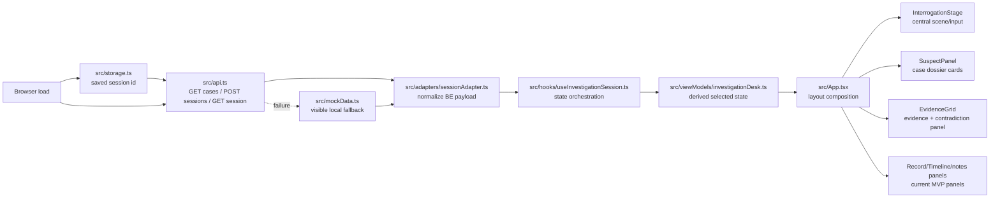
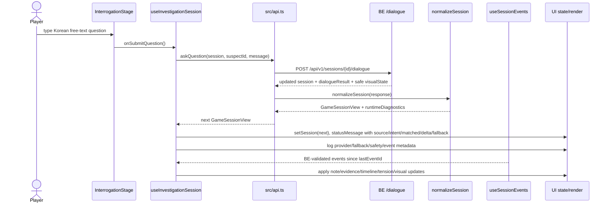
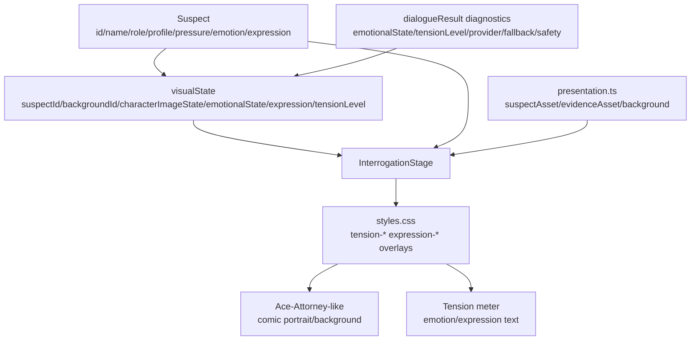
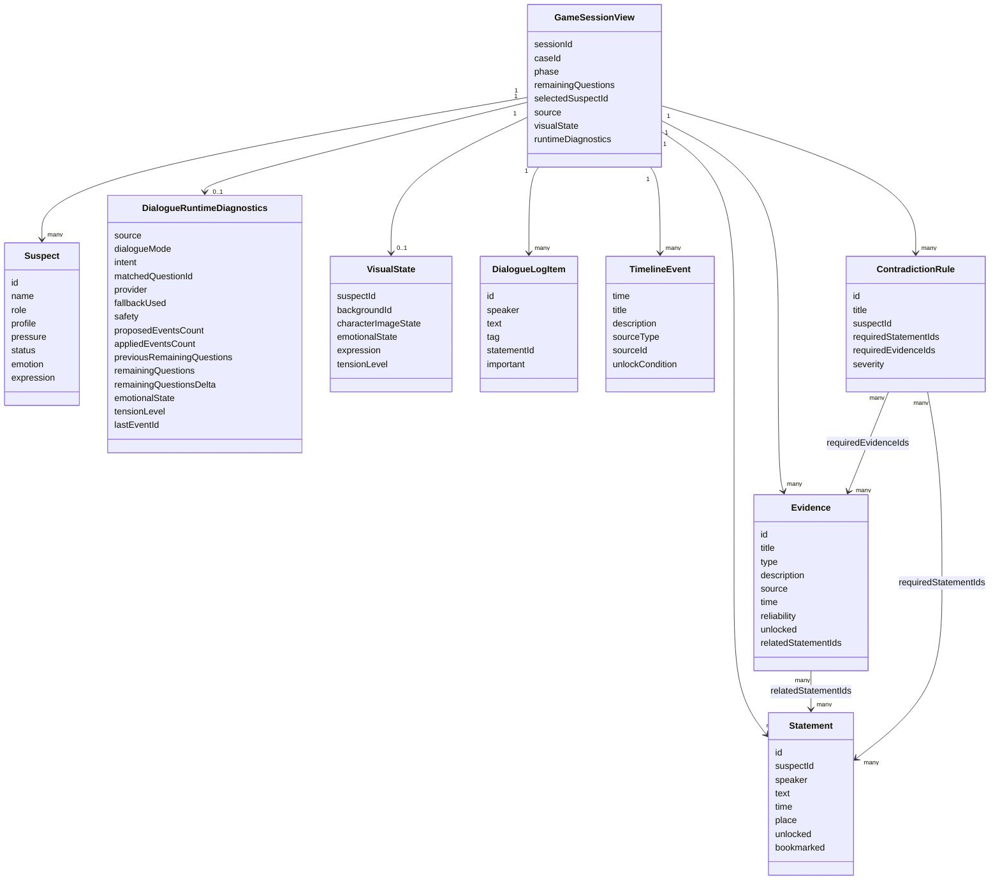
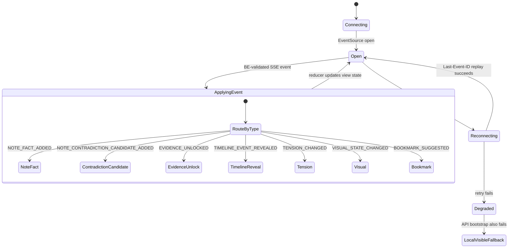

# FE Architecture and Model Map

This document is the FE-local map for future agents. It describes how the Detective Agent frontend turns BE session payloads and SSE events into the noir interrogation desk UI.

Canonical cross-repo story contracts are owned by `../Docs/`. This file documents FE usage and known contract gaps only.

## Runtime boundaries

- FE never calls AI directly.
- FE writes player-authored free text to `POST /api/v1/sessions/{sessionId}/dialogue` with `{ suspectId, message }`.
- FE treats BE session payload and BE-validated SSE events as source of truth.
- Local mock fallback exists only for disconnected dogfood and is visibly marked as `LOCAL/MOCK`, `deterministic-local`, and `not_ai_validated`.
- Hidden/private/solution fields must not be embedded in FE fixtures or displayed in public payloads.

## 1. Session bootstrap and data flow



Primary modules:

| Layer | Files | Responsibility |
| --- | --- | --- |
| API client | `src/api.ts` | Same-origin `/api/v1` requests, dialogue/contradiction/accusation calls, fallback entry points. |
| Persistence | `src/storage.ts` | Session id recovery and local save/restore. |
| Adapter | `src/adapters/sessionAdapter.ts` | Converts BE `BackendSession` into FE `GameSessionView`, fills safe UI defaults, preserves diagnostics. |
| Hook/state | `src/hooks/useInvestigationSession.ts`, `src/hooks/useSessionEvents.ts` | Bootstrap, submit actions, status messages, observability, SSE connection. |
| View model | `src/viewModels/investigationDesk.ts` | Selected suspect/question/latest answer/current objective derivation. |
| Components | `src/components/*` | Pure rendering of suspect cards, stage, evidence, system flow, modals. |
| Presentation constants | `src/constants/presentation.ts` | Public asset mapping for characters/evidence/backgrounds. |

## 2. Dialogue submit, diagnostics, SSE update flow



Displayed diagnostics after dialogue:

These fields are MVP developer diagnostics. They are intentionally visible during dogfood so BE/AI/FE can validate provider/fallback/safety/event behavior, but they are not polished player-facing UI and should move behind a debug affordance before presentation-focused release builds.

| Field | FE source | Display location |
| --- | --- | --- |
| `source` | FE adapter/API fallback path | Runtime badge: `API 연결` or `LOCAL/MOCK`. |
| `intent` / `dialogueMode` | `dialogueResult.intent` / `dialogueResult.dialogueMode` | Interrogation metadata row. |
| `matchedQuestionId` | `dialogueResult.matchedQuestionId` | Interrogation metadata row; `null` is shown explicitly. |
| `provider` | `dialogueResult.provider` | Interrogation metadata row. |
| `fallbackUsed` / `safety` | `dialogueResult.fallbackUsed`, `dialogueResult.safety` | Badge tone + metadata row. |
| `proposedEventsCount` / `appliedEventsCount` | explicit counts or array length | `events: proposed/applied`. |
| `previousRemainingQuestions`, `remainingQuestions`, `remainingQuestionsDelta` | `dialogueResult` merged payload | `remaining: before→after (delta)`. |
| `lastEventId` | `dialogueResult.lastEventId` or session `lastEventId` | `eventId:` in metadata row; also used for SSE recovery. |
| `emotionalState`, `tensionLevel` | `dialogueResult` and/or `visualState` | Metadata row and tension meter. |

## 3. Visual model for comic interrogation presentation



Current MVP behavior:

- `visualState.backgroundId` selects the scene concept; current implementation uses the mansion/study noir background asset and overlay styling.
- `visualState.characterImageState`, `visualState.expression`, and suspect `expression` are used in class names, alt text, and tension overlay text.
- `visualState.emotionalState` and `visualState.tensionLevel` are displayed directly for dogfood validation.
- Canonical `tensionLevel` is a label string: `low | medium | high | critical`. Numeric intensity is `suspect.pressure` and optional `suspect.tensionScore`; FE must not treat `tensionLevel` as a number.
- Canonical expression enum is `neutral`, `wary`, `defensive`, `angry`, `anxious`, `shocked`, `breakdown`, `confident_lying`, `sad`, `focused`.
- HTTP `visualState` may be applied immediately after `/dialogue`; newer BE session payloads or SSE events win when they arrive.
- If BE omits visual fields, FE derives safe display defaults from suspect pressure:
  - `<25`: `low` / `wary`
  - `25..59`: `medium` / `defensive`
  - `60..84`: `high` / `shocked`
  - `>=85`: `critical` / `breakdown`
- FE does not randomly mutate emotion/expression; changes must come from BE session payload or SSE visual/tension events, with deterministic pressure fallback only for display.
- Migration item: current `useSessionEvents` still needs full reducer coverage for applying newer SSE `VISUAL_STATE_CHANGED`/`TENSION_CHANGED` state over the already-rendered HTTP response state.

## 4. Type/model relationships



## 5. SSE/state event flow



FE expectations:

- `NOTE_FACT_ADDED` for `small_talk`/`unmatched` should not be emitted unless BE EventProcessor validates stable references.
- `NOTE_CONTRADICTION_CANDIDATE_ADDED` should follow canonical proposedEvent shape: `candidateId`, `contradictionId`, `suspectId`, `statementIds`, `evidenceIds`, `timelineIds`, `confidence`, `reasonCode`, `displayText`, `submitEligible`. BE still validates/regenerates public text before FE display.
- `VISUAL_STATE_CHANGED` should include safe public `backgroundId`, `characterImageState`, `emotionalState`, and label-string `tensionLevel`.
- SSE replay must not include hidden/private/solution fields.
- Newer BE session/SSE state wins over older HTTP visual state when event ordering establishes recency.

## Canonical decisions received from DOCS

DOCS published the cross-repo story/data/dialogue contracts in:

- `../Docs/story-architecture.md`
- `../Docs/story-data-contract.md`
- `../Docs/service-contract-dialogue-story.md`
- `../Docs/story-validation-gates.md`
- `../Docs/Senario/schema.md`

FE-local interpretation:

1. Tension level
   - `suspect.tensionLevel` and `visualState.tensionLevel` are label strings: `low | medium | high | critical`.
   - Numeric intensity belongs in `suspect.pressure` and optional `suspect.tensionScore`.

2. Character timeline and persona projection
   - `characterTimelines[]` is first-class BE case data.
   - `suspects[].publicTimeline` is a BE-filtered public projection from `characterTimelines[].publicEvents`; FE must not infer per-character timelines by weak matching against global `storyline.timeline.sourceId`.
   - `speechStyle` and `tensionProfile` belong in BE case data after migration; DOCS scenario prose remains design source only.

3. Factual grounding boundary
   - `allowedStatement` remains the factual anchor for AI answer text.
   - `publicTimeline`/`visibleFacts` may shape tone/context and may ground factual text only when referenced by `allowedStatement.sourceRefs` or `allowedEventPolicy` stable IDs.

4. Visual and expression contract
   - Canonical expression enum: `neutral`, `wary`, `defensive`, `angry`, `anxious`, `shocked`, `breakdown`, `confident_lying`, `sad`, `focused`.
   - HTTP `visualState` can be applied immediately; newer BE session/SSE event wins.

5. Diagnostics visibility
   - Provider/fallback/safety/event IDs are MVP developer diagnostics, not polished player-facing UI.

6. Contradiction candidate proposedEvent
   - Canonical fields: `candidateId`, `contradictionId`, `suspectId`, `statementIds`, `evidenceIds`, `timelineIds`, `confidence`, `reasonCode`, `displayText`, `submitEligible`.
   - BE validates/regenerates public text before FE display.

## Remaining FE migration items

1. Implement full SSE state application reducers for `VISUAL_STATE_CHANGED` and `TENSION_CHANGED` so newer BE session/SSE events override older HTTP `visualState` consistently.
2. Add first-class FE types for canonical `publicTimeline`, `speechStyle`, `tensionProfile`, `tensionScore`, and canonical expression enum after BE exposes them in public session payloads.
3. Move MVP developer diagnostics behind a debug affordance once runtime dogfood no longer requires always-visible provider/fallback/safety/event metadata.
4. Extend contradiction UI state to consume canonical `NOTE_CONTRADICTION_CANDIDATE_ADDED` payload shape and submit `candidateId`/stable IDs back to BE.

## Validation notes

Docs sanity should verify:

- This file exists at `FE/Docs/architecture-models.md`.
- Mermaid fences use ` ```mermaid `.
- Diagrams include session bootstrap, dialogue submit/SSE, visual model, type relationships, and state/event flow.

Runtime validation is required if FE code changes accompany docs changes:

- `npm run build`
- Rebuild/recreate frontend container before dogfood:
  - `docker compose build frontend`
  - `docker compose up -d --no-deps frontend`
- Smoke `http://127.0.0.1:8080/` through the FE proxy.
