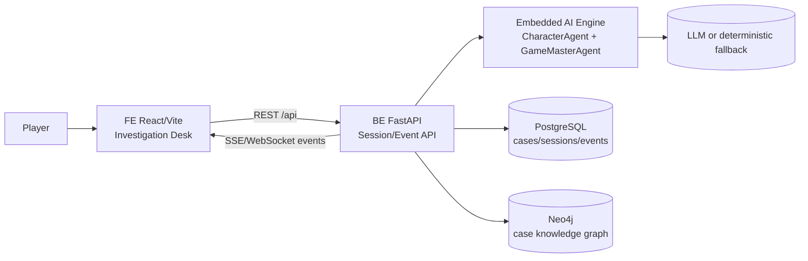
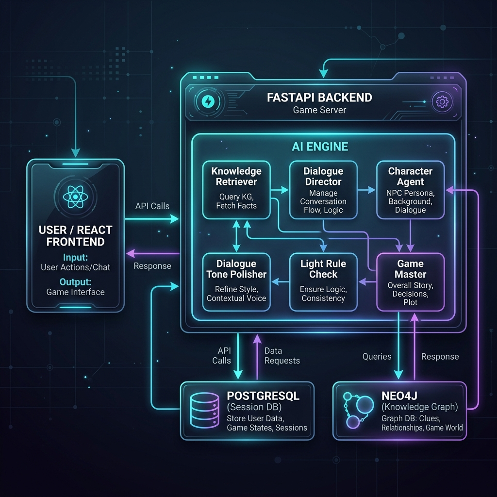
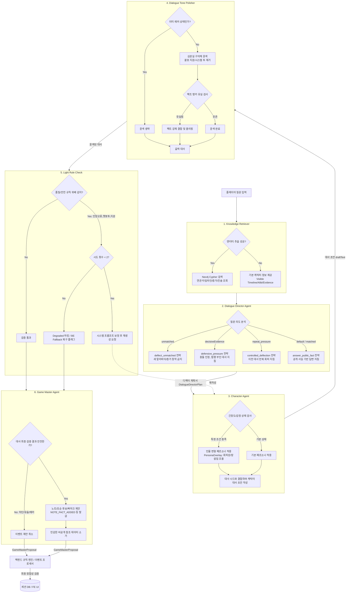
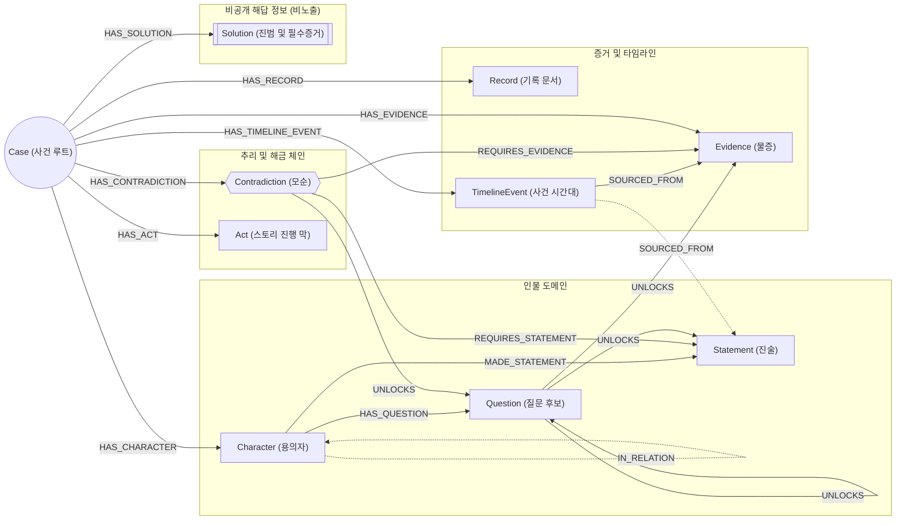
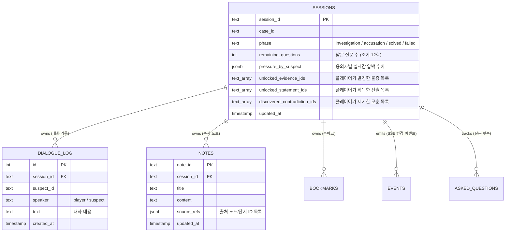
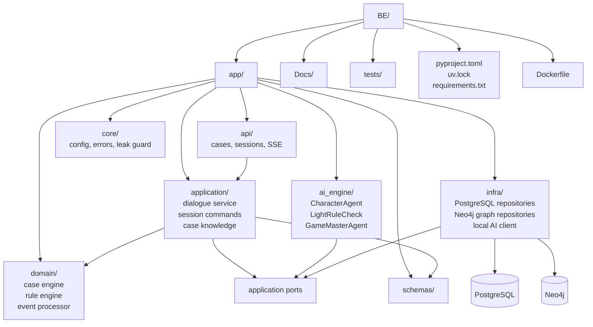
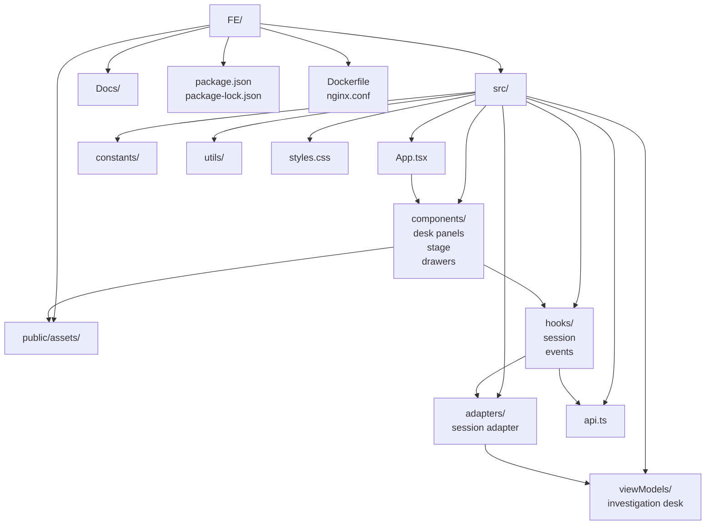
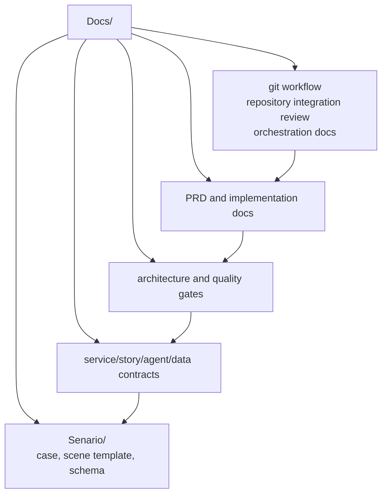

# Detective Agent

PRD 기반 대화형 알리바이 교차검증 추리 게임 MVP입니다. 사용자는 수사 데스크 UI에서 용의자와 대화하고, 증거와 진술을 비교해 모순을 제기한 뒤 최종 범인을 지목합니다.

## 핵심 목표

- 사건 1개, 용의자 4명 이상, 증거/기록 8개 이상을 제공한다.
- 제한 대화 12회 안에서 자연어 질문, 대화 기록, 추리 노트, 증거/기록/관계 탭을 제공한다.
- 진술과 증거를 기반으로 모순 제기 및 정답/부분/근거부족/오답 판정을 수행한다.
- AI 실패 시에도 deterministic rule engine으로 게임 진행을 유지한다.
- GameMasterAgent가 제안한 수첩/증거/visualState 변경은 Backend Event Processor 검증 후 UI에 반영한다.

## 서비스 구성





- `FE`: React/Vite 기반 단일 화면 수사 데스크, nginx 정적 서빙
- `BE`: FastAPI Backend API, deterministic rule engine, Event Processor, PostgreSQL/Neo4j persistence, 내장 AI engine
- `Docs`: 시나리오, 계약, 아키텍처, 운영/리뷰 문서

## AI 에이전트 아키텍처 (AI Agent Architecture)

이 프로젝트는 심문실에서 용의자와 대화하며 알리바이를 검증하고 모순을 밝혀내는 추리 게임의 핵심 재미를 구현하기 위해 고도화된 AI 에이전트 시스템을 내장하고 있습니다. 

단순히 하나의 LLM 호출에 의존하지 않고, **역할과 책임이 분리된 6개의 에이전트 컴포넌트**가 파이프라인(Chained Flow)을 이루어 작동합니다. 이를 통해 자연스러운 대화 구현뿐 아니라 추리 게임의 논리적 무결성, 보안(스포일러 방지), 그리고 시스템 안정성을 모두 확보합니다.

### 에이전트 전체 흐름도 (Agent Pipeline Flow)



### 각 에이전트의 역할 및 상세 정보

1. **Knowledge Retriever (지식 검색기)**
   - **역할**: 대화의 맥락이 흐트러지지 않도록 백과사전식 사실 정보를 적시에 제공합니다.
   - **상세**: 플레이어 질문에서 시간, 장소, 증거 관련 엔티티(토큰)를 추출하고, Neo4j 지식 그래프나 데이터베이스에서 관련 인물의 시간대별 행적(Timeline), 증거 분석 리포트, 기존 진술을 검색하여 다음 단계 에이전트에 주입합니다.

2. **Dialogue Director Agent (대화 감독 에이전트)**
   - **역할**: 대화의 거시적인 방향을 제어하고 인물의 폭주를 막는 컨트롤 타워입니다.
   - **상세**: 질문의 의도가 단순 인사인지, 예리한 추궁인지 분석합니다. 결정적인 모순이 제기되었을 경우 인물이 즉시 자백하여 게임이 싱겁게 끝나지 않도록 "갈등 상황만 인정하되 범행은 부인하라"는 식의 구체적인 **전략(Strategy)**과 **답변 제약조건(Forbidden Claims)**을 담은 디렉팅 계획서(`DialogueDirectorPlan`)를 발행합니다.

3. **Character Agent (캐릭터 에이전트)**
   - **역할**: 용의자 본인으로서 몰입감 넘치는 대사를 시뮬레이션합니다.
   - **상세**: 인물의 핵심 페르소나, 말투(Tic), 단어 선호도(Vocabulary)를 반영합니다. 특히 용의자의 현재 **긴장도(Tension Level)**, **압박 강도(Pressure State)**, **감정 상태(Emotional State)**에 따라 대사 어투와 주장이 유동적으로 변형되도록 페르소나 오버레이(`PersonaOverlay`)를 구성하여 대사 초안을 작성합니다.

4. **Dialogue Tone Polisher (대사 윤색 에이전트)**
   - **역할**: 대사의 자연스러움을 극대화하고 최종 스포일러 유출을 차단합니다.
   - **상세**: 작성된 초안을 심문실에서 실제 형사와 용의자가 주고받을 법한 현대 한국어 구어체로 윤색합니다. 시스템 프롬프트 투(예: "AI 어시스턴트로서...")나 지문 괄호 표현 `(한숨을 쉬며)` 등을 제거하고, 허용되지 않은 비공개 정보(진범 여부, 미해제된 비밀 등)가 포함되어 있는지 검사하여 최종 필터링합니다.

5. **Light Rule Check (경량 룰 체크 에이전트)**
   - **역할**: 실시간으로 품질 및 안전성 검문을 수행하는 검사관입니다.
   - **상세**: 최종 대사가 너무 짧은지, 용의자가 자신을 제3자처럼 부르는 오류(인칭 오류)가 있는지, 게임 분위기를 해치는 패턴이 있는지 체크합니다. 만약 결함이 발견될 경우 최대 2회까지 대사를 재생성(Regeneration)하며, 지속적인 실패 시 안전한 백엔드 결정론적 Fallback 답변으로 대처하여 견고성을 유지합니다.

6. **Game Master Agent (게임 마스터 에이전트)**
   - **역할**: 플레이어의 추리를 돕기 위해 수사 노트(추리 수첩) 업데이트와 북마크 지정을 제안합니다.
   - **상세**: 안전하게 대화가 완료되면, 해당 대화 내용을 기반으로 플레이어가 수첩에 추가할 만한 새로운 사실 정보(`NOTE_FACT_ADDED`)나 모순 단서(`NOTE_CONTRADICTION_CANDIDATE_ADDED`)를 백엔드에 제안합니다.
   - **중요성 (안전 장치)**: 게임 상태(Tension 수치, 증거 해제, 정답 판정)를 직접 수정하는 위험한 이벤트 유형은 발급할 수 없도록 엄격히 제한되어 있으며, 제안된 모든 이벤트는 백엔드 규칙 엔진(Deterministic Rule Engine)의 정밀한 검증을 통과해야만 최종 데이터에 반영됩니다.

## 데이터베이스 및 지식 그래프 아키텍처 (DB & Knowledge Graph Architecture)

이 프로젝트는 케이스(사건)의 정적 사실 관계를 보관하는 **지식 그래프(GraphDB / Neo4j)**와 플레이어 세션의 동적인 진행 상태를 저장하는 **관계형 데이터베이스(RDB / PostgreSQL)**를 철저히 물리적/개념적으로 분리하여 설계했습니다.

이를 통해 AI 에이전트 파이프라인과 게임의 규칙 엔진이 상태 간섭 없이 안전하게 작동합니다.

### 1. DB 책임 분리 (Responsibility Separation)

| 데이터베이스 | 주요 역할 | 보관 데이터 | 주요 비즈니스 컴포넌트 |
| :--- | :--- | :--- | :--- |
| **Neo4j (GraphDB)** | 사건 지식 그래프 및 해금 경로 | 정적 사건 사실 정보 (인물 관계, 타임라인, 증거, 진술, 모순 판정 구조, 사건 해답) | `KnowledgeRetriever` (AI 데이터 검색), `CaseRepository` (사건 초기 모델 조회), `RuleEngine` (모순 판정) |
| **PostgreSQL (RDB)** | 플레이어 세션 런타임 상태 | 세션별 플레이 진행도 (남은 질문 수, 용의자별 압박 수치, 플레이어가 발견한 모순/진술/증거 목록, 플레이어 수첩 메모) | `Backend Event Processor` (이벤트 기반 상태 변이), `SessionRepository` (런타임 복구 및 SQL 영속화) |

---

### 2. Neo4j 지식 그래프 아키텍처 (GraphDB Schema)

Neo4j는 사건의 모든 인물, 진술, 단서 간의 논리적 연관 관계와 해금 조건(Unlock Chain)을 그래프 노드와 관계로 설계하여 효율적인 그래프 조회를 지원합니다.



- **안전 규칙 (Security Gate)**: `Solution` 및 용의자 노드의 `isCulprit`, `secret` 속성은 비공개 영역으로 보호되며, 플레이어 API 및 AI 캐릭터 대화 프롬프트에 직접 유출되지 않도록 게이트웨어 단계에서 필터링됩니다.

---

### 3. PostgreSQL 세션 런타임 ERD (PostgreSQL Schema)

PostgreSQL은 플레이어마다 개별적으로 진행되는 수사 진척도를 안전한 트랜잭션 단위로 관리하며, 변경 히스토리를 이벤트 원장(Events)으로 보존해 실시간 리플레이(SSE Replay)를 보장합니다.



---

### 4. AI와 데이터베이스의 상호작용 흐름 (Interactive Loop)

AI 에이전트와 데이터베이스는 다음과 같은 흐름으로 상호작용하여 상태의 무결성을 유지합니다.

1. **지식 인입 (Retrieval)**: 플레이어 질문이 입력되면, `KnowledgeRetriever`가 질문 속 엔티티(시간, 장소, 증거 단어)를 추출하여 **Neo4j**에서 연관된 사건 지식 그래프 정보를 조회(Read)합니다. 플레이어가 아직 해금하지 못한 비공개 노드는 조회 결과에서 원천 배제됩니다.
2. **이벤트 제안 (Proposal)**: 대화 완료 후, **GameMaster Agent**가 대화 맥락을 파악하고 플레이어의 수사 수첩에 추가할 수첩 노트(`NOTE_FACT_ADDED`)나 단서 북마크를 제안(Propose)합니다.
3. **엄격한 백엔드 검증 및 커밋 (Verification & Commit)**: 백엔드의 **Event Processor** 및 **RuleEngine**이 AI의 제안을 검증하여, 플레이어가 실제로 잠금 해제한 자격이 있는지 확인합니다. 검증을 통과한 변경 사항만이 **PostgreSQL** 세션 데이터에 반영(Write/Commit)되며 플레이어 화면(UI)으로 SSE 이벤트를 통해 실시간 발행됩니다.

## 저장소 구조

```text
.
├── BE/                  # Backend API 서비스
│   ├── app/api/         # cases, sessions, SSE 라우트
│   ├── app/application/ # 세션 명령, 대화 서비스, 사건 지식 서비스
│   ├── app/domain/      # 사건 엔진, 이벤트 처리, 룰 엔진
│   ├── app/ai_engine/   # 내장 CharacterAgent, LightRuleCheck, GameMasterAgent
│   ├── app/infra/       # PostgreSQL/Neo4j repository, local AI client
│   ├── app/schemas/     # 공개 API 스키마
│   └── scripts/         # DB/Neo4j 초기화 및 마이그레이션
├── FE/                  # Frontend 앱
│   ├── public/assets/   # 캐릭터/증거/배경 에셋
│   ├── src/components/  # 수사 데스크 UI 컴포넌트
│   ├── src/hooks/       # 세션/이벤트 훅
│   ├── src/viewModels/  # 화면용 상태 조립
│   └── src/adapters/    # API 응답 어댑터
├── Docs/                # 제품/구조/운영 문서
├── PRD.md               # MVP 요구사항
├── docker-compose.yml   # FE/BE/PostgreSQL/Neo4j 로컬 실행
└── scripts/             # 보조 스크립트
```

## 각 레포 구조 시각화

### BE



Backend는 세션, 질문 소모, 모순 판정, unlock, 이벤트 저장/발행의 단일 진실 공급원이다. 내장 AI engine 응답은 Backend 검증을 통과한 뒤에만 세션 상태에 반영된다.

### FE



Frontend는 조사 데스크 경험을 구성하고, Backend 세션 payload와 SSE/WebSocket 이벤트를 화면 상태로 변환한다. 로컬 mock data는 개발 보조용이며 실제 게임 진행의 기준은 Backend 응답이다.

### Docs



문서는 제품 요구사항, 시나리오 데이터 계약, 서비스 계약, 운영 절차를 연결한다. 코드 변경으로 API, 이벤트, 데이터 구조, 운영 방식이 바뀌면 관련 문서를 같은 PR에서 갱신한다.

## Docker 실행 화면

Docker Compose로 실행한 메인 페이지입니다. 스크린샷은 1440x1100 viewport의 깨끗한 브라우저 프로필에서 캡처했습니다.


## 로컬 실행

```bash
docker compose up --build
```

접속:

- Frontend: http://localhost:8080
- Backend health: http://localhost:8000/api/v1/health

Frontend 컨테이너는 `/api/` 요청을 `http://backend:8000`으로 프록시합니다. AI runtime은 Backend 프로세스 내부의 `BE/app/ai_engine`에서 실행됩니다.

## Agent Logger 데모

`BE_DEBUG_TOOLS_ENABLED=true`로 Backend를 실행한 뒤 플레이하면 Agent 실행 흐름을 별도 화면에서 실시간으로 확인할 수 있습니다.

- Docker Compose: http://localhost:8080/logger
- Frontend 개발 서버: http://localhost:5173/logger
- 조회 API: http://localhost:8000/api/v1/agent-logs

Logger는 플레이어 질문 미리보기, 용의자, 대화 유형, Agent/노드 실행 순서, 역할, 상태와 지연 시간만 메모리에 보관합니다. 프롬프트, LLM 응답 전문, 비공개 사건 정보는 기록하지 않습니다.

## 개별 검증

```bash
cd BE && uv sync && uv run pytest -q
cd ../FE && npm run build
```

루트에서 Frontend 빌드만 실행할 수도 있습니다.

```bash
npm run build
```

## 주요 문서

- [PRD.md](PRD.md): 제품 요구사항과 MVP 범위
- [Docs/git-workflow.md](Docs/git-workflow.md): Issue, 브랜치, 최소 커밋, PR, merge, 리뷰 절차
- [Docs/repository-integration-review.md](Docs/repository-integration-review.md): 루트 저장소 통합 검토 기록
- [Docs/implementation-overview.md](Docs/implementation-overview.md): 구현 개요
- [Docs/final-scenario-and-event-architecture.md](Docs/final-scenario-and-event-architecture.md): 시나리오와 이벤트 아키텍처
- [Docs/service-contract-dialogue-story.md](Docs/service-contract-dialogue-story.md): 대화/스토리 서비스 계약
- [Docs/structure-audit.md](Docs/structure-audit.md): 구조 점검 기록

## Git 운영

루트 디렉터리 하나만 Git 저장소로 사용합니다. `BE/`, `FE/`, `Docs/` 내부에 별도 `.git`을 두지 않습니다.

기본 통합 브랜치는 `dev`입니다.

```text
feature/*, fix/*, docs/* -> PR -> dev -> release PR -> main
```

작업 원칙:

- Issue 하나를 기준으로 작업 브랜치를 만든다.
- 커밋은 리뷰 가능한 최소 단위로 나눈다.
- 모든 변경사항은 PR 리뷰를 거쳐 `dev`에 merge한다.
- 안정화된 `dev`만 `main`으로 승격한다.

자세한 절차는 [Docs/git-workflow.md](Docs/git-workflow.md)를 따릅니다.
